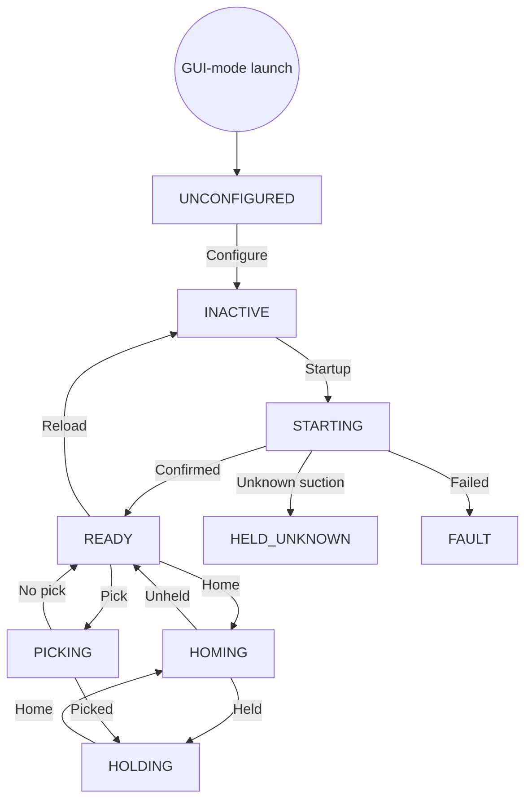
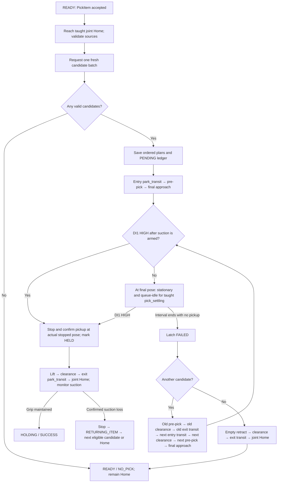
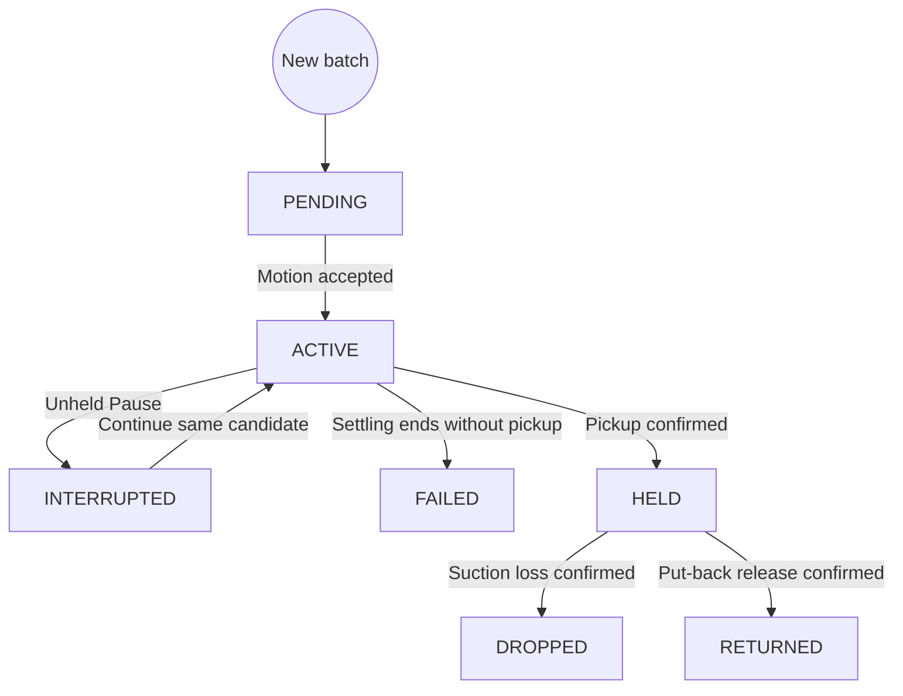
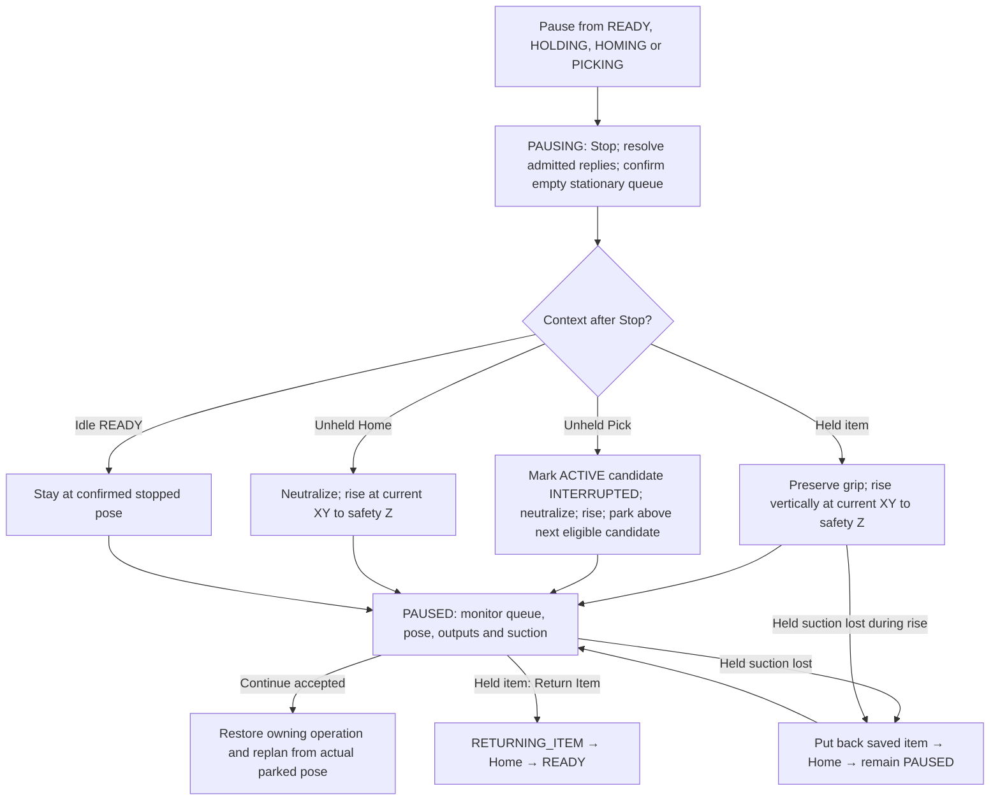
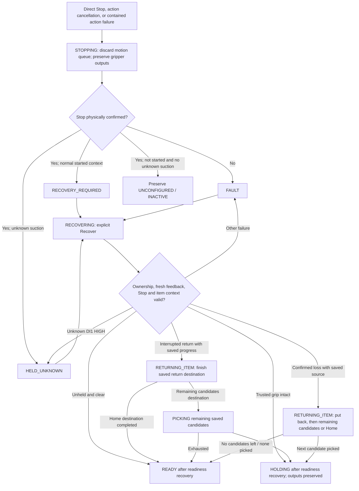
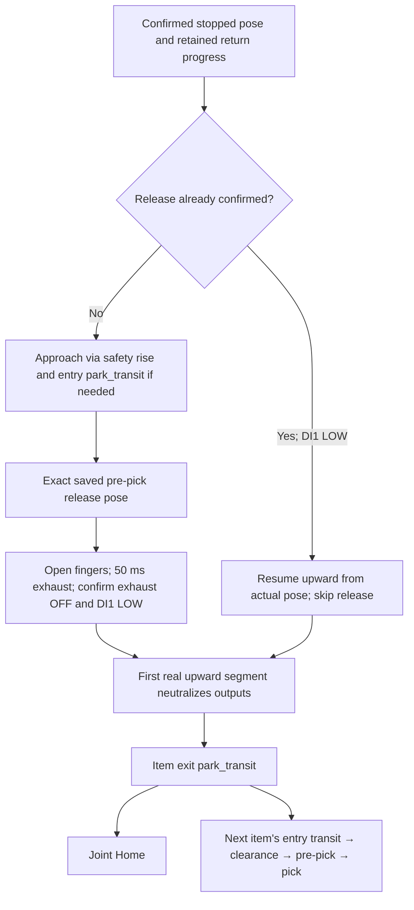

# Robot Controller — Finite State Machine

Last behavior review: **2026-09-24**, against baseline **`61207aa`** plus the
controller changes in diary rules **120–122**. Rule **118** requires keeping this document
current with future controller changes.

This describes the implemented `robot_controller` node. Diagrams use Mermaid;
open a Mermaid-capable Markdown preview or view this file on GitHub to render
them. The tables also describe the behavior without a diagram renderer.

Ready-to-view exports in this folder: [interactive visual FSM](ROBOT_CONTROLLER_FSM.html)
and [six-page visual PDF](ROBOT_CONTROLLER_FSM.pdf). The HTML opens directly in
a browser with diagram selection, zoom and dragging; both exports work offline.

## 1. Read this first

- **Launch does not enable or move the robot.** Load configuration, then Startup.
- **READY** means available for an operation; it does not always mean at Home.
- **HOLDING** means trusted held-item context; it does not always mean at Home.
- **Pause moves to a parking position**, then waits for Continue or Return Item.
- **Direct Stop stops motion and preserves the grip.** It does not put an item back.
- **Recover can move the robot** when a saved item needs put-back; it can also
  continue the batch. Recovery with an intact grip normally restores HOLDING instead.
- One controller operation owns execution at a time. A managed Pause retains
  that ownership while waiting. Direct Stop can pre-empt it.

There are two separate state machines:

| State record | What it describes | Example |
| --- | --- | --- |
| Controller lifecycle | What the whole controller is doing | `PICKING`, `PAUSED`, `RECOVERING` |
| Candidate ledger | What happened to each item pose in the accepted batch | `PENDING`, `INTERRUPTED`, `HELD` |

`phase` and `waypoint` are progress details inside a lifecycle state. For example,
Pick's initial Home travel still reports `PICKING`; it is not a separate Home
action. Flowchart boxes below describe steps unless explicitly named as states.

## 2. Normal lifecycle



Headless launch loads the strict `runtime_teach/` catalog during construction,
then enters **INACTIVE**. Invalid deployment terminates startup; it does not
invent a usable configuration or start an indefinite retry. Headless selection
is immutable until restart. GUI configuration can be replaced from idle,
unheld UNCONFIGURED, INACTIVE or READY; invalid replacement preserves the old one.

Startup order: validate ownership/feedback → best-effort StopMoveJog → strict
Stop/empty queue → unknown-item check → Disable → conditional ClearError →
Enable/confirmation → SpeedFactor 100, User 0, Tool 0, Tool 1 TCP zero, CP 100 →
unheld output reset → 200 ms coherent readiness. An unanswered service blocks
later commands, including an unanswered best-effort StopMoveJog.

### Every lifecycle state

| State | Meaning / usual exit |
| --- | --- |
| `UNCONFIGURED` | No active teach configuration; Configure loads it. |
| `INACTIVE` | Configuration loaded; explicit Startup required. |
| `STARTING` | Startup initialization in progress; READY, HELD_UNKNOWN or FAULT follows. |
| `READY` | Available and unheld; can Pick, Home, Pause, reload or change global speed. |
| `HOMING` | Explicit Cartesian GoHome action is executing. |
| `PICKING` | One accepted candidate batch is being planned/attempted/returned. |
| `HOLDING` | Trusted item held; Home, Pause, controlled return or global speed are available under their guards. New Pick is blocked. |
| `PAUSING` | Managed Stop and parking/return preparation; Continue is not yet allowed. |
| `PAUSED` | Managed parking confirmed; controller continues checking pose, queue, outputs and held suction. |
| `RETURNING_ITEM` | Saved item's put-back is executing; destination afterward depends on why it started. |
| `STOPPING` | Direct Stop/cancellation/fault containment is being confirmed. |
| `RECOVERY_REQUIRED` | Stop confirmed; previous operation cannot simply Continue. Explicit Recover required. |
| `RECOVERING` | Explicit readiness recovery, potentially followed by saved-item return and more picks. |
| `HELD_UNKNOWN` | Suction detected without trusted pickup context; keep stopped and resolve the item/sensor condition. Recover can recheck. |
| `FAULT` | Initialization, recovery, supervision or containment failed. Read the cause and explicitly Recover or Stop. |

## 3. One Pick action



- The pose provider is exactly one of headless `item_detect` or explicitly armed
  `item_teach`, through `/item_detect/get_item_poses`. Inference is requested for
  the batch; Pause/Continue and saved-batch recovery do not request replacement poses.
- The accepted batch belongs to this Pick; there is no result-age expiry during
  its operation. Source/hash checks still apply before later work.
- Final approach uses taught approach speed/acceleration. DI1 acquisition is
  immediate once armed: it can stop before reaching the nominal final target.
  If there is no early pickup, taught `timing.pick_settling` is the single final
  stationary/idle observation interval. There is no extra 300 ms gate or suction wait.
- Success first lifts to pre-pick at taught retract rates. Empty retract and
  the clearance rise use speed 100% with taught travel acceleration. Other Pick
  travel uses its taught rates; global SpeedFactor scales all motion.
- Both successful and exhausted returns queue through an explicit exit transit
  and exact joint Home. Only the terminal Home is physically confirmed for that
  group. Intermediate points may blend under global **CP(100)**.
- A missed retry queues **old exit and next entry** transit, even when coincident.
  Late DI1 from a latched miss does not turn it into success. Vacuum reset and
  DI1 clear are required before the next candidate's suction can be armed.

### Candidate ledger



FAILED, DROPPED and RETURNED are terminal ledger states. A returned uncertain
item remains **DROPPED**, recording the loss; it does not change to RETURNED.
Eligible candidates are PENDING or INTERRUPTED in saved order. Thus Continue
retries the interrupted candidate before later candidates. The ledger and held
source exist only in memory; process restart does not reconstruct them.
RETURNED confirms release feedback; retreat/Home may still be in progress.
Put-back separately retains APPROACH, RELEASING or RELEASED progress and its
original destination until Home completes or next-candidate travel takes ownership.

## 4. Pause and Continue



Safety Z is **max(actual stopped Z, taught Home Z)**. The unheld Pick endpoint is
`park_transit` at the saved candidate XY/attitude and that safety Z. It is above
pre-pick, not at pre-pick. If no candidate is eligible, there is no next-item XY
transfer. A pickup recognized during the managed Stop uses the held branch only
when the controller has an eligible active candidate and suction evidence.
An optional vertical correction within 5 mm of Home Z is skipped before
dispatch, retaining the measured pose. Required item transits remain queued.

Continue requires valid sources, fresh enabled feedback, no unexpected queue
motion, unchanged parked pose (1 mm / 0.5°), expected outputs and no pending
held loss. Unheld Pick reopens fingers and descends through saved pre-pick to
final approach. Held Pick continues its return through exit transit and Home.
Home replans its Home action. Idle Pause restores READY/HOLDING; after an idle
HOLDING pause loses and returns its item, Continue may run remaining saved candidates.

The GUI shows **STOP NOW** immediately while Pause/return is pending. This is a
direct Stop, including when a PAUSED topic sample arrives before the Pause reply.
**RETURN ITEM & STOP** appears only after pending requests clear and PAUSED has
trusted held source. External `/return_item` clients can request a managed
return from other started eligible states; the GUI exposes it while paused.

## 5. Direct Stop and Recovery



Direct Stop never automatically releases, Homes or resumes. It remains available
during Startup, parking, put-back and Recover. Physical Stop confirmation is
independent of DI1 being HIGH; an uncertain item retains its available source.
An unresolved/late motion response prevents later motion and can require another
containment Stop. A managed routine also uses physical Stop internally, without
necessarily publishing the lifecycle state STOPPING.
Concurrent callers share only an ongoing Stop attempt. A later explicit
Stop/action cancellation sends a new Stop and requires its own physical
confirmation, even after failure. An older result cannot finish a newer Stop
or overwrite a new operation. Operation startup cannot clear an in-progress Stop.

| Recovery situation | Operator path / controller result |
| --- | --- |
| Known item, suction intact | Recover → HOLDING. To put back: PAUSE → wait for RETURN ITEM & STOP → click it. |
| Saved item with latched suction loss | Recover puts back, then attempts remaining eligible candidates or Homes. A subsequent DI1 HIGH does not erase the latched loss. |
| Interrupted put-back, release unconfirmed | Recover uses the saved source and return destination; finish release, then retreat. Intentional suction OFF does not discard source context. |
| Interrupted put-back, release confirmed | Recover skips release/descent, retreats upward from actual stopped pose and finishes the saved destination. New DI1 HIGH blocks this route. |
| Unknown HIGH suction, no trusted source | Keep stopped; safely secure/clear item or inspect the sensor for obstruction. Once DI1 shows LOW, click Recover again; no extra Stop click required. No invented return location. |
| Competing maintenance app | Close the named Gripper Diagnostics/motion-debug application, then retry Recover. |
| Stale feedback, alarm, output mismatch, changed source or failed command | Resolve the reported cause, then Recover. A click does not bypass the check. |

Normal Recover repeats Stop, conditional ClearError, Enable and readiness
settings; it keeps the last confirmed global speed, or uses Startup's 100% if
none was established. It resets outputs only for an unheld, clear gripper.
Unknown HIGH at its item check blocks enable/reset. In uncertain-item recovery,
outputs are protected until the planned release. Its service response may wait
for put-back and the remaining saved Pick operation to finish.

## 6. The common put-back route



Release height is **final-pick Z + taught pre-pick height**, using the exact
saved pre-pick attitude/XY. The former fixed +50 mm release/minimum is removed.
Release commands turn finger-close and suction off, open fingers, then pulse
exhaust. These are ordered commands, not simultaneous electrical edges.

The complete put-back route uses **speed 100% / taught travel acceleration**,
scaled by global SpeedFactor. If clearance equals pre-pick, the rise to exit
transit carries the neutral events. A real upward retreat must exist. Both entry
and exit transits are queued, with CP blending permitted. Physical item placement
is not measured; the controller confirms release feedback and motion completion.
Stop preserves the source, return destination and release progress. Recovery
from RELEASING at the saved release pose can finish its I/O directly. After
RELEASED, it never descends to release again or repeats confirmed exhaust. Neutral
I/O moves to the first remaining upward segment; if already at safety height,
neutralization uses stationary guarded commands with raw DI1 LOW. Only issued
output transitions are reconciled after Stop, including the exhaust timer's OFF.
Unexpected I/O changes remain faults. None of this context survives restart.

| Why put-back started | After release and retreat |
| --- | --- |
| Explicit Return Item | Home → READY; ends the interrupted operation. |
| Held suction loss during active Pick | Next eligible saved candidate, or Home → READY if exhausted. Original Pick stays active. |
| Explicit Recover of uncertain saved item | Next eligible saved candidate, or Home → READY if exhausted. |
| Held loss during Pause / while PAUSED | Home → PAUSED. Wait for explicit Continue or Stop. |

## 7. Home has two routes

| Request | Planned route | Completion check |
| --- | --- | --- |
| Explicit Hardware Home / `go_home` | Current XY with taught Home Z/attitude → full taught Cartesian Home, one blended group | Final Cartesian Home; whole move skipped if already within 5 mm / 1° |
| Pick's initial Home | If needed: unchanged-XY/attitude rise to Home Z → exact taught joint Home | Separate rise barrier when needed, then joint Home; skip if every Home joint is within ±1° |
| Pick success, final exhausted miss, or put-back Home return | Item retreat/clearance → explicit exit transit → conditional Home-height target → exact joint Home, one ordered group | Final joint Home |

Shared joint-Home planning skips its preliminary rise when current/planned Z is
within 5 mm below Home Z or higher. Explicit Cartesian Home uses its own alignment
target; its attitude and queue behavior must not be inferred from the joint route.

## 8. What drives transitions

### Commands and guards

Names below are relative to `/robot_controller/`.

| API | Main admission guard |
| --- | --- |
| `configure` service | GUI mode; unheld UNCONFIGURED / INACTIVE / READY; operation slot free |
| `startup` service | Configured INACTIVE; operation slot free |
| `go_home` action | Started READY / HOLDING; exact configuration ID; operation slot free |
| `pick_item` action | Started, configured, unheld READY; exact configuration ID and item selection; operation slot free |
| `pause` service | Started READY / HOLDING / HOMING / PICKING / PAUSED; managed-request and owning-operation guards |
| `continue` service | Confirmed managed PAUSED with retained Pause context and valid parked feedback |
| `return_item` service | Started eligible managed state and trusted held source; no conflicting request |
| `stop` service / action cancellation | Direct pre-emption; does not require Pause first |
| `recover` service | FAULT / RECOVERY_REQUIRED / HELD_UNKNOWN; operation slot free |
| `set_global_speed` service | Stationary READY / HOLDING; integer 1–100; operation slot free |

Acceptance is not proof of motion completion. Pause/Continue/Return services
acknowledge a request; observe status afterward. Home/Pick actions provide final
results: SUCCESS, NO_PICK (Pick only), CANCELED, COMMAND_REJECTED,
FEEDBACK_FAILURE, STOP_UNCONFIRMED or CONTROLLER_FAULT. A controlled Return Item
that ends an active Home/Pick reports CANCELED and final READY, not Pick success.

### Feedback and I/O

| Input | Used for |
| --- | --- |
| `/joint_states` | Actual six robot joints, timestamp/freshness and joint Home confirmation |
| `/dobot_msgs_v4/msg/RobotStatus` | Canonical connection and enabled status |
| `/dobot_bringup_ros2/msg/FeedInfo` | Actual tool pose, queue/running flags, controller timer, modes/alarms/collision, DI/DO |
| `/item_detect/get_item_poses` service response | Validated item candidates and their source binding |

| I/O | Meaning |
| --- | --- |
| DI1 | Suction detection: acquisition HIGH is immediate; held HIGH→LOW loss is debounced 50 ms with advancing feedback |
| DI12 | Finger fully open feedback, shown on the GUI; LOW does not prove fingers are closed |
| DO1 / DO13 | Exhaust / suction; both OFF is neutral; both ON is invalid |
| DO2 / DO14 | Finger close / open; both OFF is neutral; both ON is invalid |

Feedback must be complete, connected, valid and within **one second**, including
joint source/receipt timestamps, status/feed receipt and advancement of the
controller timer. Current motion origin comes from that fresh FeedInfo sample's
`tool_vector_actual`; there is no GetPose client or separate pose subscription.
Stale feedback can block an operation or cause containment. It never means LOW.

Motion requests are admitted in order: wait for each `res=0` before sending the
next, with no fixed dispatch delay. Dobot service responses have a **five-second**
deadline; this is not a five-second motion-completion limit. Global CP is 100,
with no per-motion CP/r override. No automatic runtime restart or general fault
retry is performed.

Every queued group's terminal check requires a fresh sample after the last
acceptance, with a newer sequence and advancing controller timer, idle/empty
queue, actual endpoint tolerance and confirmed I/O. For a terminal MovL, require
the returned queue ID to equal the stream's currentCommandId. The fixed vendor
MovLIO/RelMovLUser interfaces return only res; these instead require execution
evidence latched from live running/queue flags, changed currentCommandId or
actual pose movement, including during service waits. There is no extra
query service or fixed stability interval. Only final pick retains taught
pick_settling. Midpoints and both transits stay queued and CP-blended without
arrival waits. A very short move need not expose a running sample if its streamed
command ID demonstrates execution.

The GUI receives `/robot_controller/status` at periodic **5 Hz** plus state and
progress updates. Its DI1/DI12 LEDs show raw HIGH/LOW, or UNKNOWN if feedback is
unavailable; status itself also expires after one second by source and local
receipt age. `UNAVAILABLE` is a GUI display condition, not a controller FSM state.
Full audit details remain in `/robot_controller/operator_log` and the ignored
`logs/robot_controller/events.jsonl`.

## 9. Exact allowed lifecycle transitions

This table mirrors `state_machine.py`, including its additions after the initial
transition dictionary. These are the low-level permitted edges, **not permission
to call every service from those states**; the command guards above are stricter.
Updating a message without changing state is allowed in every state.

| From | Allowed different target states |
| --- | --- |
| `UNCONFIGURED` | `FAULT`, `INACTIVE`, `STOPPING` |
| `INACTIVE` | `FAULT`, `STARTING`, `STOPPING`, `UNCONFIGURED` |
| `STARTING` | `FAULT`, `HELD_UNKNOWN`, `READY`, `STOPPING` |
| `READY` | `FAULT`, `HELD_UNKNOWN`, `HOMING`, `INACTIVE`, `PAUSED`, `PAUSING`, `PICKING`, `RECOVERING`, `STOPPING` |
| `HOMING` | `FAULT`, `HELD_UNKNOWN`, `HOLDING`, `PAUSED`, `PAUSING`, `READY`, `RECOVERY_REQUIRED`, `STOPPING` |
| `PICKING` | `FAULT`, `HELD_UNKNOWN`, `HOLDING`, `PAUSED`, `PAUSING`, `READY`, `RECOVERY_REQUIRED`, `RETURNING_ITEM`, `STOPPING` |
| `HOLDING` | `FAULT`, `HELD_UNKNOWN`, `HOMING`, `PAUSED`, `PAUSING`, `RECOVERING`, `STOPPING` |
| `PAUSED` | `FAULT`, `HOLDING`, `HOMING`, `PAUSING`, `PICKING`, `READY`, `RETURNING_ITEM`, `STOPPING` |
| `STOPPING` | `FAULT`, `HELD_UNKNOWN`, `INACTIVE`, `RECOVERY_REQUIRED`, `UNCONFIGURED` |
| `RECOVERY_REQUIRED` | `FAULT`, `RECOVERING`, `STOPPING` |
| `RECOVERING` | `FAULT`, `HELD_UNKNOWN`, `HOLDING`, `READY`, `RETURNING_ITEM`, `STOPPING` |
| `HELD_UNKNOWN` | `FAULT`, `RECOVERING`, `RECOVERY_REQUIRED`, `STOPPING` |
| `FAULT` | `RECOVERING`, `STOPPING` |
| `PAUSING` | `FAULT`, `PAUSED`, `RETURNING_ITEM`, `STOPPING` |
| `RETURNING_ITEM` | `FAULT`, `PAUSED`, `PICKING`, `READY`, `STOPPING` |

## 10. Maintaining this document

Update this file **in the same change** whenever controller states/transitions,
command guards, Pick/Pause/Stop/Recovery/put-back routes, candidate states, timing,
I/O rules or GUI control meanings change. Update the affected diagrams and tables,
the review date/source baseline, and the blueprint diary. This is a maintained
source document, not a runtime-generated view. Newer diary rules supersede older
ones; record any source/document mismatch explicitly rather than describing a
proposed behavior as already implemented.

Regenerate the HTML and PDF from this document in the same change whenever it
is updated (rule 119). The export helper copies the Mermaid blocks and headings;
do not separately edit their behavior in the exports. It requires local
Playwright/Chromium and a local VS Code Mermaid Markdown preview bundle, and
blocks network requests during rendering:

```bash
python3 scripts/render_controller_fsm.py \
  --renderer /path/to/local/mermaid-markdown-features/markdown-preview-out/index.js
```

This is a documentation tool, not a ROS/build/runtime dependency. The resulting
HTML embeds SVG diagrams and the full source SHA-256; the PDF has one vector
diagram per A3 page with the source hash prefix. Viewers need no renderer installed.

Source map for the next review:

| Source | Responsibility |
| --- | --- |
| [state_machine.py](../src/robot_controller/python/robot_controller/state_machine.py) | Lifecycle states and allowed edges |
| [controller.py](../src/robot_controller/python/robot_controller/controller.py) | API guards, configuration, lifecycle, Home/Pick ownership, Stop and supervision |
| [managed_control.py](../src/robot_controller/python/robot_controller/managed_control.py) | Parking, Continue, put-back and held-loss recovery |
| [pick_session.py](../src/robot_controller/python/robot_controller/pick_session.py) | Candidate ledger and put-back geometry |
| [motion.py](../src/robot_controller/python/robot_controller/motion.py) | Motion targets, timed I/O and candidate execution |
| [hardware.py](../src/robot_controller/python/robot_controller/hardware.py) | Ordered service admission, physical confirmation and motion policies |
| [feedback.py](../src/robot_controller/python/robot_controller/feedback.py) | Freshness, coherent samples and suction-loss debounce |
| [gui.py](../src/robot_controller/python/robot_controller/gui.py) | Button meanings, feedback display and recovery instructions |
| [Controller README](../src/robot_controller/README.md) / [blueprint diary](WORKFLOW_RULES_BLUEPRINT_DIARY.md) | Operational detail and superseding project rules |

This documents software behavior, not new physical validation. Rule 120 addresses
premature endpoint completion consistent with the logged **Unexpected motion
while parked** failure. Its strict containment remains; live validation of the
new completion, interrupted-release and Stop behavior is still outstanding.
