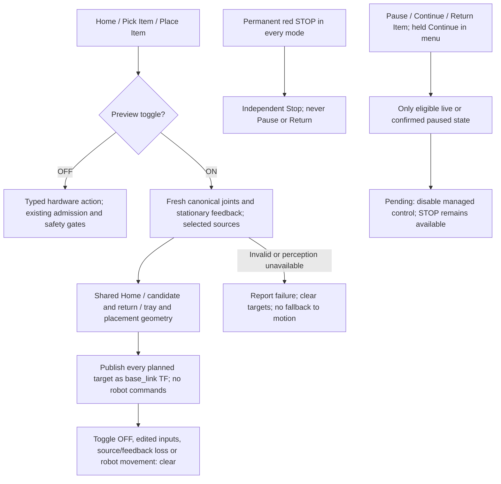
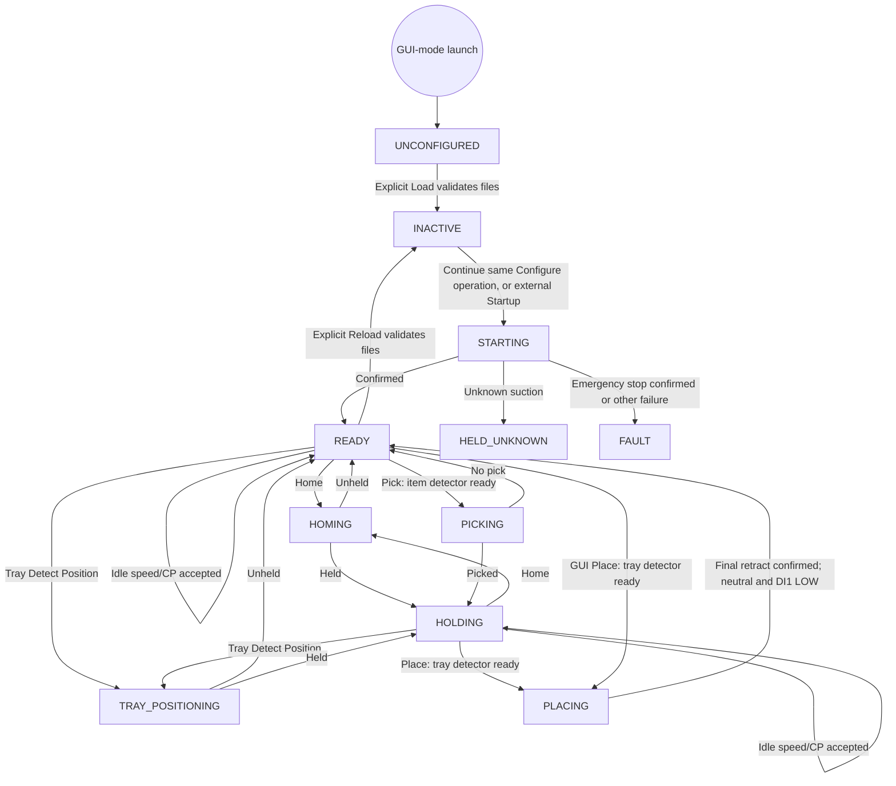
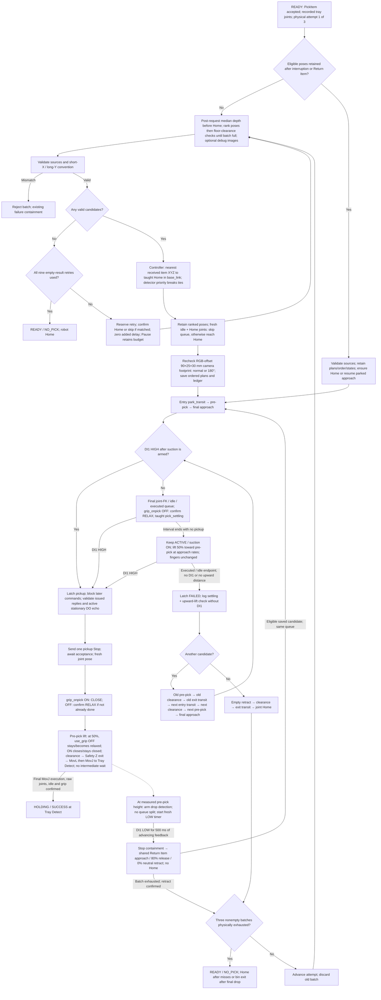
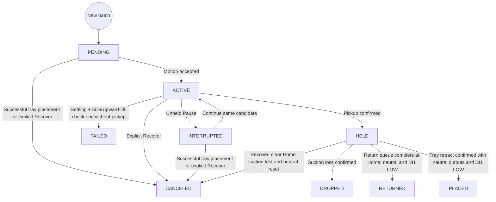
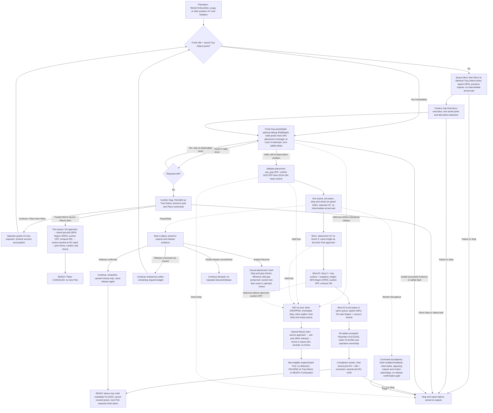
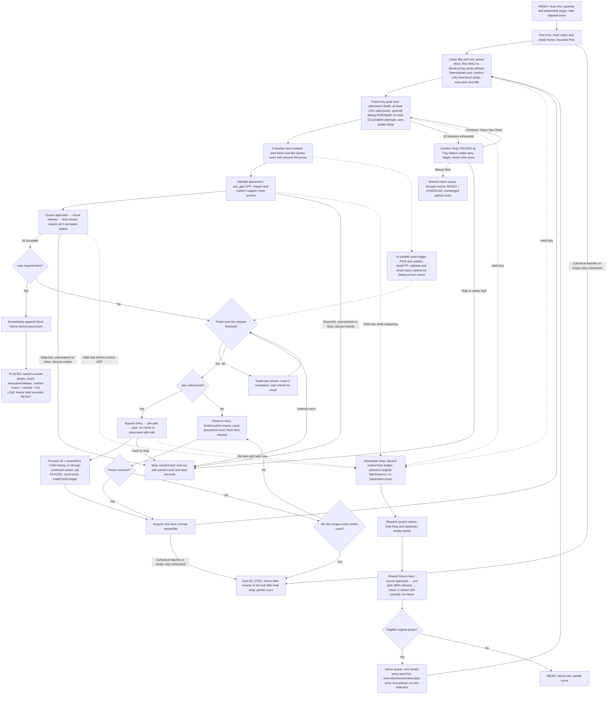
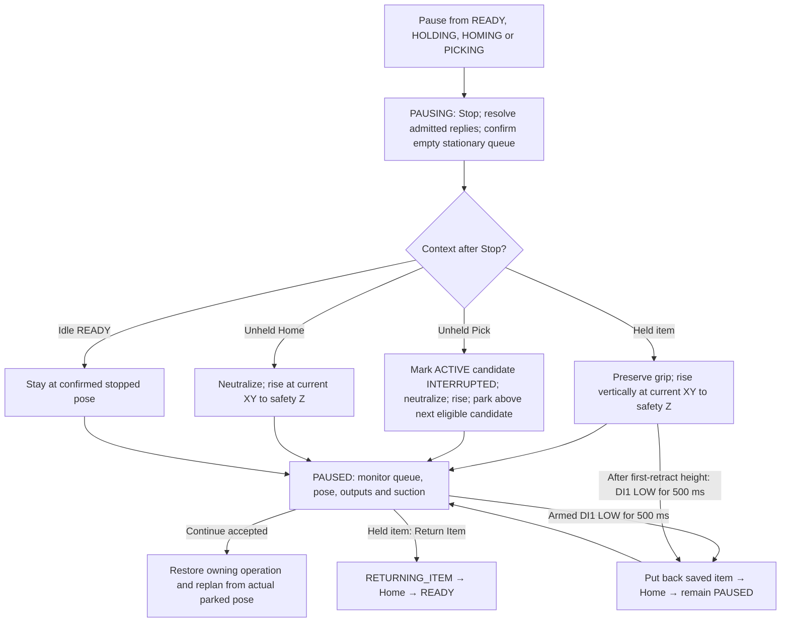
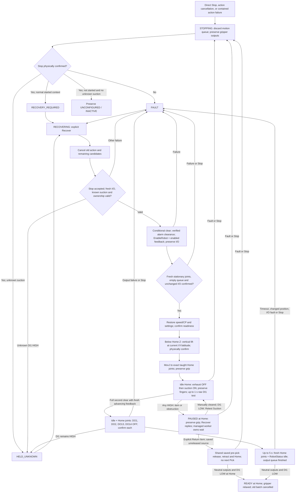
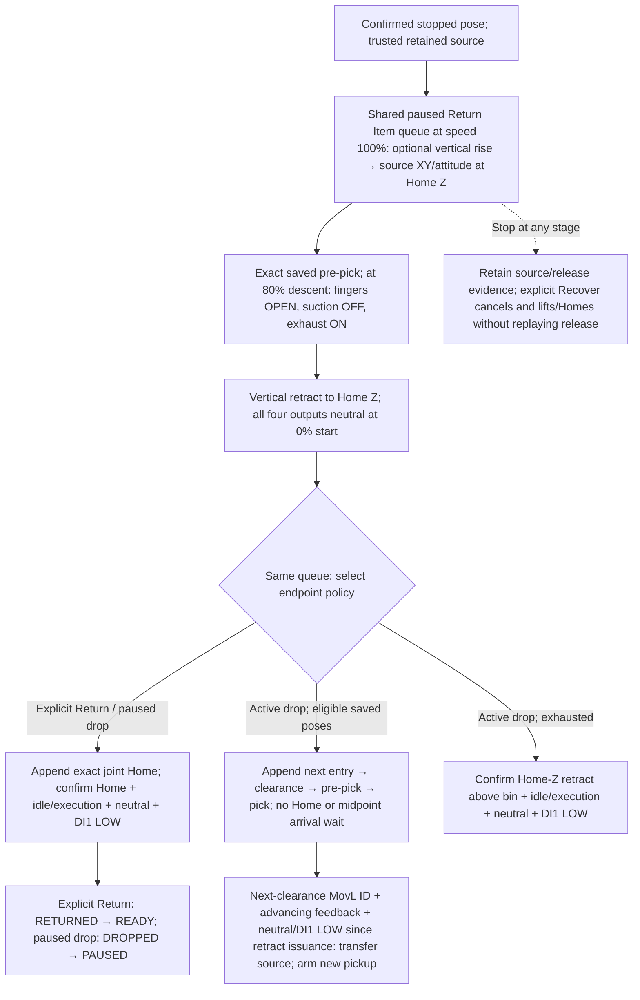

# Robot Controller — Finite State Machine

Tray placement coverage review: **2026-10-08**, baseline **`4d1fe62`** plus rule
**251**, superseding rule 243's threshold. Place Item, Auto Run and Preview request
a fixed **20%** valid-depth fraction, independent of the saved Item pick threshold.
Retain the saved physical
sampling diameter, range, freshness, synchronization and request deadline. Tray
native sampling, provider validation and controller admission use the same
explicit request value. Denominator remains every original sampling-circle
pixel; numerator remains tray-contained, range/MAD-accepted pixels. Empty or
zero-valid footprints still fail. No profile/interface change, live artifact
write, motion/I/O or retry change is introduced.

Pickup Stop ordering review: **2026-10-07**, baseline **`0c62bbf`** plus rule **249**.
Eligible DI1 immediately latches pickup and prevents later normal commands. Send
pickup Stop only after validating every already-issued response. An in-flight
finger DO at confirmed stationary final pick must also echo OFF before Stop;
finish remaining relaxation after accepted Stop, without repeating confirmed
channels. Use one pickup Stop, removing the prior early Stop/second-discard path.
Already-queued motion may continue during its response wait. Keep the existing
five-second response/output bounds, fresh feedback, suction/output/source guards,
immediate operator Stop/cancel and fault/drop containment, and managed Pause.
No new motion, setting, schema, hardware-command retry or live restart is added.

Pickup relaxation review: **2026-10-07**, baseline **`d9dac01`** plus rule **248**.
With `grip_onpick=false`, both `use_grip` combinations approach with fingers OPEN,
then confirm DO2 OFF and DO14 OFF at final-pick arrival before settling/probing.
Early DI1 instead triggers the existing accepted Stop, followed by relaxation
before the held lift. Keep suction ON/exhaust OFF and acquisition monitoring
through both service-response and fresh-output waits. An intervening DI1 latches
pickup; rule 249 orders Stop after issued replies and the active output echo.
No lift/probe may precede both output confirmations. Preserve the
single taught settling interval and strict output/feedback/cancellation gates.
Fingers remain relaxed through the probe and the first half of the held lift;
`use_grip=true` then closes at 50%, while false stays relaxed. Grip on Pick ON,
failed release/retry, held Continue and later placement reopening are unchanged.
No settings, schemas or physical commissioning are added.

Tray travel review: **2026-10-07**, baseline **`b645b5b`** plus rule **247**.
Shared Tray Detect travel queues joint-target MovL followed by absolute MovJ to
the identical six saved angles, with the same rates and no timed I/O on either.
Send MovJ immediately after MovL acceptance; do not wait for linear arrival or
condition the second command on a measured mismatch. Only final MovJ execution,
advancing joint/status feedback, idle/empty queue and every raw joint within ±1°
complete the route or allow tray acquisition. Never wrap full turns. Preserve
Stop/Pause, held-loss, output and ordered-response gates. This pair covers
successful Pick, held Continue, explicit Tray Detect and Place positioning;
Preview shows both nominal targets. Already-matched idle explicit positioning
still skips travel. Home remains MovJ and Auto Run still travels directly from
placement to the next pick. Selected CP may blend into MovJ before the linear
endpoint. This is not wrist-path validation or a guarantee against cable winding.
No new settings, schemas, services, fixed settling or physical trials are added.

Perception retry review: **2026-10-07**, baseline **`24a81c9`** plus rule **246**.
Item empty results permit nine acquisition retries per owning Pick; ten empty
requests end READY/NO_PICK. Confirm Home before every retry, reserving its count
before Home so Pause cannot reset it. Preserve the separate three-nonempty-batch
physical-pick limit. Auto Run empty prefetch finishes/counts its owned Home once;
further retries confirm already-reached Home. Tray acquisition permits ten
requests total before the existing confirmed PAUSED workflow; explicit Continue
grants another ten. Shared tray Preview uses the same bound. Neither adds a
settling delay. Every successful capture requires RGB and all raw depth frames
strictly newer than that request; stale/equal timestamps wait or fail, never
reuse cached frames. Preserve deadlines, source/evidence checks, Stop, retained
outputs and retry budgets across ordinary Pause. No schema or setting changes.

Controller pick-priority review: **2026-10-07**, baseline **`1b9ee2f`** plus rule
**244**. After validating the full Item Detect response in detector order, rank
only its returned poses by Euclidean XYZ distance from taught Home Link6 to the
received item surface position, both in `base_link`. Transform the item through
the bound platform calibration; exclude standoff, orientation and current robot
pose from this metric. Exact distance ties retain detector priority. Shared
controller acquisition supplies this order to manual Pick, Auto Run/prefetch and
Preview. Keep original IDs/detector priorities and diagnostics; log their mapping
to controller attempt numbers and distances. Detector generation/filtering/cap
and image labels remain unchanged. Freeze controller order for the owning batch,
including misses, Pause/Continue and saved-source drop/return recovery; preserve
terminal exclusions and invalidation on placement/reload/Recover/restart. No
motion/I/O, interface, schema, setting or new hardware action is introduced.

Recovery suction-test review: **2026-10-07**, baseline **`f781c29`** plus rule
**242**. Recover preserves gripper outputs through its existing Stop/clear/enable
and lift/Home route. At confirmed Home, preserve fingers, confirm exhaust OFF
before suction ON, and observe raw DI1 for up to one second. Never cycle active
vacuum OFF first. A clear test requires advancing fresh feedback for the full
second, then the existing neutral-output/DI1 LOW reset finishes READY. Any HIGH,
including a brief callback-observed pulse, latches item/obstruction; it cannot
distinguish a clog from a held item. Enter PAUSED at Home without releasing.
The Recover service returns and the existing managed worker retains ownership.
Return Item uses the shared saved pre-pick/retract/Home queue only with an
unreleased HELD/DROPPED source. Missing/confirmed-released sources never acquire
a guessed destination, and a test HIGH never promotes a DROPPED candidate.
After manual clearing and raw DI1 LOW, Continue (GUI: RETEST SUCTION) repeats
only this test. The cancelled job and remaining candidates never resume.
Keep Home/output/feedback/source/Stop guards during the test, wait and return.
No interface, configuration, executor or automatic retry is added.

Floor-relative acquisition review: **2026-10-06**, baseline **`02e139d`** plus
rule **237**. Schema-13 Item Teach adds depth-frame count 1/3/5 (default 3).
One strict-majority float32 median of fresh post-request frames supplies pose,
clearance and optional debug rendering. Effective item minimum is max(500 mm,
saved minimum); tray limits stay unchanged. The controller validates every
contributing depth timestamp, synchronization and newest response depth stamp.
Accepted batches retain their existing lifetime and retry ledger.

Express platform Z=0 in camera optical coordinates. At each physical measured XY,
height is floor depth minus camera Z. Within/on the camera-XY radius, maximum
nearby height minus candidate surface height must be below the saved threshold.
Include physical outer-bin boundary/inset margin and outside-mask depth; exclude
outside-bin points. Standoff is excluded. Degenerate/missing inputs fail closed.
Native evidence identifies `platform_floor_camera_z_v1` and reports heights,
difference and point counts. This supersedes rules 229/234’s base-XY/Z and
outside-bin interpretation. Candidate/body/pick containment checks remain.

Rank geometrically eligible poses first, then skip blocked candidates and stop
when the requested number pass. Only checked poses enter the controller batch;
remaining source IDs stay unchecked. `NO_VALID_ITEMS` retains the bounded
Home-and-reacquisition path. Clicked inspection checks its exact captured item.
Fresh active controller status pauses new Item Teach background jobs read-only;
headless detection is independent. Debug-disabled production skips images.
Timing diagnostics distinguish YOLO, processing, capture and controller validation.
Verified parsed content and one item/model validation per controller pass reduce
repeat work without skipping content reads or dynamic source bindings. No service
layout, motion queue, Stop gate, candidate-ledger or retry behavior changes.
Older profiles require explicit GUI review/Save, manual deployment and restart.

Auto Run timing review: **2026-10-06**, baseline **`bd5f2f5`** plus rule
**233**. The controller starts a monotonic timer when the accepted Auto Run begins.
Seconds include perception, retries, pauses and final Home or early termination
handling. Freeze and log time with every final/partial result. Native feedback and
result publish `elapsed_sec`; status publishes `auto_run_elapsed_sec` and retains
the last count/time until the next run or controller restart. GUI shows Elapsed
while active and Total afterward, to one decimal second. Existing status updates
carry the timer; no extra thread, blocking wait, motion or state guard is added.

Tray Detect travel review: rule **247** supersedes rule **232**'s single MovJ.
After a successful Pick's linear lifts and Safety Z exit, queue `MovL(mode=true)`
then `MovJ(mode=true)` to the same saved angles with taught travel rates and no
intermediate arrival wait. Held Continue, explicit Tray Detect travel and
Place's observation positioning share that target; the latter two retain 100%
speed. Preview uses the same planner. Preserve ordered queue acceptance, returned
command-ID execution, exact ±1° joint arrival, held-output/drop and Stop gates.
Placement approach, release descent and upward retract stay linear
`MovL`/`MovLIO`, with existing timed I/O and no added wait. Auto Run still appends
the next Pick directly behind the placement queue without Home.

Direct Auto Run continuation review: **2026-10-06**, baseline **`12bea53`** plus
rule **231**. After all placement replies are accepted, append the next fresh
entry → pre-pick → pick without Home or a placement-arrival wait. Retain OPEN at
50% entry and SUCK at 20% final descent. The existing pre-pick MovL supplies its
queue ID for source/ledger/count handoff; entry MovLIO returns no ID. Require
advancing execution at/past pre-pick plus neutral outputs/raw DI1 LOW in placement
history; handle handoff before interpreting new-pick feedback as old-item output
or loss. Slow perception confirms/counts retract, then waits unheld and still
picks directly. Initial/final Home and empty-result retry Home retain MovJ.
Parallel fresh detection, ordered admission, Stop/drop and retry guards remain.

Home-motion review: **2026-10-06**, baseline **`c2c3501`** plus rule **230**.
Every final Home destination uses absolute joint `MovJ(mode=true)` with the six
exact taught angles. Explicit Home/Preview now share the conditional upward-only
Home-Z clearance then joint Home; keep existing linear safety/transit/release
segments. Required MovJ ownership, ordered acceptance, returned queue-ID execution,
Stop/late-response containment and exact ±1° per-joint arrival apply. Never wrap
a full wrist turn or substitute Cartesian arrival. Initial/recovery/return and
Auto Run Home all use MovJ; Tray Detect now follows rule 247. Rule 231 removes
the inter-cycle Home detour; the placement-before-next-pick acceptance boundary
remains in place.

Visualization ownership review: **2026-10-06**, baseline **`17f43b0`** plus rule
**228**. Item Teach launch owns the separate read-only robot_camera_box process
in item_perception_yolo; controller launches no longer start it. It displays
/item_teach/robot_camera_body from Item Teach's validated selected camera mount,
clearing on edits/failure/shutdown or stale updates. Controller/headless planning
still use the shared body geometry and their own validated calibration, with no
dependency on the teaching display or its mount topic. Motion guards are unchanged.

Camera-body clearance review: **2026-10-06**, baseline **`bb366fb`** plus rule
**227**, superseding rule 226's centered housing dimensions. Model Gemini 335
in RGB optical axes: size 90/25/30 mm, center (+11, 0, −12.79) mm. Compose the
documented nominal RGB-to-link bridge with the saved Link6 mounting; body center
in camera-link axes is (−10.77, −25, 0) mm. Keep factory optical measurement TF
and saved calibration unchanged. At each planned pick, transform all eight corners
through the calibrated mount and platform frame and require the projected convex
outline inside/on green. Prefer the normal attitude, then exact tool-Z 180° mirror;
reject if neither fits. Item Teach, headless detection, preview and hardware use
the same pure planner; native results validate RGB frame, size, offset and outlines.
Keep blue pick-point checks independent. RGB/depth draw the actual projected
body outline. Item Teach's separate read-only robot_camera_box node displays that same
body frame-locked to live Link6 in RViz, without new TF or robot commands. This
checks pick-pose containment only; it is not a swept-path collision planner.

Recovery ordering review: **2026-10-06**, baseline **`1ce58c9`** plus rule **225**.
Explicit Recover requires Stop acceptance, then validates/adopts fresh gripper
I/O without waiting for stationary joints or queue-idle feedback. Conditional
ClearError and verified alarm clearance precede EnableRobot and enabled feedback.
Only then confirm two distinct stationary joint samples, an empty queue and
unchanged gripper I/O/raw DI1, before settings/readiness and Home recovery motion.
Reuse the accepted Stop response; no second Stop or fixed dwell is added. Keep
freshness, ownership, outstanding-response, unknown-suction, output and cancellation
guards. Failure at any stage prevents later commands. Direct Stop, Startup,
managed Pause and automatic drop containment retain their physical Stop checks.

Deferred drop-monitoring review: **2026-10-06**, baseline **`09ed60a`** plus rule
**223**. The shared falling-edge debounce is now **500 ms**. On pickup, retain
HELD/source context but defer loss monitoring until fresh joint FK reaches the
first retract/pre-pick height (at least the actual pickup origin Z). Observe
height while the full lift/clearance/Tray Detect queue executes; no midpoint
arrival wait or queue split. Ignore pre-retract LOW time and start a fresh
500 ms interval at activation; HIGH resets it immediately. Zero remaining lift
arms on a new position sample at that height. Pause acquisition uses the same
gate; a parking rise may cross it, and direct Stop preserves it. Suction OFF
clears a pending gate. Raw I/O, acquisition/probe, output/freshness checks,
intentional release and confirmed-drop containment remain unchanged. Log
`drop_detection_deferred` and `drop_detection_armed` with height and 500 ms.

Pickup probe review: **2026-10-06**, baseline **`1451bfa`** plus rule **224**
(superseding rule 222's 20% distance only).
After final-pick settling expires without DI1, keep the candidate ACTIVE and
command a last-chance upward lift through 50% of the remaining distance from
actual settled Z to saved pre-pick Z, at final-approach speed/acceleration.
Preserve measured XY/attitude, suction and finger outputs. Acquisition stays
armed across settling, probe admission and travel; DI1 HIGH uses the existing
Stop/reply containment and held continuation from the latest pose. Only the
fresh executed/idle probe endpoint without DI1 latches FAILED, with no second
settling interval. Zero available rise skips motion and never descends. This
applies to all shared Pick paths, including retries and Auto Run. Keep source
retention, Pause/Stop, failed retract/retry and post-failure late-DI1 isolation.
Messages read `FAILED — no DI1 pickup detected after N ms settling and the 50%
upward-lift check.` N comes from loaded `pick_settling`; typed state remains
FAILED. Probe events include actual distance/rates, including zero rise. This
supersedes the rule-221 settling-only message and miss boundary.

Shared debug-capture review: **2026-10-06**, baseline **`aa59259`** plus rule **220**.
The controller's Save item/tray debug RGB/depth checkbox passes one action-scoped
choice to both detectors. Pick Item uses item requests; Place Item now carries
`save_debug_images` and forwards it to tray pose/depth requests; Auto Run uses its
existing flag for initial item detection, next-bin prefetch and every tray
observation. Retries and Pause/Continue retain that choice. Existing request
writers save into `debug/pick_img/` and `debug/tray_img/`; unchecked and Preview
requests save nothing. No extra inference/worker or motion/I/O/Stop changes.
Rebuild interfaces/controller and restart controller/GUI together for the new
PlaceItem goal; perception service definitions remain unchanged.

Independent finger settings review: **2026-10-06**, baseline **`757c79c`** plus
rule **219**. `grip_onpick=true` closes immediately after confirmed suction pickup
regardless of `use_grip`. At 50% of the first held lift, `use_grip=false` relaxes
DO2/DO14 OFF; `use_grip=true, grip_onpick=false` closes; both true stays closed.
Rule 248 moves initial relaxation earlier for both `grip_onpick=false`
combinations: final-pick arrival or accepted early pickup Stop, before any lift.
Held Pause preserves outputs; Continue restores CLOSE or RELAX according to
`use_grip` before direct Tray Detect travel, including an interrupted lift event.
After valid tray pose/depth and placement validation, suction-only transport
reopens with confirmed DO2 OFF then DO14 ON before placement motion. Auto Run
starts its fresh bin request before these outputs; all placement replies still
precede next-Pick admission. Vacuum stays on; no DI12 wait is added. Continuous
drop/Stop supervision, 80% shared release and 0% retract reset remain in force.
Item Teach exposes both booleans independently without schema/profile changes.

Fresh-cycle review: **2026-10-05**, baseline **`0301756`** plus rule **218**.
Successful tray placement marks its held candidate PLACED and cancels all remaining
poses from that observation, for manual cycles and Auto Run. This supersedes rule
215's reuse across successful placements. After each valid tray pose/depth and
observation-position check, Auto Run starts a fresh next-bin request when another
item is needed, in parallel with placement planning/admission/execution. Only after
all placement replies are accepted may ready fresh poses append next entry → pre-pick → pick,
without waiting for placement arrival. Preserve the old source and poses until
advancing execution reaches next pre-pick with neutral outputs/DI1 LOW history, then count placement,
cancel unused old poses and install the new ledger. Slow perception uses the
existing confirmed-retract and supervised idle wait. Final quantity appends Home
without another request; manual Place acquires new poses on the next Pick click.
Misses, Pause, tray failure and automatic drop recovery keep original eligible
poses until successful placement. Return Item preserves other poses; Recover,
reload and restart invalidate them. Keep source validation, motion/I/O, retry
limits and Stop. No schema/interface or additional worker/executor is introduced.

Tray-failure Pause review: **2026-10-04**, baseline **`72073dc`** plus rule **214**.
Ten unavailable tray observations (rule 246) now confirm Stop and enter PAUSED at Tray
Detect in both manual Place and Auto Run. Keep the held source, outputs, original
target, operation owner and completed count. The normal paused Continue / Return
Item menu is available, alongside Place Item (Retry) and direct STOP. Continue
grants ten fresh tray attempts for the same item; another exhausted batch
pauses again. Return uses the shared return queue, ends Home/READY and cancels
the operation without counting that item or starting another Pick. Auto Run
permits these two typed controls only in this confirmed pre-release Pause;
other manual controls remain blocked. No placement or next-bin request starts
while waiting. Faults or held loss while awaiting the operator cannot resume the
run automatically; source, feedback, output and Stop containment remain strict.

Release-timing review: **2026-10-04**, baseline **`3de7a22`** plus rule **213**.
Place Item and every Return Item route now open fingers, turn suction OFF and
turn exhaust ON at **80% descent**, using the shared release planner. This
supersedes the earlier 90% trigger; all four outputs still become neutral at
0% retract. Preserve route geometry, rates, ordered queue admission, endpoint
checks and continuous drop monitoring until observed commanded suction OFF.
No teach setting, schema or interface change is introduced.

Shared item-return review: **2026-10-04**, baseline **`f405420`** plus rule **212**.
Paused explicit Return Item is the reference for every return: optional current-XY
rise to Home Z → source approach at Home Z → exact saved pre-pick release →
vertical retract to Home Z. Release is motion-timed at 80% descent; all four
outputs become neutral at 0% retract. Speed is 100%, with taught travel/approach/
retract acceleration per segment. There is no separate exhaust pulse or midpoint
arrival/release wait. Explicit Return and paused drop append joint Home; active
drop appends the next eligible saved entry/clearance/pre-pick/pick in the same
queue, with no Home. Retain the dropped source until advancing execution reaches
the next clearance's returned MovL ID and neutral/raw-DI1-LOW evidence follows
retract issuance. This arms new acquisition without treating old suction as pickup.
Exhaustion confirms the shared retract above the bin. Preview/validation share
this geometry; Home Z must exceed saved pre-pick Z. Keep the rule-223 drop
monitoring, Stop/reply containment and explicit Recover's cancel-without-replay.

Continuous drop-interrupt review: **2026-10-04**, baseline **`f2fb54d`** plus
rule **211**, with activation/debounce superseded by rule **223**. After first
retract height, monitor 500 ms DI1 loss through clearance, travel, idle holding,
tray acquisition and placement approach/descent. Confirmed loss latches DROPPED
and sends Stop in the feedback callback. Normal dispatch shares the latch lock.
Submission of release motion does not end monitoring; observed commanded suction
OFF does. Planned release is exempt, and a late release cannot erase a latched drop.

Resolve every issued command response within its original deadline, acknowledge
Stop, then send a final Stop and confirm stationary joints/empty queue. Keep the
saved source and original batch. Rule 212 uses the shared paused Return Item
80%-descent release and 0%-neutral Home-Z retract. **No Home belongs to this active
automatic return route.** Join the next eligible saved entry/pick in order without
detection or operator action. Exhaustion confirms the retract above
the bin; ordinary Pick's bounded new-batch policy is separate. Auto Run discards
speculative perception/separate appended sessions, preserving the original source
ledger until successful placement under rule 218. It does not count the dropped placement,
and places the replacement after a successful retained Pick. Manual Place ends
its interrupted placement and leaves a replacement at Tray Detect. Preserve
strict output/source/feedback/reply gates, direct Stop and paused-drop behavior.

Depth coverage review: **2026-10-04**, baseline **`14e4dfd`** plus rule **208**.
Item schema 11 removes the fixed depth sample-count field. Item poses require the
taught fraction (default 50%); tray placement now requests a fixed 20% under rule
251. Both require that fraction of all original sampling-circle pixels to
survive containment, range and MAD filtering. Empty/zero-valid
footprints fail. Tray provider and controller validate the same fraction before
placement admission through `/tray_detect/get_tray_pose_v3`; old endpoints cannot
satisfy readiness. GUI recovery retains older percentages for explicit review
and Save. No motion, I/O, freshness, source-binding or retry behavior changes.

Parallel acquisition review: **2026-10-04**, baseline **`8982d9f`** plus rule **209**.
After Pick confirms Tray Detect, acquire and validate tray pose/depth, recheck the
observation position, then start the single next-bin worker whenever another item
remains, even with unused old poses (rule 218 supersedes rule 215).
The read-only request overlaps placement planning, ordered command admission and
execution, superseding rule 206's post-admission trigger. All three placement commands
must be accepted before next-Pick motion, even if poses are ready earlier.
Failed acquisition or pre-trigger Stop prevents the request; later failures discard
it. Ready poses still append the next Pick without waiting for placement completion.
Preserve motion/I/O, retry limits, source/DI1 ownership, slow-result supervision,
cancellation, final-item behavior and physical counting.

Safety Z restoration review: **2026-10-01**, baseline **`77f3559`** plus rule **205**.
Successful manual/Auto Run Pick now queues pre-pick lift → clearance → explicit
vertical Safety Z exit → saved Tray Detect. Exit Z is max(taught Home Z, current
height), with unchanged measured X/Y/attitude and taught travel rates. Keep it
even when coincident with clearance. Preserve the one ordered group, selected
CP, grip timing and final Tray Detect confirmation; no Home detour or extra
arrival wait. Preview shows the shared exit before the success destination.
The exit is a CP-blended control point, not a guarantee of exact intermediate
height before lateral travel. Held Continue already departs its confirmed
safety-height parking pose and keeps the existing direct Tray Detect route.

Global CP review: **2026-10-01**, baseline **`0acf05a`** plus rule **204**.
The CP slider beside the global-speed controls accepts 0–100 while idle in
READY/HOLDING. One typed service uses the existing command owner, feedback,
response and held-output gates. Unknown CP is -1, not 0. Startup/Load sets 100;
Recover retains the last accepted value, including zero. Preview, Auto Run and
active operations lock the slider. Every queue inherits this global value without
per-motion overrides; geometry, I/O timing and endpoint checks are unchanged.

Place entry review: **2026-10-01**, baseline **`289dbd9`** plus rule **203**.
Explicit Place accepts READY/HOLDING with or without an item in either launch
mode. Skip observation travel when fresh idle/joints match saved Tray Detect;
otherwise queue its direct 100% joint-target MovL then MovJ, preserve outputs
and confirm only final arrival before acquiring tray/depth. Failure/Stop blocks acquisition.
Auto Run retains both-provider and trusted-pick guards; its disabled reason is
now visible beside the controls. Away-from-tray preview shows only the required
observation-travel TF, never an invented placement depth or hardware command.

Cycle audit: **2026-10-01**, baseline **`f31bd97`** plus rule **201**. Manual and
Auto Run retain the same queues, rates, I/O, arrival checks and retry budgets.
Strict source validation still runs at every existing checkpoint. Catalog scans
reuse only camera-prefix parsing of identical bytes (bounded to 16 contents),
while rereading files and preserving newest-file, schema and hash checks. No
perception observation or physical state is cached. The recorded 3/3 Auto Run
completed in 53.65 s before this optimization; the separate offline validation
benchmark improved 41.5%, not a measured physical-cycle speedup.

Pick acquisition review: **2026-10-01**, baseline **`9145d4a`** plus rule **200**.
Request item poses before Home. A nonempty result is retained while ensuring
Home before candidate motion; the existing idle/joint match skips that motion.
Rule 246 permits nine Home-and-acquisition retries for valid empty results per
Pick. A tenth empty result ends NO_PICK at Home. Preserve this allowance across Pause
and physical misses, separately from the three-nonempty-batch physical-pick limit.
Auto Run applies the same policy; empty prefetch finishes the owned Home and
counts placement before retry. Service faults and invalid evidence stay terminal.

Queued release review: **2026-10-01**, baseline **`57bf58e`** plus rule **199**.
Place Item and explicit held Return Item open fingers (DO2 OFF, DO14 ON), disable
suction and enable exhaust (DO13 OFF, DO1 ON) at 80% of descent.
There is no separate 100% output event.
Release evidence uses finger-open/exhaust ON, finger-close/suction OFF and DI1 LOW, independently
of DI12. Missing intermediate release evidence still cannot block the queue.
Place Item and explicit held Return Item neutralize DO2/DO14/DO1/DO13 at 0%
(start) of the upward MovLIO. Use the existing distance-mode zero trigger.
Each routine queues its complete route in one ordered CP (default 100%) group without a
drop-arrival or settling wait. Keep speed 100% and final neutral/DI1 LOW gates.
Place acknowledges complete queue acceptance while its worker verifies final
retract; Return completes only at taught Home. Auto Run can append the next
Pick behind placement. No slow Drop Retract segment is added.

Queued Return Item review: **2026-10-01**, baseline **`9706508`** plus rule **191**.
Explicit held Return shares placement's approach/drop/retract, 80% finger OPEN/
suction OFF/exhaust ON and 0% neutral timing, using the saved pre-pick drop target.
Append exact joint Home in the same queue; confirm final Home and neutral/DI1 LOW. Source/release
context survives Stop. Rule 212 extends this same route to automatic drop returns.

Pickup grip review: **2026-10-01**, baseline **`fa9836d`** plus diary rule **190**.
With use_grip enabled and grip_onpick disabled, close fingers at 50% of the first
held lift to pre-pick using MovLIO; clearance uses MovL with no finger event.
Rule 219 supersedes the dependency of immediate pickup closing on use_grip and
adds first-lift RELAX for suction-only transport. Motion rates, Stop acknowledgement
and direct Tray Detect completion remain unchanged for manual Pick and Auto Run.
Rule 248 starts RELAX at arrival/early pickup Stop when grip_onpick is disabled.

Auto Run review: **2026-09-30**, baseline **`fcc4f72`** plus diary rule **189**.
One counted action owns Pick/Place and final Home. For every next normal cycle,
prefetch a fresh bin batch after validated tray/depth acquisition (rules 209/218),
even if old poses remain, overlapping placement admission
and execution; all placement commands must be accepted before the next Pick.
Append the next Pick when the batch is ready, without
an intermediate arrival wait. Keep the old source until placement execution and
neutral/released feedback cross into the appended pre-pick. Auto Run disables manual
controls except direct STOP during execution. Rule 214 adds Continue/Return
after tray-exhaustion Pause; exhausted Pick retries still end with a partial count.

Load/preparation review: **2026-09-30**, baseline **`e87fb08`** plus diary rule
**187**. Explicit Configure now retains one operation owner through source loading
and the existing hardware Startup sequence. READY is confirmed before success;
Stop cancels before further setup, and invalid files preserve the old profile.
Remove GUI Start, keeping exactly Recover, managed Pause/Continue/Return and STOP.
Headless construction remains inert/INACTIVE with explicit external Startup.

Operator UI review: **2026-09-30**, baseline **`dcd28a7`** plus diary rule **186**.
Keep all internal lifecycle states, simplify their user-facing labels, expose the
activity/reason and gate every button consistently before dispatch. Separate
permanent red STOP from Pause/Return. Typed status adds read-only motion/preview
readiness, saved Tray Detect arrival and Continue eligibility. Continue rejects
uncertain release without setting resume. No motion queue or I/O timing changes.

Acquisition pause review: **2026-09-30**, baseline **`2ed6a41`** plus diary rule
**185** (retry count superseded by rule **246**). Ten unavailable observations
Stop and pause Place at Tray Detect,
preserving grip and ownership. Continue / Place Item (Retry) explicitly grants ten new
requests; Pick Item remains disabled. The normal paused RETURN ITEM
control uses the saved-source bin put-back and Home routine, ending READY and
Place CANCELED. Rule 186 gives direct STOP its own permanent control. Require a
trusted HELD source before release admission and normal held checks on return;
manual placement without a source offers retry/direct Stop. No automatic retry
beyond the batch, parking rise, release or Home while awaiting the operator.
Rule 214 extends this workflow to Auto Run and restores the normal paused
Continue/Return menu for both actions.

Placement height review: **2026-09-30**, baseline **`9581a46`** plus diary rule
**184**. Item Teach schema 10 requires `motion.trayplace_height` in millimetres.
Real placement and Preview use surface Z + this height, independently of Pick
heights. Approach/retract remain at Home Z, which must be above the drop. Older
profiles require explicit height entry and Save in Item Teach before production
loading; no fallback or automatic artifact rewrite is provided. Queue acceptance,
release/neutral timing, final retract supervision and Pick routes are unchanged.

Placement completion review: **2026-09-30**, baseline **`cbbacd0`** plus diary
rule **183**. Place checks fresh idle RobotStatus and saved Tray Detect joints
and skips travel when already matched. Rule 203 supersedes the old read-only
arrival window with confirmed observation travel when needed. Then queue only
pre-place → release → retract, with no final Home. The
action returns SUCCESS on complete ordered acceptance; one completion worker
retains PLACING and command ownership until actual retract/neutral/DI1 LOW, then
READY. Later failures use status/events and Stop containment. Preview shows those
same three targets; interrupted confirmed release resumes upward only.

Pick destination review: **2026-09-30**, baseline **`1fdc2f0`** plus diary rule
**182**. Initial Home skips immediately from fresh idle RobotStatus and all six
canonical joint positions within ±1°, with no extra tick/query/dwell. Successful
Pick queues pre-pick lift → clearance lift → Safety Z exit → saved Tray Detect
joints (exit restored by rule 205), with no final Home. Finish HOLDING at Tray Detect; held Continue uses that same
destination. Missed candidates, put-back and exhausted batches retain their Home
routes. Pick/preview require recorded tray joints before motion or detection.

Preview/UI review: **2026-09-30**, baseline **`e2eff65`** plus diary rule **181**.
The motion grid is Home / Preview toggle, then Pick Item / Place Item. Preview ON
routes all three to the read-only planner and blocks motion-producing lifecycle
controls; direct Stop remains available. The standalone tray-position button is
removed; rule 183 replaces Place's observation travel with its read-only position
check. Preview does not change hardware-controller lifecycle states.

Retry behavior review: **2026-09-30**, baseline **`30073a2`** plus diary rule
**180**, superseded for Pick acquisition by rule **200**. Pick permits three
nonempty physical-pick batches and, under rule 246, nine empty-result acquisition
retries after Home.
The initial request precedes Home; Home is confirmed before candidate motion.
Place permits ten
fresh tray/depth requests for unavailable observations or missing replies.
Ordinary Pause retains both limits; rule 185 permits an explicit new tray batch
after acquisition exhaustion. Robot faults and invalid successful pose evidence
remain terminal; no hardware command is retried on uncertain acceptance.

Position feedback review: **2026-09-30**, baseline **`caad7a8`** plus diary rule
**179**. All actual position checks and motion origins use canonical joint
feedback, with CR10 forward kinematics for Cartesian poses and RobotStatus idle.
Joint/status callbacks wake arrival checks directly. FeedInfo remains the safety,
I/O and queue-execution source. Recovery's final gripper reset uses bounded
post-reset confirmation rather than an immediate Home/idle boolean test.

Last behavior review: **2026-09-24**, against baseline **`d8245a0`**, restored by diary rule **124**.
Automatic camera calibration is a separate direct-command maintenance exception;
the controller has no calibration action or CALIBRATING state. Rule **118** requires keeping this document
current with future controller changes.

Deployment catalog review: **2026-09-27**, against **`d301221`** plus diary rule
**140**. Complete optional Tray Teach pairs may coexist with Item/Bin deployment;
controller sequencing, states and motion remain unchanged.

Item-axis contract review: **2026-09-28**, against **`c4294c1`** plus diary rule
**157**. Item poses now use short X / long Y; Link6 green/Y follows short X,
preserving physical pickup orientation. Require matching request/response pose
conventions before planning. Lifecycle and motion sequencing are unchanged.


Tray placement review: **2026-09-29**, baseline **`a69434f`** plus diary rule **171**
and existing rules **158–163/169–170**. Controller configuration
now binds an optional Tray Teach. `GoTrayDetectPosition` and `PlaceItem` add
`TRAY_POSITIONING` and `PLACING`; placement uses fresh tray depth and an independent
tool-Z rotation. Placement Pause stops in place; interrupted release has its own
retained Continue progress and never enters the bin put-back routine. Explicit
Recover supersedes that progress with cancel-and-Home, followed by rule 242's
suction test and explicit return/retest choice before any neutral reset.
Rule 203 permits explicit empty or held placement in either launch mode;
Auto Run retains its trusted held-item requirement.
Tray service requests now use the versioned depth-capable endpoint; old provider
processes cannot satisfy readiness. Executor failures in the provider are visible.

Recovery behavior review: rule **242** supersedes rule **176**'s immediate reset:
explicit Recover cancels the old action, preserves grip through lift/Home, then
tests suction. Clear permits the reset; detected suction pauses for an operator.

Emergency-stop feedback review: **2026-09-29**, diary rule **167**. Startup queries
GetErrorID before initialization; confirmed emergency stops have explicit operator
feedback. Recover preserves alarm clearing after physical button release.

Calibration selection review: **2026-09-29**, diary rule **173**. The controller
combines the latest current-station platform geometry with the latest calibration
of its camera prefix independently. The platform's teaching-camera filename/hash
is historical provenance and need not match or exist. Platform schema 4 separates
that provenance from the unchanged base/platform pose; schema 3 remains readable.
Item Teach/Detect retain explicit active-camera selection. Exact active source
hashes must still agree across controller and detector before a pick. Camera-only
recalibration preserves taught platform/bin geometry and wall clearances; lifecycle,
motion queues, safety gates and robot-camera clearance planning are unchanged.

This describes the implemented `robot_controller` node. Diagrams use Mermaid;
open a Mermaid-capable Markdown preview or view this file on GitHub to render
them. The tables also describe the behavior without a diagram renderer.

Ready-to-view exports in this folder: [interactive visual FSM](ROBOT_CONTROLLER_FSM.html)
and [visual PDF](ROBOT_CONTROLLER_FSM.pdf). The HTML opens directly in
a browser with diagram selection, zoom and dragging; both exports work offline.

## 1. Read this first

- **Launch does not enable or move the robot.** Explicit Load/Reload prepares the robot to READY.
- **READY** means available for an operation; it does not always mean at Home.
- **HOLDING** means trusted held-item context; it does not always mean at Home.
- **Pause parks Home/Pick/tray-position operations. Placement Pause stops in place**,
  then waits for Continue or direct Stop without releasing or moving the item.
  Exhausted tray acquisition offers Continue / Place Item (Retry) and the normal
  held-item Return control, including during Auto Run; Pick Item remains disabled.
- **Direct Stop stops motion and preserves the grip.** It does not put an item back.
- **Recover cancels the old action, returns Home, then tests suction.**
  Preserve outputs during travel. At Home, preserve fingers and enable suction;
  a positive test pauses with Return Item when its saved source is available.
  Clear DI1 enables Retest Suction; only a clear test permits the neutral reset.
  It confirms a vertical lift to Home height before moving Home; it never resumes
  release or the old batch. Fresh gripper/robot checks must pass first.
- One controller operation owns execution at a time. A managed Pause retains
  that ownership while waiting. Direct Stop can pre-empt it.
- Place's action result acknowledges the queue. Its completion worker retains
  ownership and PLACING until final retract is confirmed; READY means available again.

There are two separate state machines:

| State record | What it describes | Example |
| --- | --- | --- |
| Controller lifecycle | What the whole controller is doing | `PICKING`, `PAUSED`, `RECOVERING` |
| Candidate ledger | What happened to each item pose in the accepted batch | `PENDING`, `INTERRUPTED`, `HELD` |

`phase` and `waypoint` are progress details inside a lifecycle state. For example,
Pick's initial Home travel still reports `PICKING`; it is not a separate Home
action. Flowchart boxes below describe steps unless explicitly named as states.

## 1a. Operator status, buttons and preview

The window title is **Robot Controller**. The main status is NOT READY, READY,
BUSY, HOLDING ITEM, AUTO RUN, PAUSED, ATTENTION REQUIRED or OFFLINE. Starting, homing,
picking, placing, parking, returning and recovering appear in the activity line;
PAUSED appears only after confirmed parking/Stop. The reason is always visible.
Confirmed emergency-stop evidence overrides the main label in red.

The lifecycle row is Recover / Clear Error, a managed Pause/Continue/Return Item
control, and a **permanent red STOP**. STOP always calls the independent Stop service when
reachable, including while another request is pending, with stale status, and in
Preview. It never changes into Pause or Return. A pending Pause/Return disables
the managed button and shows Pausing…/Returning item…; STOP remains available.

| Operator status | Available controls, subject to the prerequisites below |
| --- | --- |
| NOT READY, no configuration | Select/load teach files; STOP |
| NOT READY, configured | Reload to prepare; Preview; STOP |
| READY | Home; Pick Item; Place Item; Auto Run; Preview; reload; speed; CP; STOP |
| AUTO RUN | STOP; quantity/progress visible; all manual controls and input edits disabled |
| BUSY, Home/Pick/Place/tray travel | Pause; STOP |
| BUSY, startup/recovery/return/parking/stopping | STOP |
| HOLDING ITEM | Home preserving grip; Place Item; Pause; Preview; speed; CP; STOP |
| PAUSED, ordinary | Continue; Return Item with trusted held source; STOP |
| PAUSED, Recovery suction detected | Return Item with saved unreleased HELD/DROPPED source; Retest Suction after raw DI1 LOW; STOP |
| PAUSED, tray acquisition exhausted (Place / Auto Run) | Continue / Place Item (Retry); Return Item with trusted held source; STOP |
| ATTENTION REQUIRED | Recover when configured with fresh feedback and no active operation; STOP |
| OFFLINE | STOP if reachable; loading/preparation waits for fresh robot feedback |
| EMERGENCY STOP PRESSED | STOP; explicit Recover rechecks alarms after physical release |

Home/Pick/Place and speed/CP require started configuration and fresh enabled,
fault-free, idle robot feedback with an empty queue. Pick also requires an unheld
READY state, configured Item/Bin, saved Tray Detect joints and exactly one armed
item provider. Place requires saved tray joints, positive finite X/Y, legal rotation
and one tray provider. It accepts READY/HOLDING with or without an item, regardless
of current Tray Detect position; the action moves there if needed and confirms
arrival before acquisition. Missing conditions, including Auto Run blockers,
appear beside the controls and in tooltips.

Continue requires retained managed Pause context, unchanged parked pose/outputs,
no pending suction loss, and no uncertain placement release. A paused observation
also needs the tray provider. Retry uses the original target and a new ten-request
budget; target fields stay locked. Return remains independent of tray perception.
An old E-stop message never permanently disables Recover: the controller rechecks
current alarms on the explicit request. Unknown suction is still checked by
Recover and never authorizes an inferred item source or output reset.

Preview ON explicitly says **No robot motion** and routes Home/Pick/Place only to
TF planning. Enable it after loading configuration. It requires fresh stationary
feedback but permits a disabled robot and no Startup. Selected files, placement inputs and detector availability gate
preview requests; the preview node validates the selected sources and position.
Preview OFF and STOP remain available; Load/Recover/Pause/Continue/Return/speed/CP stay disabled.
A stopped fault can also be inspected with read-only Preview. All buttons check
service availability and recheck their policy on click. Pending requests disable
conflicting controls immediately. These status hints do not replace execution's
source, ownership, I/O and feedback validation or guarantee a detection result.


| Left | Right |
| --- | --- |
| Home | Preview: OFF / ON |
| Pick Item | Place Item |


```mermaid
flowchart TD
    Buttons["Home / Pick Item / Place Item"] --> Mode{"Preview toggle?"}
    Mode -->|OFF| Action["Typed hardware action; existing admission and safety gates"]
    Mode -->|ON| Inputs["Fresh canonical joints and stationary feedback; selected sources"]
    Inputs --> Plan["Shared Home / candidate and return / tray and placement geometry"]
    Plan --> TF["Publish every planned target as base_link TF; no robot commands"]
    TF --> Clear["Toggle OFF, edited inputs, source/feedback loss or robot movement: clear"]
    Inputs -->|Invalid or perception unavailable| Failed["Report failure; clear targets; no fallback to motion"]
    Stop["Permanent red STOP in every mode"] --> Direct["Independent Stop; never Pause or Return"]
    Managed["Pause / Continue / Return Item; held Continue in menu"] --> Guard["Only eligible live or confirmed paused state"]
    Guard --> Pending["Pending: disable managed control; STOP remains available"]
```

Preview is a GUI routing mode, starts OFF, and cannot be entered with an active or
pending hardware operation. It adds no controller lifecycle state. While ON,
Load, Continue, Recover, managed Pause/Return and global speed/CP cannot dispatch;
the three motion buttons use only `/robot_controller/preview_v2`. Load/Reload is
disabled because it now prepares real hardware. External hardware APIs retain their own guards and are independent.
There is no fallback when the preview service is unavailable. Its process creates
only read-only perception clients, never Dobot command clients, and can plan from
fresh feedback while disabled without running Startup.

Home uses joint FK for its actual origin and shares the conditional vertical
clearance, absolute MovJ Home target and exact joint arrival skip. Pick shares that route,
all accepted candidates, their successful Tray Detect target, missed transits
and Home/put-back branches. It previews one fresh batch at nominal endpoints;
actual early-contact poses and future retry batches require live execution and are not invented.
Place requires saved Tray Detect joints and shares the three-command
placement route, including taught rotation, with no observation-travel/Home TF. It samples real fresh tray/depth at
the camera's current pose with ten requests maximum. Preview cannot move the
camera to make a hidden tray visible. Sources and successful pose evidence remain
strict; failed observation publishes no partial placement route.

Clearing pre-empts perception and prevents a late result from installing TFs.
Installed TFs stop on input edits, mode OFF, source change, stale feedback or robot
movement; RViz removes expired frames using its existing TF timeout. Rebuild
controller interfaces/controller and restart controller/preview/GUI together.
The old preview endpoint is not used. The removed Tray Detect Position GUI button
does not remove the native external action. Place only checks observation position;
it never moves there. Lifecycle buttons stay in their separate row.

## 2. Normal lifecycle

Load/Reload Teach Configuration is the explicit preparation command. After the
files validate, the controller runs its existing Startup sequence under the same
operation owner: alarm/ownership/feedback checks, Stop, cold DI1 protection,
disable/clear/enable, global settings, guarded neutral outputs and confirmed READY.
It does not queue Home, Pick or Place. The service reports success only at READY.
Invalid files preserve the old configuration; preparation failure retains the
new configuration and reports FAULT or HELD_UNKNOWN with explicit Recover guidance.
Stop during validation, installation or preparation cancels the sequence; no later
Startup request can re-enable the robot. Launch and filename prefill remain inert.
Headless launch still loads into INACTIVE and needs the existing external Startup
service. The GUI has no Startup client or button.

The lifecycle row has exactly **Recover / Clear Error**, **Pause** and permanent
red **STOP**. In an ordinary empty pause, the middle button becomes **CONTINUE**.
With a trusted held item, its main action is **RETURN ITEM**, with **CONTINUE** in
the split-button menu. If Return is unavailable but Continue is valid, Continue
becomes the main action. Each choice has its own eligibility guard. Acquisition
failure uses this same Continue/Return menu in manual Place and Auto Run, plus
the **Place Item (Retry)** shortcut. Pending requests disable conflicting actions;
STOP remains direct.

Load/Reload is disabled in Preview because loading now prepares real hardware.
Turning Preview OFF never starts preparation; click Load/Reload explicitly.
Preview motion buttons retain their read-only behavior, including while disabled.


```mermaid
flowchart TD
    Launch((GUI-mode launch)) --> UNCONFIGURED
    UNCONFIGURED -->|Explicit Load validates files| INACTIVE
    INACTIVE -->|Continue same Configure operation, or external Startup| STARTING
    STARTING -->|Confirmed| READY
    READY -->|Explicit Reload validates files| INACTIVE
    READY -->|Idle speed/CP accepted| READY
    HOLDING -->|Idle speed/CP accepted| HOLDING
    READY -->|Home| HOMING
    HOMING -->|Unheld| READY
    HOLDING -->|Home| HOMING
    HOMING -->|Held| HOLDING
    READY -->|Pick: item detector ready| PICKING
    PICKING -->|Picked| HOLDING
    PICKING -->|No pick| READY
    READY -->|Tray Detect Position| TRAY_POSITIONING
    HOLDING -->|Tray Detect Position| TRAY_POSITIONING
    TRAY_POSITIONING -->|Unheld| READY
    TRAY_POSITIONING -->|Held| HOLDING
    HOLDING -->|Place: tray detector ready| PLACING
    READY -->|GUI Place: tray detector ready| PLACING
    PLACING -->|Final retract confirmed; neutral and DI1 LOW| READY
    STARTING -->|Unknown suction| HELD_UNKNOWN
    STARTING -->|Emergency stop confirmed or other failure| FAULT
```

Headless launch loads the strict `runtime_teach/` catalog during construction,
then enters **INACTIVE**. Invalid deployment terminates startup; it does not
invent a usable configuration or start an indefinite retry. Headless selection
is immutable until restart. GUI configuration can be replaced from idle,
unheld UNCONFIGURED, INACTIVE or READY; invalid replacement preserves the old one.

The catalog permits a complete optional Tray Teach YAML/model pair. Controller
configuration binds that pair, the active eye-on-hand calibration selected in
`ITEM_TEACH_ROBOT_CAMERA_CALIBRATION`, and optional recorded detect joints. The
tray YAML’s original camera filename/hash is teaching history, not a source-file
dependency. Tray Teach/Detect use current intrinsics and image-time TF with the
unchanged saved base-frame plane. Camera replacement requires explicit reload;
active hashes remain pinned and returned camera evidence must match the controller.
Pick and tray operations require those joints. Place requires an armed canonical
`tray_teach` or headless `tray_detect` provider. Explicit Place permits READY or
HOLDING without a Pick in either launch mode; Auto Run still requires a trusted item.
Configuration hashes include Tray Teach and its camera; explicit reload includes preparation.

New Pick and Place goals require a currently available pose service from exactly
one allowed root provider. Typed status exposes `item_detector_ready` and
`tray_detector_ready`; buttons update from these flags, direct GUI sends recheck
status, and action admission rechecks the service/owner before reserving work.
Teaching disarm removes its service. Missing, unknown, namespaced or duplicate
providers disable admission; neither check triggers detection nor arms a provider.
Armed Tray Teach does not imply HOLDING. `manual_placement_enabled` is true in
either launch mode: explicit Place accepts an empty READY robot and does not
require suction during observation/approach. Auto Run still requires a trusted
picked item. Both execute real hardware motion with the existing feedback guards.
Tooltips explain the applicable prerequisites. Home and Tray
Detect Position have no perception-readiness requirement. Keep request-time source
and fresh-pose validation. Rebuild/restart status publishers and clients together.

Tray readiness and requests use `/tray_detect/get_tray_pose_v3` exclusively. The
unversioned and v2 endpoints cannot satisfy a new
Place goal; there is no mixed-layout fallback. Restart Tray Teach/Detect and
Robot Controller after updating. Provider executor failures revoke arming and
report a terminal error with traceback, rather than retaining a silent frozen
preview. Each unanswered in-flight request retains its bounded timeout; retry
only within the ten-request acquisition batch, then confirm Stop and pause.
Explicit Continue / Place Item (Retry) grants another batch; no automatic eleventh request.

Startup order: validate ownership/feedback → read-only GetErrorID E-stop check → best-effort StopMoveJog → strict
Stop/empty queue → unknown-item check → Disable → conditional ClearError →
Enable/confirmation → SpeedFactor 100, User 0, Tool 0, Tool 1 TCP zero, CP 100 →
unheld output reset → 200 ms coherent readiness. An unanswered service blocks
later commands, including an unanswered best-effort StopMoveJog.
GetErrorID must return a valid V4.6.5 alarm-ID list. Alarm 1537 or a command
response -3 reports **Emergency stop pressed — cannot start or recover**, with
instructions to release the physical button then use Recover / Clear Error.
StopMoveJog's -3 is fatal, not best effort. Other robot faults are not relabeled
as emergency stops. The GUI displays this confirmed cause in its FAULT panel;
typed status and failed service responses include the complete guidance.

### Every lifecycle state

| State | Meaning / usual exit |
| --- | --- |
| `UNCONFIGURED` | No active teach configuration; Configure loads it. |
| `INACTIVE` | Files loaded; Configure continues into preparation. Headless waits for external Startup. |
| `STARTING` | Startup initialization in progress; READY, HELD_UNKNOWN or FAULT follows. |
| `READY` | Available and unheld; can Pick, Home, Tray Detect Position, GUI-mode Place, Pause, reload or change global speed/CP. |
| `HOMING` | Explicit joint-target MovJ GoHome action is executing. |
| `TRAY_POSITIONING` | Queued MovL then MovJ to saved Tray Detect joints; only final MovJ arrival is confirmed. |
| `PLACING` | Checking observation position, observing tray/depth, admitting placement or supervising retract after action SUCCESS. |
| `PICKING` | Poses before Home; nine empty-result retries at Home; up to three nonempty physical-pick batches; success ends at Tray Detect. |
| `HOLDING` | Trusted item held; Home, Tray Detect Position, Place Item, Pause, controlled return or global speed/CP are available under their guards. New Pick is blocked. |
| `PAUSING` | Managed Stop and parking/return preparation; Continue is not yet allowed. |
| `PAUSED` | Managed parking, acquisition Stop or Recovery Home suction test confirmed. Monitor pose/queue/outputs. Recovery offers saved-source return or explicit retest after DI1 LOW. |
| `RETURNING_ITEM` | Saved item's put-back is executing; destination afterward depends on why it started. |
| `STOPPING` | Direct Stop/cancellation/fault containment is being confirmed. |
| `RECOVERY_REQUIRED` | Stop confirmed; previous operation cannot simply Continue. Explicit Recover required. |
| `RECOVERING` | Cancel interrupted action, restore readiness, lift/Home with grip preserved, then test suction before resetting outputs. |
| `HELD_UNKNOWN` | Suction detected without trusted pickup context; keep stopped and resolve the item/sensor condition. Recover can recheck. |
| `FAULT` | Initialization, recovery, supervision or containment failed. Read the cause and explicitly Recover or Stop. |

## 3. One Pick action


```mermaid
flowchart TD
    Request["READY: PickItem accepted; recorded tray joints; physical attempt 1 of 3"] --> Saved{"Eligible poses retained after interruption or Return Item?"}
    Saved -->|No| Detect["Post-request median depth before Home; rank poses then floor-clearance checks until batch full; optional debug images"]
    Saved -->|Yes| Reuse["Validate sources; retain plans/order/states; ensure Home or resume parked approach"]
    Reuse --> Entry
    Detect --> Validate["Validate sources and short-X / long-Y convention"]
    Validate -->|Mismatch| Reject["Reject batch; existing failure containment"]
    Validate -->|Valid| Any{"Any valid candidates?"}
    Any -->|No| EmptyBudget{"All nine empty-result retries used?"}
    EmptyBudget -->|Yes| Empty["READY / NO_PICK; robot Home"]
    EmptyBudget -->|No| RetryHome["Reserve retry; confirm Home or skip if matched; zero added delay; Pause retains budget"]
    RetryHome --> Detect
    Limit{"Three nonempty batches physically exhausted?"}
    Limit -->|Yes| NoPick["READY / NO_PICK; Home after misses or bin exit after final drop"]
    Limit -->|No| Next["Advance attempt; discard old batch"]
    Next --> Detect
    Any -->|Yes| Rank["Controller: nearest received item XYZ to taught Home in base_link; detector priority breaks ties"]
    Rank --> Home["Retain ranked poses; fresh idle + Home joints: skip queue, otherwise reach Home"]
    Home --> Plan["Recheck RGB-offset 90×25×30 mm camera footprint: normal or 180°; save ordered plans and ledger"]
    Plan --> Entry["Entry park_transit → pre-pick → final approach"]
    Entry --> Sense{"DI1 HIGH after suction is armed?"}
    Sense -->|Yes| Drain["Latch pickup; block later commands; validate issued replies and active stationary DO echo"]
    Drain --> Acquire["Send one pickup Stop; await acceptance; fresh joint pose"]
    Sense -->|No| Settle["Final joint-FK / idle / executed queue; grip_onpick OFF: confirm RELAX; taught pick_settling"]
    Settle -->|DI1 HIGH| Drain
    Settle -->|Interval ends with no pickup| Probe["Keep ACTIVE / suction ON; lift 50% toward pre-pick at approach rates; fingers unchanged"]
    Probe -->|DI1 HIGH| Drain
    Probe -->|Executed / idle endpoint; no DI1 or no upward distance| Miss["Latch FAILED; log settling + upward-lift check without DI1"]
    Acquire --> Fingers["grip_onpick ON: CLOSE; OFF: confirm RELAX if not already done"]
    Fingers --> HeldReturn["Pre-pick lift: at 50%, use_grip OFF stays/becomes relaxed; ON closes/stays closed; clearance → Safety Z exit → MovL then MovJ to Tray Detect; no intermediate wait"]
    HeldReturn -->|Final MovJ execution, raw joints, idle and grip confirmed| Success["HOLDING / SUCCESS at Tray Detect"]
    HeldReturn -.-> DropGate["At measured pre-pick height: arm drop detection; no queue split; start fresh LOW timer"]
    DropGate -->|DI1 LOW for 500 ms of advancing feedback| PutBack["Stop containment → shared Return Item approach / 80% release / 0% neutral retract; no Home"]
    PutBack -->|Eligible saved candidate; same queue| Entry
    PutBack -->|Batch exhausted; retract confirmed| Limit
    Miss --> More{"Another candidate?"}
    More -->|Yes| Retry["Old pre-pick → old clearance → old exit transit → next entry transit → next clearance → next pre-pick → final approach"]
    Retry --> Sense
    More -->|No| Exhausted["Empty retract → clearance → exit transit → joint Home"]
    Exhausted --> Limit
```

- The pose provider is exactly one of headless `item_detect` or explicitly armed
  `item_teach`, through `/item_detect/get_item_poses`. Inference is requested for
  the batch; Pause/Continue keeps its poses and the three-attempt limit. Recover cancels it.
- One physical attempt covers all eligible poses in a nonempty batch. Successful
  tray placement cancels unused poses; the next normal cycle uses fresh ones.
  Eligible poses retained after interruption/return may still be used. Ensure Home before
  candidate motion. Valid empty
  results allow nine retries, each after Home confirmation; the tenth empty result
  ends READY/NO_PICK at Home. Empty results do not consume physical attempts,
  and the empty-result allowance survives Pause and later misses. Three nonempty
  batches plus nine empty observations permit at most twelve requests per Pick.
  After physical exhaustion, confirm Home before requesting a fresh batch.
  First held success ends the action while retaining its batch; three physically
  exhausted batches finish READY/NO_PICK. Reused IDs in new replies, item-service failures/timeouts, source changes
  and robot faults remain terminal. Result `attempted_candidates` sums candidates
  across all batches, including failure/cancellation results. Each new batch uses
  controller Home-distance order (rule 244); taught `pose_candidates`, routes,
  I/O and settling remain unchanged.
- The accepted batch stays in memory for misses, held-item recovery and
  Pause/Continue, retaining original plans/identifiers/order without age expiry.
  Successful tray placement marks PLACED and cancels its remaining candidates;
  the next manual/Auto Run cycle requires fresh detection. Source/hash checks
  still apply. Explicit Recover cancels the batch; reload/restart prevents reuse.
  Return Item excludes its returned candidate and preserves other poses.
- Both pose request and response evidence must declare
  `item_short_x_long_y_v1`. A missing or mismatched convention rejects the batch
  before candidate planning; it cannot produce a pick target. Detector and
  controller processes must be rebuilt/restarted together after this change.
  The shared planner projects item short X perpendicular to taught Home tool Z
  when aligning Link6 green/Y. The unchanged physical short-side line preserves
  tool attitude, pick_rotation choices and robot-camera clearance. Saved item
  dimensions, pick-point origin, taught Home and all motion routes are unchanged.
  Numerically equal offset travel (within 1e-12 radians) prefers CCW, preventing
  frame relabeling roundoff from changing an otherwise equivalent choice.
- Final approach uses taught approach speed/acceleration. Once armed, DI1 HIGH
  during descent, settling or the probe immediately latches pickup and blocks
  later normal commands. Validate every already-issued response, then send one
  pickup Stop to discard the old trajectory. Await its acknowledgement, complete
  any remaining finger relaxation, then mark HELD and
  queue the lifts/Tray Detect from the latest fresh joint-derived pose. No
  stationary, idle, empty-queue or remaining-settling wait precedes this return.
  Retain output/suction checks, cancellation, ownership and source validation.
  No pickup Stop precedes an outstanding reply; already-queued motion can keep
  executing during that bounded wait. A stationary finger DO already sent also
  needs fresh OFF feedback before Stop; pending relaxation resumes after accepted
  Stop without duplicate outputs. Operator Stop/cancel, Pause and fault/drop
  containment remain immediate. Keep five-second response/output deadlines and
  all feedback guards. Normal delayed callbacks cannot send a redundant Stop
  into the return queue. Rejection/timeout blocks the return.
  If there is no early pickup, observe taught `timing.pick_settling` at the final
  stationary/idle pose. Expiry without acquisition starts a 50% upward probe to
  saved pre-pick Z at taught approach rates, keeping measured XY/attitude and
  unchanged suction/finger outputs. Keep the same acquisition filter and ACTIVE
  candidate throughout; HIGH latches pickup in either phase. Require the
  probe's returned queue ID, fresh idle endpoint and unchanged outputs before
  latching a miss. There is no second settling wait. Zero upward distance skips
  motion. Failed retract or successful held lift then uses the measured pose;
  the original saved source remains unchanged.
- Success first lifts to pre-pick at taught retract rates. Empty retract and
  the clearance rise use speed 100% with taught travel acceleration. Other Pick
  travel uses its taught rates; global SpeedFactor scales all motion.
  Drop supervision starts only when fresh joint FK reaches first-retract Z;
  it remains deferred during this first lift. No LOW time from lifting counts
  toward the subsequent 500 ms debounce. Source/HELD context and output guards
  remain active. Monitor crossing the height within the same blended queue;
  Pause parking may complete that rise and direct Stop retains its pending gate.
- `grip_onpick=false` sends DO2 OFF then DO14 OFF at confirmed final-pick idle,
  before settling/probing, or after an earlier pickup Stop acceptance. Both
  `use_grip` settings take this path. Keep suction ON/exhaust OFF; DI1 remains
  supervised during response and output waits. Only fresh confirmed OFF states
  update the expected outputs; failures/cancellation prevent lift or probe.
  Relax once per attempt, retaining neutral fingers throughout the probe and
  first half of the held lift. Missed retries reopen on the next entry as before.
  DI1 during either DO finishes that issued output before pickup Stop, then
  completes the other channel after Stop when needed. Never start another DO
  between the latch and Stop, and never repeat a confirmed OFF channel.
- `grip_onpick=true` sends DO14 OFF then DO2 ON, with output confirmation before
  lifting, independently of `use_grip`. With `use_grip=false`, the first held lift
  uses MovLIO `{0,50,2,0}` then `{0,50,14,0}`: both finger outputs OFF at 50%.
  With `use_grip=true, grip_onpick=false`, it instead uses `{0,50,14,0}` then
  `{0,50,2,1}`: CLOSE at 50%. Both true keeps CLOSE, with no lift I/O. Clearance
  never has finger I/O. Suction remains ON in every combination. Held Continue
  restores the chosen transport state before direct travel from safety parking.
  Both false remains relaxed; the 50% OFF events simply reaffirm the arrival state.
- Successful Pick queues its two lifts, Cartesian Safety Z exit, then
  joint-target MovL then MovJ to identical saved Tray Detect joints. Both use taught travel
  rates. The exit keeps measured X/Y/attitude and Z at max(Home Z, current height).
  Keep that queued control point even at clearance height; omit final Home.
  Selected CP may round the exit; no intermediate arrival gate is added.
  Confirm only final MovJ joints/idle/executed queue; finish HOLDING there.
  Exhausted returns keep exit transit and exact joint Home, confirmed only at Home.
  Both groups preserve global **selected CP** blending (default 100%) and existing I/O.
- Initial Home reads fresh RobotStatus idle plus all six canonical joints within
  ±1° and skips the queue immediately when matched. No FK/query/new tick/dwell
  is required for that decision. Otherwise keep the conditional rise/joint Home.
  Pick requires recorded Tray Detect joints before moving or requesting items,
  but does not require an armed tray detector or request tray poses/placement.
- A missed retry queues **old exit and next entry** transit, even when coincident.
  Late DI1 from a latched miss does not turn it into success. Vacuum reset and
  DI1 clear are required before the next candidate's suction can be armed.

### Candidate ledger


```mermaid
flowchart TD
    Batch((New batch)) --> PENDING
    PENDING -->|Motion accepted| ACTIVE
    ACTIVE -->|Unheld Pause| INTERRUPTED
    INTERRUPTED -->|Continue same candidate| ACTIVE
    ACTIVE -->|Settling + 50% upward-lift check end without pickup| FAILED
    ACTIVE -->|Pickup confirmed| HELD
    HELD -->|Suction loss confirmed| DROPPED
    HELD -->|Return queue complete at Home; neutral and DI1 LOW| RETURNED
    HELD -->|Tray retract confirmed with neutral outputs and DI1 LOW| PLACED
    PENDING -->|Successful tray placement or explicit Recover| CANCELED
    ACTIVE -->|Explicit Recover| CANCELED
    INTERRUPTED -->|Successful tray placement or explicit Recover| CANCELED
    HELD -->|Recover: clear Home suction test and neutral reset| CANCELED
```

FAILED, DROPPED, RETURNED, PLACED and CANCELED are terminal ledger states. A returned uncertain
item remains **DROPPED**, recording the loss; it does not change to RETURNED.
Successful tray placement cancels remaining PENDING/INTERRUPTED candidates.
Until then, eligible candidates remain in saved controller Home-distance order. Thus Continue
retries the interrupted candidate before later candidates. The ledger and held
source exist only in memory; process restart does not reconstruct them.
RETURNED requires completed return at Home with neutral outputs and DI1 LOW.
When a dropped return precedes the next pick, defer that candidate's ACTIVE state
until the execution/neutral boundary; acceptance alone retains the dropped source.
PLACED records the completed tray queue and clear final grip above the tray, without
requiring intermediate release evidence or proving the item landed on the tray.
Put-back separately retains APPROACH, RELEASING or RELEASED progress and its
original destination until Home completes, next-candidate travel takes ownership,
or explicit Recover cancels it. Preserve a trusted held source through recovery
travel, then mark it CANCELED when resetting the gripper at Home. This does not
claim PLACED or RETURNED.

## 3a. Tray observation and queued placement


```mermaid
flowchart TD
    Request["PlaceItem: READY/HOLDING, empty or held; positive X/Y and Rotation"] --> Observe{"Fresh idle + saved Tray Detect joints?"}
    Observe -->|Yes immediately| Depth["Fresh tray pose/depth; optional debug RGB/depth; valid pixels meet 20% placement coverage; at most 10 attempts; zero added delay"]
    Observe -->|No| Travel["Queue MovL then MovJ to identical Tray Detect joints; speed 100%; preserve outputs; no intermediate arrival wait"]
    Travel --> Arrive["Confirm only final MovJ execution, raw saved joints and idle before detection"]
    Arrive --> Depth
    Travel -->|Failure or Stop| Stop["Stop and report failure; preserve outputs"]
    Arrive -->|Failure or Stop| Stop
    Depth -->|No usable result or reply timeout| Budget{"Requests left?"}
    Budget -->|Yes; stay at observation pose| Depth
    Budget -->|No| AcquisitionPause["Confirm Stop; PAUSED at Tray Detect; preserve grip and Place ownership"]
    AcquisitionPause -->|Continue / Place Item Retry| Reset["Operator grants 10 new requests; recheck sources and position"]
    Reset --> Observe
    AcquisitionPause -->|Trusted HELD source: Return Item| PutBack["One queue: bin approach → saved pre-pick (80% fingers OPEN, suction OFF, exhaust ON) → retract (neutral at 0% start) → joint Home; confirm only Home"]
    PutBack --> Returned["READY; Place CANCELED; no new Pick"]
    AcquisitionPause -->|Direct Stop or safety fault| Stop
    Depth -->|Invalid successful evidence or safety fault| Stop
    Depth -->|Valid; still at observation position| Fingers["Validate placement; use_grip OFF: confirm DO2 OFF then DO14 ON; keep suction"]
    Fingers --> Queue["One queue: pre-place, drop and retract at speed 100%; selected CP; no intermediate arrival wait"]
    Queue --> Pre["MovL: placement X/Y at Home Z; same height as first Item Pick approach"]
    Pre --> Release["MovLIO: drop Z = tray surface + trayplace_height; 80% fingers OPEN, suction OFF, exhaust ON"]
    Release --> Retract["MovLIO to pre-place in same queue; speed 100%; 0% start fingers + vacuum neutral"]
    Retract --> Accepted["All replies accepted: PlaceItem SUCCESS; retain PLACING and operation ownership"]
    Accepted --> Monitor["Completion worker: final retract joint-FK + idle + execution; neutral and DI1 LOW"]
    Monitor --> Ready["READY above tray; held candidate PLACED; cancel unused poses; next Pick requests fresh batch"]
    Monitor -->|Fault or Stop| Stop
    Queue -. "Monitor throughout" .-> Feedback["Command acceptance, fresh enabled feedback, robot faults, opposing outputs and motion watchdogs; no release-confirmation gate"]
    Feedback -->|Fault| Stop
    Depth -. "Held loss before intentional release" .-> Drop
    Fingers -. "Held loss" .-> Drop
    Fingers -. "Direct Stop" .-> Stop
    Pre -. "Held loss" .-> Drop
    Release -. "Held loss before observed suction OFF" .-> Drop["500 ms loss: latch DROPPED; immediate Stop; drain replies; final Stop and empty queue"]
    Drop --> Source["Shared Return Item: source approach → pre-pick (80% release) → Home-Z retract (0% neutral); no Home"]
    Source --> Saved["Next eligible original-batch Pick; no detection; HOLDING at Tray Detect, or READY if exhausted"]
    Queue -. "Pause/Stop" .-> Stopped["Stop in place; preserve outputs and release evidence"]
    Stopped -->|Release command not issued| Retry["Continue reobserves within remaining request budget"]
    Retry --> Observe
    Stopped -->|Release confirmed| Recover["Continue: neutralize, upward retreat only; never release again"]
    Recover --> Ready
    Stopped -->|Partial release unconfirmed| Block["Continue blocked; no repeated descent/release"]
    Stopped -->|Explicit Recover| Cancel["Cancel placement; fresh Stop and grip checks; lift/Home with grip preserved; suction test then reset or operator choice"]
```

X/Y are strictly positive millimetres along the detected tray inward short-X /
long-Y axes from its nearest-base corner. Reject targets at or beyond either far
edge. Rotation accepts −180° to +180°; zero is the saved Tray Detect Pose tool
orientation, followed by the requested local tool-Z rotation. Item axes,
pick_rotation and the detected tray quaternion do not determine tool attitude.

As for Pick's initial Home skip, check fresh RobotStatus idle and all six actual
joints within ±1° of saved Tray Detect. Proceed immediately when matched;
otherwise queue direct joint-target MovL then MovJ at 100% with taught travel
acceleration and preserved outputs. Send MovJ after MovL acceptance without an
arrival check between them. Confirm only final MovJ execution/idle/raw-joint
arrival before requesting tray pose/depth. Failure or Stop contains motion and
prevents a tray request or placement queue; no Home detour is added.
Recheck position during observation and after its result. There is no fixed
settling interval, new FeedInfo tick or GetPose call for this position check.
Fresh safety/held-item gates remain. The external Tray Detect Position action
uses the same queued MovL/MovJ pair and confirms only final execution/idle/joints.
Bin routes retain their existing clearance logic.

After the valid observation, start Auto Run's next-bin request when needed, then
validate placement geometry and sources. For `use_grip=false`, reopen with DO2
OFF followed by DO14 ON; await each service response and output echo before the
placement queue. Do not wait for DI12 or alter vacuum. With `use_grip=true`, retain
CLOSE until 80% descent. Reopening is pre-release preparation, so drop supervision
and Stop remain active and prevent later dispatch. Released recovery never repeats
this reopen. All placement replies still precede next Pick admission.

Use a fresh after-trigger synchronized RGB/depth observation and calibrated
RGB-time TF. Preserve requested base X/Y; obtain surface base Z from target-ray
filtered median depth. Reuse Item Teach physical diameter and range/MAD, with fixed 20% valid
pixel coverage (rule 251), with samples restricted to the tray and all circle pixels in
the denominator. Empty/zero-valid samples fail; no count floor remains.
Inadequate/clipped depth fails before
any placement command. Hash/provider/plane checks remain strict.

Retry missing pose/depth, no-result/error/BUSY responses and unanswered requests
at most ten times total, including the first request. Each request has the
existing taught timeout plus one second reply allowance and its own capture-time
boundary. Cancel/discard timed-out local futures; never consume their late results.
There is zero added settling delay for item or tray retries. RGB and every raw
depth timestamp must be strictly newer than each request; previous capture frames
are rejected even if the next request starts immediately. Waiting for new camera
frames, Home confirmation and inference still contribute actual elapsed time.
The provider serializes inference and may reply BUSY while an old callback retires.
Pause retains the count, drains an interrupted request to completion or its original
deadline and discards that result. Local source/ownership/feedback failures and
invalid successful pose/depth evidence stop immediately. After ten unavailable
observations, confirm Stop and stay at saved Tray Detect in PAUSED with original
action/operation ownership and unchanged grip. There is no parking rise or
placement/release command. Publish phase `TRAY_ACQUISITION_PAUSED` and the failure
reason. Continue / Place Item (Retry) explicitly resets the request budget, rechecks sources
and observation position, then makes up to ten new requests. Another exhausted
batch pauses again. Ordinary manual Pause retains its partly used budget.

Pick Item remains disabled. A trusted HELD source before any placement release
enables the same paused RETURN ITEM control as held Pick. It calls the
queued bin Return Item: optional vertical rise, Home-Z approach, saved pre-pick
drop with fingers OPEN, suction OFF and exhaust ON at 80%, retract to Home Z
with neutral at its 0% start, then joint Home.
Admit the complete route in one queue, then confirm Home/neutral/DI1 LOW.
No intermediate arrival or settling wait is added.
Complete READY and Place/Auto Run CANCELED; never start a new Pick. Require trusted held
state before dispatch even in GUI mode; queued release supervision matches Place.
Return does not require the tray detector; retry does. An empty/manual placement
pause with no trusted held source offers Continue and direct Stop. A held item
uses the same Continue/Return split-button menu as an ordinary Pause; the Place
button supplies the retry shortcut. Auto Run shows PAUSED with its retained count.
Return immediately disables the managed control and retry. The separate permanent
STOP directly stops/cancels, including before the Return service response.
Attempt N/3 and the last failure reason appear in controller progress/events.
No automatic arming, runtime restart, configuration/interface change or physical
motion retry is added.

Release Z = surface Z + `motion.trayplace_height` (millimetres). Schema 10
requires this finite, nonnegative value; Pick standoff/pre-pick/retract settings
do not affect it. Hardware and Preview share the calculation.
Pre-place/retract Z = taught Home Z,
matching the first Item Pick's `pN_transit` height before pre-pick; that initial
route skips the lower clearance point. Approach/drop/retract keep tray-target
X/Y and detect-relative tool attitude through the final upward endpoint.
Require Home Z above drop Z for timed descent/retract. No extra preliminary
safety rise is added. Send exactly three commands in one group: pre-place, drop
and retract. Every segment and the external Tray Detect Position action use 100%.
Global SpeedFactor still scales those speeds and is never changed by placement.
Retain Item Teach travel/approach/retract acceleration for the queue and
travel acceleration for Tray Detect Position; Item Pick retains its taught speeds.
Commands are MovL pre-place; MovLIO release
with 80% DO2 OFF → DO14 ON → DO13 OFF → DO1 ON; MovLIO back to pre-place with
0% DO2 OFF → DO14 OFF → DO1 OFF → DO13 OFF. No final Home command or additional
retract-height/clearance target is sent. Exhaust
lasts from descent's 80% trigger until the upward command starts,
not a 50 ms pulse.
Zero uses distance-mode start events (`{1,0,channel,0}`) in the retract MovLIO;
there is no separate DO call or pre-retract output wait.

Service replies are ordered admission barriers, not physical waypoint waits.
All motion inherits CP (default 100%), which may round control points within a group.
Queue the retract immediately after descent acceptance, without waiting for drop
arrival or idle. Require advancing joint/status, final joint-FK arrival, idle/empty
queue and execution evidence only at final retract. There is no timed settling or
extra origin wait. No intermediate finger-open/exhaust/
DI12/DI1 confirmation gate is added in either mode.
Missing intermediate release evidence and bounded-history gaps alone do not
stop the queue. Confirmed held DI1 loss before observed commanded suction OFF
always interrupts it. Finger transitions and release admission do not disable
this monitor; unknown/uncommanded output transitions remain faults. Retain coherent finger-open/exhaust ON, finger-close/suction OFF and DI1
LOW as release evidence for diagnostics and interruption recovery only; DI12 is
not a release-confirmation gate. Auto Run requires a trusted held item before
queue start; explicit Place accepts either initial item state. Preserve ordered command
acceptance, enabled/fresh/fault-free robot feedback, opposing-output protection,
motion watchdogs and direct Stop/Pause throughout.

After all three commands' ordered `res=0` replies, return PlaceItem SUCCESS,
normally with `final_state=PLACING`. One completion worker retains the operation
slot, transport execution evidence and active status while awaiting physical
completion. No other motion may overlap; Stop, Pause and shutdown remain active.
The worker uses the same three-second no-progress and 300-second motion bounds;
it adds no ROS executor thread. A post-result failure uses Stop containment and
status/events, without changing the returned action result.

Only after advancing joint/status feedback, terminal execution, empty queue and
joint-FK final retract arrival, check neutral outputs and DI1 LOW before READY.
Missing final grip state reports a retract-reached fault; DI12 and prior release
evidence are not required. Record PLACED for an existing HELD candidate only at successful retract completion,
clear held context and log release_feedback_observed separately. This confirms
the queue completed, not physical item deposition. No candidate is invented.

Placement Pause stops in place; direct Stop requires Recover. Both retain output
and release evidence without waiting for continuous exhaust to turn itself OFF.
If the release command was not issued, Continue rechecks saved observation position,
returns there if needed, then can reobserve within the remaining budget.
Retain the original placement mode
across Pause/Continue. Startup/idle unknown-item and other action guards remain.
Once release is issued, never descend/release again. Observed release permits neutralizing
outputs and an upward-only retreat at actual X/Y to at least pre-place Z, ending there.
Unconfirmed partial release blocks Continue. Explicit Recover cancels placement,
validates fresh stopped I/O, preserves outputs and lifts to Home Z before Home,
then resets all four gripper outputs OFF. It neither replays expired history nor
declares successful placement. Bin put-back is available only for the exhausted
acquisition Pause described above, before any placement release admission. Pick settling/retries and its return paths are
unchanged. Process restart cannot reconstruct retained placement progress.

## 3b. Counted Auto Run and queued next Pick

Auto Run is a native action under one operation lock, not GUI-generated action
requests. It requires configured, unheld READY, saved Tray Detect joints and both
canonical pose providers. The goal freezes quantity (1–10000), placement X/Y/rotation
and debug-image choice. The first Pick uses the existing Home skip/arrival and
candidate pipeline. All cycles keep normal Pick motion, acquisition and loss
handling, and use trusted held-item placement even when launched from the GUI.


```mermaid
flowchart TD
    Start["READY: Auto Run quantity and placement target; start elapsed timer"] --> Pick["First Pick: fresh batch and initial Home; bounded Pick"]
    Pick --> Tray["Linear lifts and exit; queue MovL then MovJ to identical tray joints without intermediate wait; confirm only final MovJ joints, execution and idle"]
    Tray --> Observe["Fresh tray pose then placement depth: at least 20% valid pixels; optional debug RGB/depth; at most 10 complete attempts; zero added delay"]
    Observe --> Prefetch["If another item needed: start fresh next-bin worker even with unused old poses"]
    Prefetch --> Fingers["Validate placement; use_grip OFF: reopen and confirm outputs; keep suction"]
    Fingers --> Place["Queue approach → timed release → final retract; require all 3 accepted replies"]
    Prefetch -.-> Capture["In parallel: post-trigger RGB and median depth/TF; validate and retain batch ranked by distance from Home"]
    Place -->|All accepted| Last{"Last required item?"}
    Last -->|Yes| Home["Immediately append MovJ Home behind placement"]
    Home --> Done["PLACED; cancel unused poses; count execution/release; confirm Home + neutral + DI1 LOW; freeze total seconds; READY"]
    Last -->|No| Ready{"Fresh next-bin request finished?"}
    Capture -.-> Ready
    Ready -->|No| Wait["Supervise retract; count if completed; wait unheld for result"]
    Wait --> Ready
    Ready -->|Yes| Poses{"Any valid poses?"}
    Poses -->|Yes| Append["Append entry → pre-pick → pick; no Home or placement idle wait"]
    Poses -->|No| RetryHome["Reserve retry; finish/confirm Home; count placement once; fresh item request"]
    RetryHome --> Retried{"Poses returned?"}
    Retried -->|Yes| Next
    Retried -->|No| EmptyBudget{"All nine empty-result retries used?"}
    EmptyBudget -->|Yes| Empty
    EmptyBudget -->|No| RetryHome
    Append --> Boundary["Pre-pick ID + neutral/DI1 LOW history, or already confirmed retract: old PLACED; count once; install fresh ledger"]
    Boundary --> Next["Acquire next item; normal retries/lifts"]
    Next --> Tray
    Pick -->|3 physical batches or empty retry exhausted| Empty["End NO_PICK; Home after misses or bin exit after final drop; partial count"]
    Next -->|3 physical batches or empty retry exhausted| Empty
    Observe -->|10 requests exhausted| Paused["Confirm Stop; PAUSED at Tray Detect; retain item, target, owner and count"]
    Paused -->|Continue / Place Item Retry| Observe
    Paused -->|Return Item| PutBack["Shared return queue through Home; READY / CANCELED; unchanged partial count"]
    Paused -->|Stop or safety fault| Fail["Stop containment; end run with partial count and total seconds"]
    Fingers -->|Rejected, unanswered or Stop; discard worker| Fail
    Place -->|Rejected, unanswered or Stop; discard worker| Fail
    Ready -->|Detector error| Fail
    Append -->|Fault or Stop| Fail
    Tray -. "Held loss" .-> Drop
    Observe -. "Held loss" .-> Drop
    Fingers -. "Held loss while reopening" .-> Drop
    Place -. "Held loss before suction OFF" .-> Drop
    Append -. "Old item still held: loss" .-> Drop["Immediate Stop; discard worker/new ledger; preserve original batch/source; no placement count"]
    Drop --> Contain["Resolve issued replies; final Stop and stationary empty queue"]
    Contain --> Return["Shared Return Item: source approach → pre-pick (80% release) → Home-Z retract (0% neutral); no Home"]
    Return --> Saved{"Eligible original poses?"}
    Saved -->|Yes| SavedPick["Same queue: next saved entry and Pick; execution/neutral boundary arms new pickup; no new detection"]
    SavedPick --> Tray
    Saved -->|No| DroppedEnd["READY above bin; partial count"]
```

Start a fresh next-bin request after each accepted tray pose/depth when another
item is required. Never use old remaining candidates for that next normal cycle.
Keep the original ledger/source for drop recovery until placement completes, then
cancel its unused poses and install the fresh ledger. Do not clear the source
merely because next-pick commands were accepted.

One read-only candidate worker overlaps placement planning, admission and execution;
normal hardware dispatch remains
in the owning action thread; feedback may dispatch independent Stop, and the ROS executor still has exactly two threads.
The worker uses the existing validated request path and immutable configuration.
The accepted batch belongs to the loaded configuration and stays available for
misses, Pause/Continue and drop recovery until successful tray placement. Manual
Place discards unused poses too; its next explicit Pick requests fresh ones.
A repeated batch ID in a new detector response is rejected across the whole run. Recover cancels
remaining candidates, and reloading configuration/process restart invalidates reuse.
Pick confirms saved Tray Detect joints/idle, then the owner acquires and validates
tray pose/depth and rechecks the observation position before starting the worker.
The owner continues placement planning and ordered dispatch without waiting for
perception. All three placement commands must receive accepted replies before any
next Pick motion or result handoff, including an early success/error/empty batch.
Tray retries run without a next-item request; exhausted acquisition or cancellation
before the trigger prevents prefetch. Rejected/unanswered placement commands, Stop
or other failures after the trigger cancel/discard the worker and its result.
Never start it for the final item. Keep the fixed bin camera view clear
during the placement-time observation; no automatic occlusion or tool-height test
is added. The detector requires post-request RGB plus every median-depth frame and matching
stationary-camera TF; schema 13 defaults to three depth frames.
A ready result or detector error uses the existing handoff path. Stop, held loss
or another run failure closes/discards this worker and its result before another
operation can own the controller.
If a valid empty batch arrives, append/finish Home and count the placement, then
request poses again. Allow nine empty-result retries per owning Pick, confirming
Home each time; a tenth empty result ends NO_PICK with the partial count. This
budget cannot reset after a physical miss. Empty observations do not consume its
three nonempty physical-pick batches.
If observation is slower than placement, finish normal retract
supervision, count the placement and wait for the request while supervising unheld
idle feedback. Retain that completed placement context: the next nonempty batch
must also approach directly from tray retract, skipping ordinary initial Home.

The planned retract is at Home Z. Append only next entry, pre-pick and final pick,
preserving OPEN at 50% entry and SUCK at 20% final descent. The second appended
target, pre-pick MovL, supplies the execution ID that entry MovLIO cannot return.
The old placement/source remains authoritative until advancing FeedInfo reaches
or passes that ID and output history shows neutral DO1/DO2/DO13/DO14 with DI1 LOW
since placement admission. Then mark the old item PLACED, increment once, cancel
its unused candidates and install the fresh ledger before activating the next
candidate. Process this boundary before old-placement output/drop checks on the
same feedback sample, including when it already shows the new pickup's SUCK.
Old held DI1 cannot trigger new acquisition. Missing neutral/release evidence at
the boundary fails closed; Stop before it retains the old source, and Stop after
it retains the next source. Confirmed retract may already have completed this
placement; never count it twice.
There is no stationary midpoint or extra waypoint for handoff; CP (default 100%)
and ordered acceptance are preserved. Initial Pick, final quantity and empty-result
recovery still use Home. Final Home requires actual saved-joint/idle/execution
confirmation and neutral/DI1 LOW.
Counts mean placement execution/release evidence, not measured physical delivery.

Auto Run owns one monotonic elapsed timer from action execution start to its
terminal result, including retries, acquisition pauses and final Home or early
termination handling. `AutoRun` feedback/results include `elapsed_sec` and status
includes `auto_run_elapsed_sec`. The timer never pauses or restarts for an item
retry/Continue. At SUCCESS, NO_PICK, fault, Stop/cancel or completed Return Item,
freeze/log the duration with the full or partial count. Periodic status retains
that summary for GUI reconnects and headless clients until the next run starts or
the controller restarts. No disk persistence or separate timing worker is used.
GUI displays elapsed seconds to one decimal beside the count and labels the
frozen duration Total; unavailable status is labelled unavailable. This measures
whole-run time through final Home, not individual inference or placement latency.

The UI exposes AUTO RUN with completed/requested counts and locks manual controls
and inputs during execution, except permanent STOP. Ten unavailable tray requests
confirm Stop and enter the shared acquisition PAUSED state at Tray Detect. Keep
the same placement object, held source, target, action owner and completed count;
show PAUSED and the normal Continue/Return menu. Typed Continue and Return Item
are permitted only in this confirmed pre-release acquisition Pause. Continue
grants ten new tray requests for that item; another exhaustion pauses again.
No new Pick, bin prefetch or placement motion is sent while waiting. Return Item
executes the shared saved-source queue through Home, ends READY / CANCELED and
retains the partial count. No fault-recovery Stop is added after successful return.
Return requires a trusted held source; Continue also requires the tray provider
and valid unchanged parked state. A fault or held loss while awaiting this
operator decision cannot automatically restart counted production.
External manual actions still cannot acquire the operation slot. Three physically
exhausted nonempty Pick batches, or an empty result after its nine acquisition retries
are used, end NO_PICK at Home. Other faults and STOP terminate with the completed
count; no fourth physical-pick batch, extra empty-result retry, automatic startup,
configuration change or hardware restart is implied.

## 4. Pause and Continue


```mermaid
flowchart TD
    Pause["Pause from READY, HOLDING, HOMING or PICKING"] --> Pausing["PAUSING: Stop; resolve admitted replies; confirm empty stationary queue"]
    Pausing --> Context{"Context after Stop?"}
    Context -->|Held item| Rise["Preserve grip; rise vertically at current XY to safety Z"]
    Context -->|Unheld Pick| Transit["Mark ACTIVE candidate INTERRUPTED; neutralize; rise; park above next eligible candidate"]
    Context -->|Unheld Home| HomePark["Neutralize; rise at current XY to safety Z"]
    Context -->|Idle READY| Stay["Stay at confirmed stopped pose"]
    Rise --> Paused["PAUSED: monitor queue, pose, outputs and suction"]
    Transit --> Paused
    HomePark --> Paused
    Stay --> Paused
    Paused -->|Continue accepted| Resume["Restore owning operation and replan from actual parked pose"]
    Paused -->|Held item: Return Item| Return["RETURNING_ITEM → Home → READY"]
    Paused -->|Armed DI1 LOW for 500 ms| Drop["Put back saved item → Home → remain PAUSED"]
    Rise -->|After first-retract height: DI1 LOW for 500 ms| Drop
    Drop --> Paused
```

Safety Z is **max(actual stopped Z, taught Home Z)**. The unheld Pick endpoint is
`park_transit` at the saved candidate XY/attitude and that safety Z. It is above
pre-pick, not at pre-pick. If no candidate is eligible, there is no next-item XY
transfer. A pickup recognized during the managed Stop uses the held branch only
when the controller has an eligible active candidate and suction evidence.
An optional vertical correction within 5 mm of Home Z is skipped before
dispatch, retaining the measured pose. Required item transits remain queued.

Continue requires valid sources, fresh enabled feedback, no unexpected queue
motion, unchanged parked pose (1 mm / 0.5°), expected outputs and no pending
held loss. Unheld Pick reopens fingers and descends through saved pre-pick to
final approach. Held Pick continues directly to Tray Detect from its parked pose.
Home replans its Home action. Idle Pause restores READY/HOLDING; after an idle
HOLDING pause loses and returns its item, Continue may run remaining saved candidates.

The permanent red **STOP** always dispatches direct Stop, including when a PAUSED
topic sample arrives before the Pause reply. Pending Pause/Return disables the
separate managed control. **RETURN ITEM** appears only after PAUSED has a
trusted held source, or Recovery's suction test retains an unreleased source.
External `/return_item` clients can request a managed
return from other started eligible states; the GUI exposes it while paused.
The exhausted tray-acquisition pause uses this same Return control and route,
but stays at Tray Detect while awaiting the choice (section 3a).

## 5. Direct Stop and Recovery


```mermaid
flowchart TD
    Interrupt["Direct Stop, action cancellation, or contained action failure"] --> Stopping["STOPPING: discard motion queue; preserve gripper outputs"]
    Stopping --> Contained{"Stop physically confirmed?"}
    Contained -->|No| Fault["FAULT"]
    Contained -->|Yes; normal started context| Required["RECOVERY_REQUIRED"]
    Contained -->|Yes; unknown suction| Unknown["HELD_UNKNOWN"]
    Contained -->|Yes; not started and no unknown suction| Before["Preserve UNCONFIGURED / INACTIVE"]
    Required --> Recover["RECOVERING: explicit Recover"]
    Fault --> Recover
    Unknown --> Recover
    Recover --> Cancel["Cancel old action and remaining candidates"]
    Cancel --> Guard{"Stop accepted; fresh I/O, known suction and ownership valid?"}
    Guard -->|Unknown DI1 HIGH| Unknown
    Guard -->|Other failure| Fault
    Guard -->|Valid| Enable["Conditional clear; verified alarm clearance; EnableRobot + enabled feedback; preserve I/O"]
    Enable -->|Failure| Fault
    Enable --> Stationary{"Fresh stationary joints, empty queue and unchanged I/O confirmed?"}
    Stationary -->|Failure or Stop| Fault
    Stationary -->|Yes| Settings["Restore speed/CP and settings; confirm readiness"]
    Settings --> Lift["Below Home Z: vertical lift at current XY/attitude; physically confirm"]
    Lift --> Home["MovJ to exact taught Home joints; preserve grip"]
    Home --> Test["Idle Home: exhaust OFF then suction ON; preserve fingers; up to 1 s raw DI1 test"]
    Test -->|Full second clear with fresh advancing feedback| Relax["Idle + Home joints: DO1, DO2, DO13, DO14 OFF; confirm each"]
    Test -->|Any HIGH: item or obstruction| Choice["PAUSED at Home: preserve grip; Recover replies; managed worker owns wait"]
    Choice -->|Explicit Return Item; saved unreleased source| Return["Shared saved pre-pick release, retract and Home; no next Pick"]
    Return -->|Neutral outputs and DI1 LOW at Home| Ready
    Choice -->|Manually cleared; DI1 LOW; Retest Suction| Test
    Test -->|Fault or Stop| Stopping
    Choice -->|Fault or Stop| Stopping
    Return -->|Fault or Stop| Stopping
    Relax --> Confirm["Up to 5 s: fresh Home joints + RobotStatus idle; output queue finished"]
    Confirm -->|Neutral outputs and DI1 LOW| Ready["READY at Home; gripper relaxed; old batch cancelled"]
    Confirm -->|Timeout, changed position, I/O fault or Stop| Fault
    Relax -->|DI1 remains HIGH| Unknown
    Relax -->|Output failure or Stop| Fault
```

Direct Stop never automatically releases, Homes or resumes. It remains available
during Startup, parking, put-back and Recover. Physical Stop confirmation is
independent of DI1 being HIGH; an uncertain item retains its available source.
An unresolved/late motion response prevents later motion and can require another
containment Stop. A managed routine also uses physical Stop internally, without
necessarily publishing the lifecycle state STOPPING.
Concurrent callers share only an ongoing Stop attempt. A later explicit
Stop/action cancellation sends a new Stop and requires its own physical
confirmation, even after failure. An older result cannot finish a newer Stop
or overwrite a new operation. Operation startup cannot clear an in-progress Stop.

| Recovery situation | Operator path / controller result |
| --- | --- |
| Known item, suction intact | Preserve grip through lift/Home; positive suction test pauses before reset. Explicit Return Item uses the saved source. |
| Saved item with latched loss | Fresh LOW permits lift/Home without release or new picks; HIGH does not erase the prior loss and blocks motion. |
| Interrupted pick/place/put-back, release unconfirmed | Cancel it, validate fresh stopped grip, lift/Home; no repeated release and no fabricated placement success. |
| Interrupted release confirmed | Preserve current outputs through lift/Home, then relax. New DI1 HIGH before travel blocks this route. |
| Unknown HIGH suction, no trusted source | Keep stopped; safely secure/clear item or inspect the sensor for obstruction. Once DI1 shows LOW, click Recover again; no extra Stop click required. No invented return location. |
| Home test detects suction with no saved source | Stay PAUSED at Home, preserve fingers/vacuum, and offer no Return Item. Manually clear it; raw DI1 LOW permits Retest Suction. |
| Home test detects suction with an uncertain DROPPED source | Retain that source/state; offer the existing dropped-item return route. The test is not a new pickup. |
| Competing maintenance app | Close the named Gripper Diagnostics/motion-debug application, then retry Recover. |
| Collision mode blocks pre-enable standstill | Recover requires accepted Stop, then conditional ClearError and Enable. Confirm stationary joints/empty queue after enabled feedback, before settings or motion. |
| Confirmed emergency stop (`res=-3` or alarm 1537) | Cannot start/recover while active. Release the physical button, then click Recover / Clear Error. Recover may clear a latched alarm; Enable remains blocked until clearance is verified. |
| Stale feedback, alarm, output mismatch, changed source or failed command | Resolve the reported cause, then Recover. A click does not bypass the check. |

Normal Recover cancels the old operation and remaining candidates, then sends
Stop and requires acceptance. Validate and adopt fresh current gripper I/O without
waiting for stationary joints or an empty queue at this stage; never replay
expired placement history. Reject opposing outputs and unknown suction. Known
held suction must have a trusted source and active vacuum; sustained clear DI1
permits empty recovery without asserting that an object left the fingers.

Preserve those outputs through conditional ClearError, verified clearance,
EnableRobot and enabled feedback. Now confirm stationary joints and an empty
queue across two distinct fresh joint samples with unchanged gripper outputs/raw
DI1. The existing bounded confirmation remains cancellable and requires enabled
feedback. Reuse the original accepted Stop; no additional Stop is sent. A timeout
names the post-EnableRobot check, and any latched I/O violation blocks progression.
Only after confirmation restore settings/readiness. Direct Stop, Startup, managed
Pause and drop containment retain their original physical Stop order.
Keep the last confirmed global speed and CP (each 100% if unset;
CP=0 remains valid). Preserve outputs
during travel. Below Home Z, issue and physically confirm an upward-only
RelMovLUser with unchanged XY/attitude; then a separate joint-target MovJ to taught
Home. Use taught travel rates. Already-high skips the rise; already-at-Home skips
its move. Monitor unchanged outputs and held/clear suction throughout. Direct
Stop pre-empts recovery; another Recover replans from a new Stop and current pose.
At confirmed stationary Home, confirm DO1 OFF before DO13 ON as needed; preserve
fingers and never switch an active vacuum OFF to start the test. Confirm Home and
the output queue, then observe raw DI1 for up to one second. A HIGH during any
accepted feed callback latches item/obstruction even if it clears before the wait
wakes. A clear result needs a full second with advancing fresh feedback. Stale
feedback, motion, output mismatch, failed command or Stop prevents completion.

Positive enters PAUSED with phase RECOVERY_SUCTION_BLOCKED. The service returns
and transfers the operation slot to the existing managed worker. Keep monitoring
enabled idle Home, outputs and feedback while waiting. Retain the unreleased
HELD/DROPPED source even when fresh LOW during recovery made holding uncertain.
Offer Return Item only with that source; its shared queue releases at saved
pre-pick, retracts and confirms Home/neutral/LOW before READY. Missing or already
released sources require manual clearing; no inferred return target is allowed.
Raw DI1 LOW enables Continue, labelled RETEST SUCTION, to repeat the same test
at Home. A repeated positive waits again. Neither choice revives cancelled work.
Suction loss during this wait retains the source without starting automatic motion.

Only after a clear test, issue DO1 OFF, DO2 OFF, DO13 OFF and DO14 OFF,
confirming every response and fresh output echo. Accept only the pending OFF
transition; unexpected output changes still fail. During this reset, intentional
suction loss is allowed and the former held source becomes CANCELED. No finger
OPEN command, exhaust pulse or replay of placement/put-back release is sent.
Require neutral outputs, DI1 LOW and continued Home arrival before READY. After
the output commands, wait up to five seconds for newer joint/status samples,
idle RobotStatus, Home joint tolerance and completion of the output queue.
A transient busy sample waits instead of falsely reporting position loss; a
failure names idle/freshness/queue blockers and the maximum Home joint error. A stuck
HIGH DI1 remains HELD_UNKNOWN; stale feedback/output failure/Stop cannot report
success or dispatch remaining reset commands. No detector or next-candidate request.

If ClearError acknowledges but the alarm-clear feedback check fails, a read-only
GetErrorID query provides the explicit emergency-stop reason for alarm 1537.
Unrelated alarms retain their clearance failure; malformed/unavailable diagnostics
also fail without enabling. Held-suction loss retains its existing failure path.
No automatic reset, retry or enabling is added. Recover remains available in FAULT
to recheck after physical release, avoiding a latch that prevents clearing alarms.

## 6. Explicit Return Item and automatic drop put-back


```mermaid
flowchart TD
    Start["Confirmed stopped pose; trusted retained source"] --> Queue["Shared paused Return Item queue at speed 100%: optional vertical rise → source XY/attitude at Home Z"]
    Queue --> Release["Exact saved pre-pick; at 80% descent: fingers OPEN, suction OFF, exhaust ON"]
    Release --> Retract["Vertical retract to Home Z; all four outputs neutral at 0% start"]
    Retract --> Kind{"Same queue: select endpoint policy"}
    Kind -->|Explicit Return / paused drop| Home["Append exact joint Home; confirm Home + idle/execution + neutral + DI1 LOW"]
    Home --> Done["Explicit Return: RETURNED → READY; paused drop: DROPPED → PAUSED"]
    Kind -->|Active drop; eligible saved poses| Next["Append next entry → clearance → pre-pick → pick; no Home or midpoint arrival wait"]
    Next --> Boundary["Next-clearance MovL ID + advancing feedback + neutral/DI1 LOW since retract issuance: transfer source; arm new pickup"]
    Kind -->|Active drop; exhausted| Exhausted["Confirm Home-Z retract above bin + idle/execution + neutral + DI1 LOW"]
    Queue -. "Stop at any stage" .-> Stop["Retain source/release evidence; explicit Recover cancels and lifts/Homes without replaying release"]
```

Paused **Return Item is the shared reference**, including its approach/drop/retract
planner, release observer and ordered admission. All variants use exact saved
pre-pick X/Y/Z/attitude, **final-pick Z + taught pre-pick height**. A vertical rise
at current X/Y/attitude is included when more than 5 mm below Home Z. Approach
moves to source X/Y at Home Z, descent releases at pre-pick, and retract returns
vertically to Home Z. Home Z must exceed saved pre-pick Z; candidate validation
and preview use this same geometry. No fixed +50 mm release offset is added.

At 80% descent: DO2 OFF, DO14 ON, DO13 OFF, DO1 ON. At 0% retract: DO2/DO14/DO1/
DO13 OFF. All return speeds are 100%; acceleration is taught travel for rise,
approach and Home, approach for descent, and retract for ascent. Global
SpeedFactor/CP apply. One complete group is admitted in order, with no intermediate
arrival, settling, release-I/O wait or separate 50 ms exhaust pulse. Exhaust ends
as retract begins. CP may blend waypoints; their admission is not physical arrival.

Explicit Return and paused drop append joint Home and confirm its execution,
actual joints, idle state, neutral outputs and raw DI1 LOW. Only completed
explicit held return marks RETURNED; dropped candidates remain DROPPED. Active
drop joins the next retained candidate's entry/clearance/pre-pick/pick in the same
group. Its source stays owned until fresh advancing feedback reaches the returned
queue ID of the next clearance MovL, with neutral outputs/raw DI1 LOW observed
after retract issuance. Admission alone cannot clear the source or arm new suction.
This is feedback supervision while the complete queue executes, not an arrival
wait before dispatch. Missing neutral evidence faults rather than treating old
suction as a new pickup. Exhaustion confirms only the shared retract above the bin.

Stop retains source, destination and issued/observed release evidence. Explicit
Recover cancels the interrupted operation and takes its fresh-feedback lift/Home
route, preserving outputs until Home and never repeating release. Unexpected
outputs, stale feedback and rejected/unanswered commands remain faults. Physical
item placement is not measured; source context does not survive restart.

| Why return started | Endpoint policy |
| --- | --- |
| Explicit Return Item, including failed tray acquisition | Shared queue + joint Home → RETURNED / READY. |
| Held loss in active Pick, idle holding, tray acquisition or placement | Shared queue + next eligible original-batch pick; no Home/detection. Exhausted return ends above bin. Auto Run places the replacement; manual Place ends at replacement Tray Detect. |
| Held loss during Pause / while PAUSED | Shared queue + joint Home → DROPPED / PAUSED; wait for Continue or Stop. |
| Explicit Recover | Cancel; preserve grip through lift/Home, then test suction. Clear resets; positive offers saved-source Return Item or manual clearing/retest. No automatic next Pick. |

## 7. Home uses exact taught joint motion

| Request | Planned route | Completion check |
| --- | --- | --- |
| Explicit Hardware Home / `go_home` | Conditional unchanged-XY/attitude rise to Home Z, separately confirmed → absolute joint MovJ Home | Exact taught joints within ±1° each, execution/idle; skip only when those joints already match |
| Pick's Home after pose acquisition, or before its empty-result retry | If needed: unchanged-XY/attitude rise to Home Z → exact taught joint Home | Separate rise barrier when needed, then joint Home; skip if idle and every Home joint is within ±1° |
| Explicit Return Item or paused drop | Shared queue: optional rise → item XY at Home Z → saved pre-pick timed drop → timed retract Home Z → joint Home | Final Home joints / idle / execution with neutral outputs / DI1 LOW |
| Final exhausted miss | Item retreat/clearance → explicit exit transit → conditional Home-height target → exact joint Home, one ordered group | Final joint Home |

Successful Pick is not a Home route: it lifts to pre-pick and clearance, then
queues its linear Safety Z exit then MovL and MovJ to the same saved Tray Detect joints
and finishes HOLDING there.

Shared joint-Home planning skips its preliminary rise when current/planned Z is
within 5 mm below Home Z or higher. Every final Home command is MovJ in absolute
joint mode, including all rows above and Auto Run. Linear clearance, approach,
release and retract segments retain their existing services and barriers.
Home arrival compares raw angles without modulo wrapping: the same tool pose with
a different wrist turn count is insufficient. Preview shows endpoints, not a
collision-checked swept path; final Home uses joint interpolation.


## 8. What drives transitions

### Commands and guards

Names below are relative to `/robot_controller/`.

| API | Main admission guard |
| --- | --- |
| `configure` service | GUI mode; unheld UNCONFIGURED / INACTIVE / READY; reserves operation through loading and robot preparation; success means READY |
| `startup` service | Configured INACTIVE; operation slot free |
| `go_home` action | Started READY / HOLDING; exact configuration ID; operation slot free |
| `pick_item` action | Started, configured, unheld READY; exact configuration ID and item selection; recorded tray joints; item detector ready; operation slot free |
| `go_tray_detect_position` action | Started READY / HOLDING; saved tray joints; exact configuration ID; operation slot free |
| `place_item` action | Started READY/HOLDING in either launch mode, empty or held; saved tray joints; tray detector ready; exact configuration ID; operation slot free; moves to Tray Detect if needed |
| `auto_run` action | Started, configured, unheld READY; exact configuration ID; Item/Bin/Tray with recorded joints; both detectors; positive whole quantity ≤10000; valid placement target; operation slot free |
| Saved bin-pose reuse for retry/return (manual / Auto Run) | No successful tray placement since acquisition; same loaded configuration, unchanged sources, eligible PENDING/INTERRUPTED candidate; original plans/order/states retained |
| Controller item priority (manual Pick / Auto Run / Preview) | Validate detector order and all source/timestamp/pose evidence first; then rank returned item XYZ in base_link by 3D distance from taught Home Link6 XYZ, exact ties by detector priority; preserve IDs and fixed order for the batch; never expand the detector's returned set |
| Pick camera-body clearance (perception / preview / hardware) | All eight corners of the RGB-referenced 90 × 25 × 30 mm box, center (+11, 0, −12.79) mm, composed through nominal RGB-to-link, saved mounting and planned Link6 pose, project inside/on green; try normal attitude then exact 180° tool-Z mirror; reject if neither fits |
| Pick nearby-depth eligibility (perception) | No usable median-depth point inside/on the physical outer bin and camera-XY radius reaches the saved floor-relative height difference from the candidate surface; evaluate platform Z=0 beneath each point along camera Z; exclude standoff; schema-13 defaults 150/60 mm and three frames; check in rank order until requested count passes, skip blockers, leave remaining candidates unchecked; consume only the checked profile-bound batch |
| Pickup probe (internal) | Final-pick settling completed with no DI1; candidate still ACTIVE, suction armed/ON; upward distance to saved pre-pick; unchanged outputs and normal Stop/Pause gates |
| Pickup Stop ordering (internal) | Eligible DI1 latched; all issued service responses accepted; in-flight stationary finger DO echoed OFF; no later normal admission until one accepted Stop; five-second deadlines and immediate operator/fault containment retained |
| Pickup finger relaxation (internal) | grip_onpick=false; confirmed final-pick idle or accepted eligible acquisition Stop; DO2 OFF then DO14 OFF with fresh echoes before probing/lifting; suction ON/exhaust OFF and DI1 supervision through both waits; no extra settling interval |
| Tray arrival pair (internal) | Admit MovL then MovJ to identical taught angles/rates, waiting only for ordered service acceptance; preserve outputs/Stop/drop gates; no midpoint arrival or mismatch decision; final MovJ execution/idle and all raw joints within ±1° required before completion or detection |
| Drop activation (internal) | Confirmed pickup; fresh joint FK reaches first-retract Z; restart LOW interval at activation; never use queue acceptance as height evidence |
| Auto Run next-bin request (internal) | Confirmed Tray Detect, valid tray pose/depth and observation position; another item remains, regardless of unused old poses; no cancellation; starts before placement planning/admission |
| Auto Run direct next Pick motion (internal) | All three placement commands have received ordered acceptance; fresh validated new batch available; no cancellation; no physical placement-completion wait |
| Placement depth admission (internal) | Fresh v3 response bound to the exact sources/settings; valid original pixels meet the placement-specific 20% of the full sampling circle after tray containment/range/MAD filtering; empty/zero-valid samples fail; no fixed count floor; item pick percentage unchanged |
| Placement finger reopen (internal) | `use_grip=false`; valid tray pose/depth, placement geometry and sources; DO2 OFF then DO14 ON each accepted and echoed before motion; suction preserved, drop/Stop still pre-empt; Auto Run bin request already started when needed |
| `pause` service | Started READY / HOLDING / HOMING / PICKING / PAUSED; managed-request and owning-operation guards |
| `continue` service | Confirmed managed PAUSED with valid parked feedback; recovery suction Pause additionally requires raw DI1 LOW and only retests; during Auto Run, only exhausted-acquisition Pause |
| `return_item` service | Started eligible managed state and held source, or recovery suction Pause with unreleased HELD/DROPPED source; during Place/Auto Run, only exhausted-acquisition PAUSED before release admission; no conflicting request |
| `stop` service / action cancellation | Direct pre-emption; does not require Pause first |
| `recover` service | FAULT / RECOVERY_REQUIRED / HELD_UNKNOWN; operation slot free |
| `set_global_speed` service | Stationary READY / HOLDING; integer 1–100; operation slot free |
| `set_global_cp` service | Started, stationary READY / HOLDING; integer 0–100; operation slot free; strict CP response and held-output checks |

Acceptance is not proof of motion completion. Pause/Continue/Return services
acknowledge a request; observe status afterward. Home/Pick actions provide final
results: SUCCESS, NO_PICK (Pick/Auto Run), CANCELED, COMMAND_REJECTED,
FEEDBACK_FAILURE, STOP_UNCONFIRMED or CONTROLLER_FAULT. A controlled Return Item
that ends active Home/Pick or acquisition-paused Place/Auto Run reports CANCELED
and final READY; it does not claim pick/placement success or increment Auto Run's count.
PlaceItem SUCCESS means acceptance of the complete approach/drop/retract queue; its
completion worker retains `operation_active` until final retract/neutral/DI1 LOW
and READY, or failure containment. Clients must observe status for that outcome.

### Feedback and I/O

| Input | Used for |
| --- | --- |
| `/joint_states` | All actual position/progress checks, direct joint targets, Cartesian FK, motion origins and Stop joint stationarity |
| `/dobot_msgs_v4/msg/RobotStatus` | Canonical connection and idle indication (`is_enable` means vendor mode 5) |
| `/dobot_bringup_ros2/msg/FeedInfo` | Queue/execution evidence, controller freshness, enable/modes/alarms/collision and DI/DO; no position comparisons |
| `/item_detect/get_item_poses` service response | Validated item candidates, source binding and matching short-X/long-Y convention before planning |

| I/O | Meaning |
| --- | --- |
| DI1 | Acquisition HIGH is immediate; held loss is deferred until first-retract height, then debounced 500 ms with advancing feedback |
| DI12 | Finger fully open feedback, shown on the GUI; LOW does not prove fingers are closed |
| DO1 / DO13 | Exhaust / suction; both OFF is neutral; both ON is invalid |
| DO2 / DO14 | Finger close / open; both OFF is neutral; both ON is invalid |

Feedback must be complete, connected, valid and within **one second**, including
joint source/receipt timestamps, status/feed receipt and advancement of the
controller timer. Current motion origin and all actual Cartesian poses come from
CR10 FK of the fresh canonical joint sample; there is no GetPose client or
separate pose subscription. New joint/status samples wake position waits without
waiting for another FeedInfo update. A motion origin requires both streams to
advance, RobotStatus idle and an empty command queue within two seconds, except
successful pickup's immediate return origin: reuse fresh joints after Stop
acceptance without waiting for physical standstill. Repeated
or backward joint timestamps are discarded without refreshing receipt age.
Stale feedback can block an operation or cause containment. It never means LOW.

Successful pickup validates issued replies and any active stationary finger DO
echo before sending Stop. It only acknowledges Stop before replacing its trajectory; it
does not claim a physical stop. All other Stop stationarity checks use two
distinct joint source samples unchanged within 0.05°,
with the stopped/empty-queue guard. Stop can still be confirmed while disabled,
faulted or paused; it never requires enabling the robot. Parked-position checks
use the same joint-derived Cartesian pose with their existing 1 mm/0.5° tolerance.

Motion requests are admitted in order: wait for each `res=0` before sending the
next, with no fixed dispatch delay. Dobot service responses have a **five-second**
deadline; this is not a five-second motion-completion limit. Global CP is 100,
with no per-motion CP/r override. No automatic runtime restart or general fault
retry is performed.

Every queued group's terminal check requires a newer joint source timestamp and
newer RobotStatus receipt after the last acceptance, idle RobotStatus, actual
endpoint tolerance and confirmed I/O. Joint targets use ±1° per joint; Cartesian
targets use joint FK within 5 mm/1°. Empty-queue and execution evidence remain
separate command guards. For a terminal MovJ or MovL, require
the returned queue ID to equal the stream's currentCommandId. The fixed vendor
MovLIO/RelMovLUser interfaces return only res; these instead require execution
evidence latched from live running/queue flags, changed currentCommandId or
joint movement, including during service waits. There is no extra
query service or fixed stability interval. Only final pick retains taught
pick_settling. Midpoints and both transits stay queued and CP-blended without
arrival waits. A very short move need not expose a running sample if its streamed
command ID demonstrates execution.

The GUI receives `/robot_controller/status` at periodic **5 Hz** plus state and
progress updates. Its DI1/DI12 LEDs show Detected / Not detected, or Unknown if feedback is
unavailable; status itself also expires after one second by source and local
receipt age. `OFFLINE` is a GUI display condition, not a controller FSM state.
Full audit details remain in `/robot_controller/operator_log` and the ignored
`logs/robot_controller/events.jsonl`.

## 9. Exact allowed lifecycle transitions

This table mirrors `state_machine.py`, including its additions after the initial
transition dictionary. These are the low-level permitted edges, **not permission
to call every service from those states**; the command guards above are stricter.
Updating a message without changing state is allowed in every state.

| From | Allowed different target states |
| --- | --- |
| `UNCONFIGURED` | `FAULT`, `INACTIVE`, `STOPPING` |
| `INACTIVE` | `FAULT`, `STARTING`, `STOPPING`, `UNCONFIGURED` |
| `STARTING` | `FAULT`, `HELD_UNKNOWN`, `READY`, `STOPPING` |
| `READY` | `FAULT`, `HELD_UNKNOWN`, `HOMING`, `INACTIVE`, `PAUSED`, `PAUSING`, `PICKING`, `PLACING`, `RECOVERING`, `STOPPING`, `TRAY_POSITIONING` |
| `HOMING` | `FAULT`, `HELD_UNKNOWN`, `HOLDING`, `PAUSED`, `PAUSING`, `READY`, `RECOVERY_REQUIRED`, `RETURNING_ITEM`, `STOPPING` |
| `PICKING` | `FAULT`, `HELD_UNKNOWN`, `HOLDING`, `PAUSED`, `PAUSING`, `READY`, `RECOVERY_REQUIRED`, `RETURNING_ITEM`, `STOPPING` |
| `HOLDING` | `FAULT`, `HELD_UNKNOWN`, `HOMING`, `PAUSED`, `PAUSING`, `PLACING`, `RECOVERING`, `RETURNING_ITEM`, `STOPPING`, `TRAY_POSITIONING` |
| `PAUSED` | `FAULT`, `HOLDING`, `HOMING`, `PAUSING`, `PICKING`, `PLACING`, `READY`, `RECOVERING`, `RETURNING_ITEM`, `STOPPING`, `TRAY_POSITIONING` |
| `STOPPING` | `FAULT`, `HELD_UNKNOWN`, `INACTIVE`, `RECOVERY_REQUIRED`, `UNCONFIGURED` |
| `RECOVERY_REQUIRED` | `FAULT`, `RECOVERING`, `STOPPING` |
| `RECOVERING` | `FAULT`, `HELD_UNKNOWN`, `HOLDING`, `PAUSED`, `READY`, `RETURNING_ITEM`, `STOPPING` |
| `HELD_UNKNOWN` | `FAULT`, `RECOVERING`, `RECOVERY_REQUIRED`, `STOPPING` |
| `FAULT` | `RECOVERING`, `STOPPING` |
| `PAUSING` | `FAULT`, `PAUSED`, `RETURNING_ITEM`, `STOPPING` |
| `RETURNING_ITEM` | `FAULT`, `PAUSED`, `PICKING`, `READY`, `STOPPING` |
| `TRAY_POSITIONING` | `FAULT`, `HELD_UNKNOWN`, `HOLDING`, `PAUSED`, `PAUSING`, `READY`, `RECOVERY_REQUIRED`, `RETURNING_ITEM`, `STOPPING` |
| `PLACING` | `FAULT`, `HELD_UNKNOWN`, `HOLDING`, `HOMING`, `PAUSED`, `PAUSING`, `PICKING`, `READY`, `RECOVERY_REQUIRED`, `RETURNING_ITEM`, `STOPPING` |

## 10. Maintaining this document

Update this file **in the same change** whenever controller states/transitions,
command guards, Pick/Pause/Stop/Recovery/put-back routes, candidate states, timing,
I/O rules or GUI control meanings change. Update the affected diagrams and tables,
the review date/source baseline, and the blueprint diary. This is a maintained
source document, not a runtime-generated view. Newer diary rules supersede older
ones; record any source/document mismatch explicitly rather than describing a
proposed behavior as already implemented.

Regenerate the HTML and PDF from this document in the same change whenever it
is updated (rule 119). The export helper copies the Mermaid blocks and headings;
do not separately edit their behavior in the exports. It requires local
Playwright/Chromium and a local VS Code Mermaid Markdown preview bundle, and
blocks network requests during rendering:

```bash
python3 scripts/render_controller_fsm.py \
  --renderer /path/to/local/mermaid-markdown-features/markdown-preview-out/index.js
```

This is a documentation tool, not a ROS/build/runtime dependency. The resulting
HTML embeds SVG diagrams and the full source SHA-256; the PDF has one vector
diagram per A3 page with the source hash prefix. Viewers need no renderer installed.

Source map for the next review:

| Source | Responsibility |
| --- | --- |
| [state_machine.py](../src/robot_controller/python/robot_controller/state_machine.py) | Lifecycle states and allowed edges |
| [controller.py](../src/robot_controller/python/robot_controller/controller.py) | API guards, configuration, lifecycle, action ownership, Stop and supervision |
| [placement.py](../src/robot_controller/python/robot_controller/placement.py) | Read-only tray-position check, complete placement queue, release evidence and upward interruption recovery |
| [release.py](../src/robot_controller/python/robot_controller/release.py) | Shared timed targets, observed release progress and terminal neutral checks |
| [item_return.py](../src/robot_controller/python/robot_controller/item_return.py) | Explicit held return: one queue through saved pre-pick drop, retract and taught Home |
| [tray_client.py](../src/robot_controller/python/robot_controller/tray_client.py) | Fresh tray/depth request, provider and source validation |
| [managed_control.py](../src/robot_controller/python/robot_controller/managed_control.py) | Parking, Continue, put-back and held-loss recovery |
| [pick_session.py](../src/robot_controller/python/robot_controller/pick_session.py) | Candidate ledger and put-back geometry |
| [motion.py](../src/robot_controller/python/robot_controller/motion.py) | Motion targets, timed I/O and candidate execution |
| [hardware.py](../src/robot_controller/python/robot_controller/hardware.py) | Ordered service admission, physical confirmation and motion policies |
| [feedback.py](../src/robot_controller/python/robot_controller/feedback.py) | Freshness, coherent samples and suction-loss debounce |
| [gui.py](../src/robot_controller/python/robot_controller/gui.py) | Button meanings, feedback display and recovery instructions |
| [Controller README](../src/robot_controller/README.md) / [blueprint diary](WORKFLOW_RULES_BLUEPRINT_DIARY.md) | Operational detail and superseding project rules |

This documents software behavior, not new physical validation. Rule 120 addresses
premature endpoint completion consistent with the logged **Unexpected motion
while parked** failure. Its strict containment remains; live validation of the
new completion, interrupted-release and Stop behavior is still outstanding.
