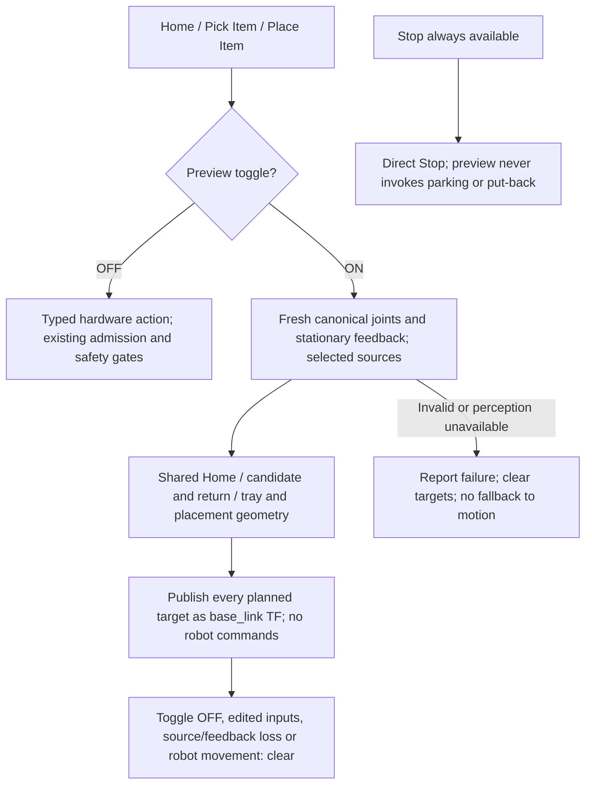
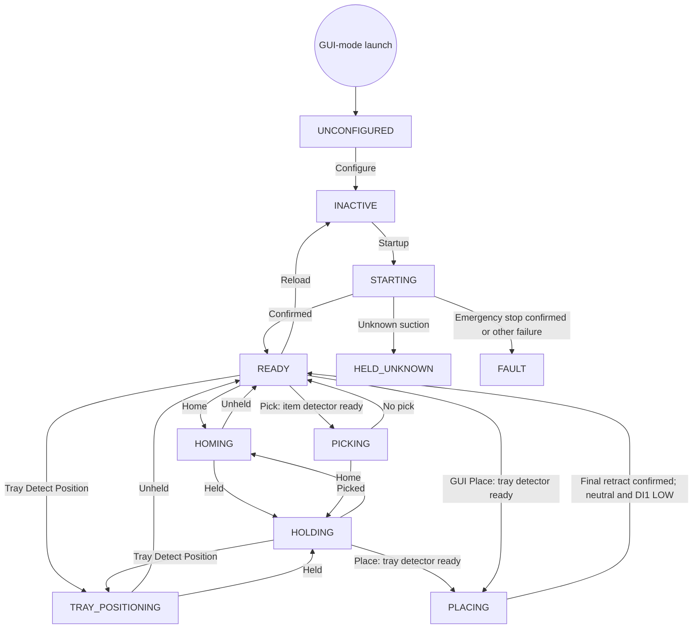
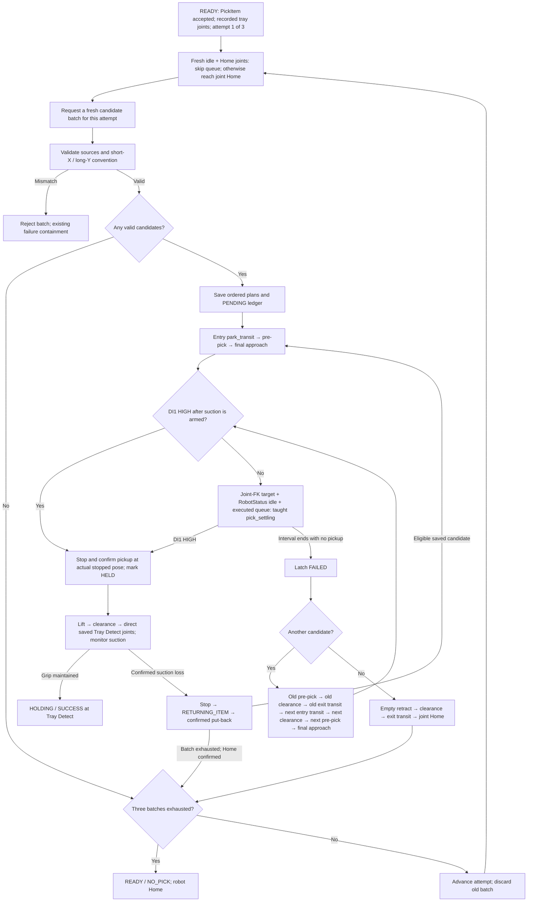
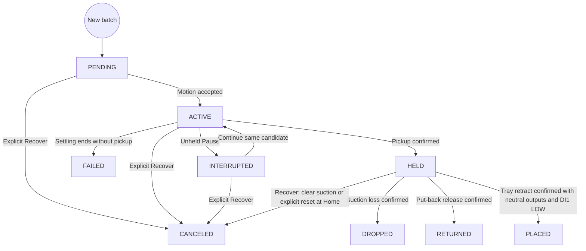
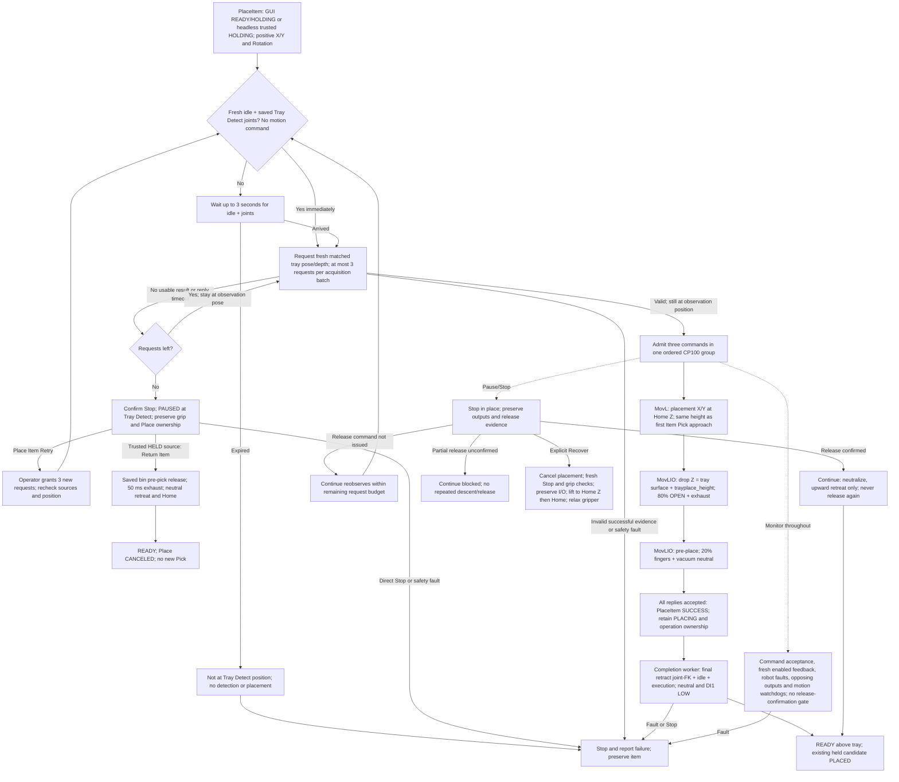
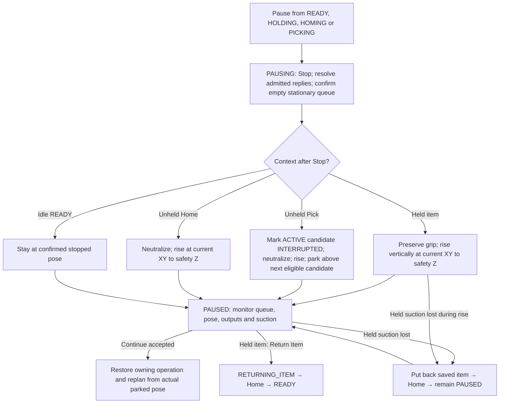
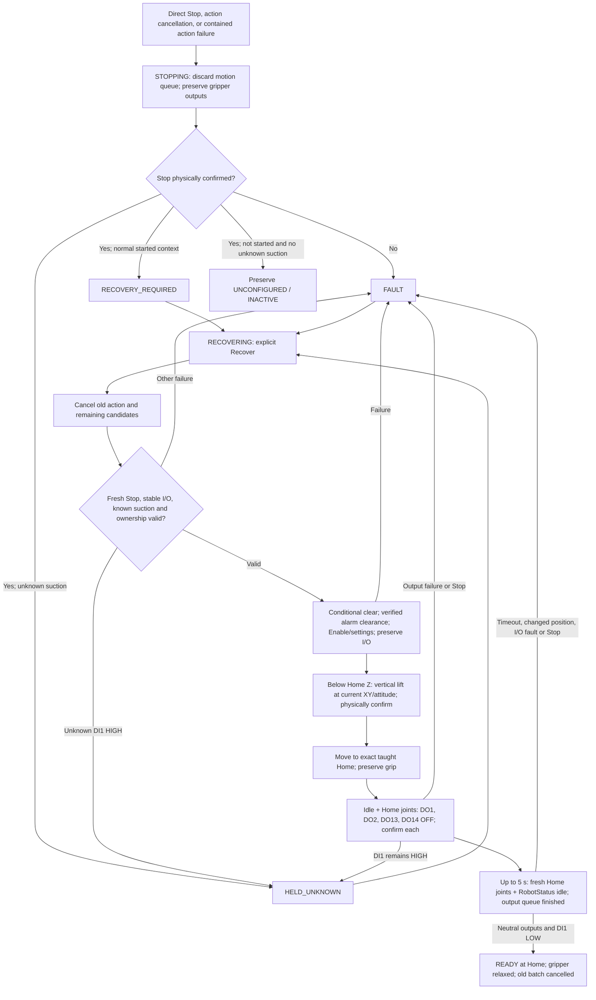
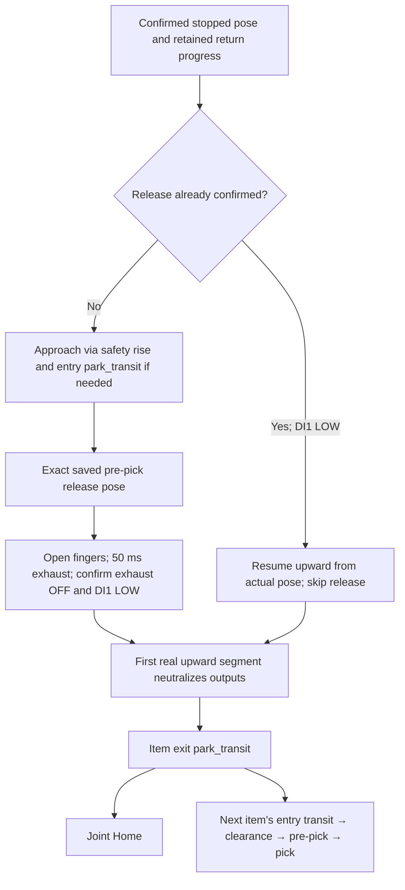

# Robot Controller — Finite State Machine

Acquisition pause review: **2026-09-30**, baseline **`2ed6a41`** plus diary rule
**185**. Three unavailable observations Stop and pause Place at Tray Detect,
preserving grip and ownership. Place Item (Retry) explicitly grants three new
requests; Pick Item remains disabled. The normal paused RETURN ITEM & STOP
control uses the saved-source bin put-back and Home routine, ending READY and
Place CANCELED. Pending/executing return presents direct STOP NOW. Require a
trusted HELD source before release admission and normal held checks on return;
manual placement without a source offers retry/direct Stop. No automatic retry
beyond the batch, parking rise, release or Home while awaiting the operator.

Placement height review: **2026-09-30**, baseline **`9581a46`** plus diary rule
**184**. Item Teach schema 10 requires `motion.trayplace_height` in millimetres.
Real placement and Preview use surface Z + this height, independently of Pick
heights. Approach/retract remain at Home Z, which must be above the drop. Older
profiles require explicit height entry and Save in Item Teach before production
loading; no fallback or automatic artifact rewrite is provided. Queue acceptance,
release/neutral timing, final retract supervision and Pick routes are unchanged.

Placement completion review: **2026-09-30**, baseline **`cbbacd0`** plus diary
rule **183**. Place checks fresh idle RobotStatus and saved Tray Detect joints
without commanding observation travel. Already matched proceeds immediately;
otherwise allow three seconds, then report "Not at Tray Detect position" without
detection. Queue only pre-place → release → retract, with no final Home. The
action returns SUCCESS on complete ordered acceptance; one completion worker
retains PLACING and command ownership until actual retract/neutral/DI1 LOW, then
READY. Later failures use status/events and Stop containment. Preview shows those
same three targets; interrupted confirmed release resumes upward only.

Pick destination review: **2026-09-30**, baseline **`1fdc2f0`** plus diary rule
**182**. Initial Home skips immediately from fresh idle RobotStatus and all six
canonical joint positions within ±1°, with no extra tick/query/dwell. Successful
Pick queues pre-pick lift → clearance lift → saved Tray Detect joints, with no
exit transit/Home. Finish HOLDING at Tray Detect; held Continue uses that same
destination. Missed candidates, put-back and exhausted batches retain their Home
routes. Pick/preview require recorded tray joints before motion or detection.

Preview/UI review: **2026-09-30**, baseline **`e2eff65`** plus diary rule **181**.
The motion grid is Home / Preview toggle, then Pick Item / Place Item. Preview ON
routes all three to the read-only planner and blocks motion-producing lifecycle
controls; direct Stop remains available. The standalone tray-position button is
removed; rule 183 replaces Place's observation travel with its read-only position
check. Preview does not change hardware-controller lifecycle states.

Retry behavior review: **2026-09-30**, baseline **`30073a2`** plus diary rule
**180**. Pick permits three full candidate batches; an exhausted/empty batch
counts as one attempt, with Home before fresh detection. Place permits three
fresh tray/depth requests for unavailable observations or missing replies.
Ordinary Pause retains both limits; rule 185 permits an explicit new tray batch
after acquisition exhaustion. Robot faults and invalid successful pose evidence
remain terminal; no hardware command is retried on uncertain acceptance.

Position feedback review: **2026-09-30**, baseline **`caad7a8`** plus diary rule
**179**. All actual position checks and motion origins use canonical joint
feedback, with CR10 forward kinematics for Cartesian poses and RobotStatus idle.
Joint/status callbacks wake arrival checks directly. FeedInfo remains the safety,
I/O and queue-execution source. Recovery's final gripper reset uses bounded
post-reset confirmation rather than an immediate Home/idle boolean test.

Last behavior review: **2026-09-24**, against baseline **`d8245a0`**, restored by diary rule **124**.
Automatic camera calibration is a separate direct-command maintenance exception;
the controller has no calibration action or CALIBRATING state. Rule **118** requires keeping this document
current with future controller changes.

Deployment catalog review: **2026-09-27**, against **`d301221`** plus diary rule
**140**. Complete optional Tray Teach pairs may coexist with Item/Bin deployment;
controller sequencing, states and motion remain unchanged.

Item-axis contract review: **2026-09-28**, against **`c4294c1`** plus diary rule
**157**. Item poses now use short X / long Y; Link6 green/Y follows short X,
preserving physical pickup orientation. Require matching request/response pose
conventions before planning. Lifecycle and motion sequencing are unchanged.


Tray placement review: **2026-09-29**, baseline **`a69434f`** plus diary rule **171**
and existing rules **158–163/169–170**. Controller configuration
now binds an optional Tray Teach. `GoTrayDetectPosition` and `PlaceItem` add
`TRAY_POSITIONING` and `PLACING`; placement uses fresh tray depth and an independent
tool-Z rotation. Placement Pause stops in place; interrupted release has its own
retained Continue progress and never enters the bin put-back routine. Explicit
Recover supersedes that progress with cancel-and-Home-then-relax under rule 176.
GUI-mode placement also permits an empty robot; headless placement retains its
trusted held-item requirement.
Tray service requests now use the versioned depth-capable endpoint; old provider
processes cannot satisfy readiness. Executor failures in the provider are visible.

Recovery behavior review: **2026-09-29**, diary rule **176**: explicit Recover
cancels the old action, preserves grip through lift/Home, then resets the gripper
to relaxed/OFF at confirmed Home.

Emergency-stop feedback review: **2026-09-29**, diary rule **167**. Startup queries
GetErrorID before initialization; confirmed emergency stops have explicit operator
feedback. Recover preserves alarm clearing after physical button release.

Calibration selection review: **2026-09-29**, diary rule **173**. The controller
combines the latest current-station platform geometry with the latest calibration
of its camera prefix independently. The platform's teaching-camera filename/hash
is historical provenance and need not match or exist. Platform schema 4 separates
that provenance from the unchanged base/platform pose; schema 3 remains readable.
Item Teach/Detect retain explicit active-camera selection. Exact active source
hashes must still agree across controller and detector before a pick. Camera-only
recalibration preserves taught platform/bin geometry and wall clearances; lifecycle,
motion queues, safety gates and robot-camera clearance planning are unchanged.

This describes the implemented `robot_controller` node. Diagrams use Mermaid;
open a Mermaid-capable Markdown preview or view this file on GitHub to render
them. The tables also describe the behavior without a diagram renderer.

Ready-to-view exports in this folder: [interactive visual FSM](ROBOT_CONTROLLER_FSM.html)
and [visual PDF](ROBOT_CONTROLLER_FSM.pdf). The HTML opens directly in
a browser with diagram selection, zoom and dragging; both exports work offline.

## 1. Read this first

- **Launch does not enable or move the robot.** Load configuration, then Startup.
- **READY** means available for an operation; it does not always mean at Home.
- **HOLDING** means trusted held-item context; it does not always mean at Home.
- **Pause parks Home/Pick/tray-position operations. Placement Pause stops in place**,
  then waits for Continue or direct Stop without releasing or moving the item.
  Exhausted tray acquisition offers Place Item (Retry) and the normal held-item
  Return control; Pick Item remains disabled.
- **Direct Stop stops motion and preserves the grip.** It does not put an item back.
- **Recover cancels the old action, returns Home, then relaxes the gripper.**
  Preserve outputs during travel; reset DO1/DO2/DO13/DO14 only at confirmed Home.
  It confirms a vertical lift to Home height before moving Home; it never resumes
  release or the old batch. Fresh gripper/robot checks must pass first.
- One controller operation owns execution at a time. A managed Pause retains
  that ownership while waiting. Direct Stop can pre-empt it.
- Place's action result acknowledges the queue. Its completion worker retains
  ownership and PLACING until final retract is confirmed; READY means available again.

There are two separate state machines:

| State record | What it describes | Example |
| --- | --- | --- |
| Controller lifecycle | What the whole controller is doing | `PICKING`, `PAUSED`, `RECOVERING` |
| Candidate ledger | What happened to each item pose in the accepted batch | `PENDING`, `INTERRUPTED`, `HELD` |

`phase` and `waypoint` are progress details inside a lifecycle state. For example,
Pick's initial Home travel still reports `PICKING`; it is not a separate Home
action. Flowchart boxes below describe steps unless explicitly named as states.

## 1a. Motion controls and preview

| Left | Right |
| --- | --- |
| Home | Preview: OFF / ON |
| Pick Item | Place Item |


```mermaid
flowchart TD
    Buttons["Home / Pick Item / Place Item"] --> Mode{"Preview toggle?"}
    Mode -->|OFF| Action["Typed hardware action; existing admission and safety gates"]
    Mode -->|ON| Inputs["Fresh canonical joints and stationary feedback; selected sources"]
    Inputs --> Plan["Shared Home / candidate and return / tray and placement geometry"]
    Plan --> TF["Publish every planned target as base_link TF; no robot commands"]
    TF --> Clear["Toggle OFF, edited inputs, source/feedback loss or robot movement: clear"]
    Inputs -->|Invalid or perception unavailable| Failed["Report failure; clear targets; no fallback to motion"]
    Stop["Stop always available"] --> Direct["Direct Stop; preview never invokes parking or put-back"]
```

Preview is a GUI routing mode, starts OFF, and cannot be entered with an active or
pending hardware operation. It adds no controller lifecycle state. While ON,
Start/Continue, Recover, managed Pause/Return and global speed cannot dispatch;
the three motion buttons use only `/robot_controller/preview_v2`. Load remains
read-only. External hardware APIs retain their own guards and are independent.
There is no fallback when the preview service is unavailable. Its process creates
only read-only perception clients, never Dobot command clients, and can plan from
fresh feedback while disabled without running Startup.

Home uses joint FK for its actual origin and shares Cartesian alignment/final
targets and arrival skips. Pick shares the conditional initial joint-Home route,
all accepted candidates, their successful Tray Detect target, missed transits
and Home/put-back branches. It previews one fresh batch at nominal endpoints;
actual early-contact poses and future retry batches require live execution and are not invented.
Place requires saved Tray Detect joints and shares the three-command
placement route, including taught rotation, with no observation-travel/Home TF. It samples real fresh tray/depth at
the camera's current pose with three requests maximum. Preview cannot move the
camera to make a hidden tray visible. Sources and successful pose evidence remain
strict; failed observation publishes no partial placement route.

Clearing pre-empts perception and prevents a late result from installing TFs.
Installed TFs stop on input edits, mode OFF, source change, stale feedback or robot
movement; RViz removes expired frames using its existing TF timeout. Rebuild
controller interfaces/controller and restart controller/preview/GUI together.
The old preview endpoint is not used. The removed Tray Detect Position GUI button
does not remove the native external action. Place only checks observation position;
it never moves there. Lifecycle buttons stay in their separate row.

## 2. Normal lifecycle


```mermaid
flowchart TD
    Launch((GUI-mode launch)) --> UNCONFIGURED
    UNCONFIGURED -->|Configure| INACTIVE
    INACTIVE -->|Startup| STARTING
    STARTING -->|Confirmed| READY
    READY -->|Reload| INACTIVE
    READY -->|Home| HOMING
    HOMING -->|Unheld| READY
    HOLDING -->|Home| HOMING
    HOMING -->|Held| HOLDING
    READY -->|Pick: item detector ready| PICKING
    PICKING -->|Picked| HOLDING
    PICKING -->|No pick| READY
    READY -->|Tray Detect Position| TRAY_POSITIONING
    HOLDING -->|Tray Detect Position| TRAY_POSITIONING
    TRAY_POSITIONING -->|Unheld| READY
    TRAY_POSITIONING -->|Held| HOLDING
    HOLDING -->|Place: tray detector ready| PLACING
    READY -->|GUI Place: tray detector ready| PLACING
    PLACING -->|Final retract confirmed; neutral and DI1 LOW| READY
    STARTING -->|Unknown suction| HELD_UNKNOWN
    STARTING -->|Emergency stop confirmed or other failure| FAULT
```

Headless launch loads the strict `runtime_teach/` catalog during construction,
then enters **INACTIVE**. Invalid deployment terminates startup; it does not
invent a usable configuration or start an indefinite retry. Headless selection
is immutable until restart. GUI configuration can be replaced from idle,
unheld UNCONFIGURED, INACTIVE or READY; invalid replacement preserves the old one.

The catalog permits a complete optional Tray Teach YAML/model pair. Controller
configuration binds that pair, the active eye-on-hand calibration selected in
`ITEM_TEACH_ROBOT_CAMERA_CALIBRATION`, and optional recorded detect joints. The
tray YAML’s original camera filename/hash is teaching history, not a source-file
dependency. Tray Teach/Detect use current intrinsics and image-time TF with the
unchanged saved base-frame plane. Camera replacement requires explicit reload;
active hashes remain pinned and returned camera evidence must match the controller.
Pick and tray operations require those joints. Place requires an armed canonical
`tray_teach` or headless `tray_detect` provider. Headless Place additionally requires
a trusted HELD item; normal GUI-mode Place permits READY or HOLDING without a Pick.
Configuration hashes include Tray Teach and its camera; reload still requires Startup.

New Pick and Place goals require a currently available pose service from exactly
one allowed root provider. Typed status exposes `item_detector_ready` and
`tray_detector_ready`; buttons update from these flags, direct GUI sends recheck
status, and action admission rechecks the service/owner before reserving work.
Teaching disarm removes its service. Missing, unknown, namespaced or duplicate
providers disable admission; neither check triggers detection nor arms a provider.
Armed Tray Teach does not imply HOLDING. `manual_placement_enabled` reports the
controller's non-headless mode: GUI debug placement accepts an empty READY robot
and does not require suction during observation/approach. It still controls real
hardware. A GUI client cannot override a headless controller's held-source guard.
Tooltips explain the applicable prerequisites. Home and Tray
Detect Position have no perception-readiness requirement. Keep request-time source
and fresh-pose validation. Rebuild/restart status publishers and clients together.

Tray readiness and requests use `/tray_detect/get_tray_pose_v2` exclusively. The
unversioned endpoint used before placement-depth integration cannot satisfy a new
Place goal; there is no mixed-layout fallback. Restart Tray Teach/Detect and
Robot Controller after updating. Provider executor failures revoke arming and
report a terminal error with traceback, rather than retaining a silent frozen
preview. Each unanswered in-flight request retains its bounded timeout; retry
only within the three-request acquisition batch, then confirm Stop and pause.
An explicit Place Item (Retry) grants another batch; no automatic fourth request.

Startup order: validate ownership/feedback → read-only GetErrorID E-stop check → best-effort StopMoveJog → strict
Stop/empty queue → unknown-item check → Disable → conditional ClearError →
Enable/confirmation → SpeedFactor 100, User 0, Tool 0, Tool 1 TCP zero, CP 100 →
unheld output reset → 200 ms coherent readiness. An unanswered service blocks
later commands, including an unanswered best-effort StopMoveJog.
GetErrorID must return a valid V4.6.5 alarm-ID list. Alarm 1537 or a command
response -3 reports **Emergency stop pressed — cannot start or recover**, with
instructions to release the physical button then use Recover / Clear Error.
StopMoveJog's -3 is fatal, not best effort. Other robot faults are not relabeled
as emergency stops. The GUI displays this confirmed cause in its FAULT panel;
typed status and failed service responses include the complete guidance.

### Every lifecycle state

| State | Meaning / usual exit |
| --- | --- |
| `UNCONFIGURED` | No active teach configuration; Configure loads it. |
| `INACTIVE` | Configuration loaded; explicit Startup required. |
| `STARTING` | Startup initialization in progress; READY, HELD_UNKNOWN or FAULT follows. |
| `READY` | Available and unheld; can Pick, Home, Tray Detect Position, GUI-mode Place, Pause, reload or change global speed. |
| `HOMING` | Explicit Cartesian GoHome action is executing. |
| `TRAY_POSITIONING` | Traveling to the saved Tray Detect Pose joints. |
| `PLACING` | Checking observation position, observing tray/depth, admitting placement or supervising retract after action SUCCESS. |
| `PICKING` | Up to three fresh candidate batches, Home between exhausted batches; success ends at Tray Detect. |
| `HOLDING` | Trusted item held; Home, Tray Detect Position, Place Item, Pause, controlled return or global speed are available under their guards. New Pick is blocked. |
| `PAUSING` | Managed Stop and parking/return preparation; Continue is not yet allowed. |
| `PAUSED` | Managed parking or in-place acquisition Stop confirmed; monitor pose, queue, outputs and held suction. Failed tray acquisition offers explicit retry or trusted-source return. |
| `RETURNING_ITEM` | Saved item's put-back is executing; destination afterward depends on why it started. |
| `STOPPING` | Direct Stop/cancellation/fault containment is being confirmed. |
| `RECOVERY_REQUIRED` | Stop confirmed; previous operation cannot simply Continue. Explicit Recover required. |
| `RECOVERING` | Cancel interrupted action, validate fresh stopped grip, restore readiness, lift and return Home with outputs preserved. |
| `HELD_UNKNOWN` | Suction detected without trusted pickup context; keep stopped and resolve the item/sensor condition. Recover can recheck. |
| `FAULT` | Initialization, recovery, supervision or containment failed. Read the cause and explicitly Recover or Stop. |

## 3. One Pick action


```mermaid
flowchart TD
    Request["READY: PickItem accepted; recorded tray joints; attempt 1 of 3"] --> Home["Fresh idle + Home joints: skip queue; otherwise reach joint Home"]
    Home --> Detect["Request a fresh candidate batch for this attempt"]
    Detect --> Validate["Validate sources and short-X / long-Y convention"]
    Validate -->|Mismatch| Reject["Reject batch; existing failure containment"]
    Validate -->|Valid| Any{"Any valid candidates?"}
    Any -->|No| Limit{"Three batches exhausted?"}
    Limit -->|Yes| Empty["READY / NO_PICK; robot Home"]
    Limit -->|No| Next["Advance attempt; discard old batch"]
    Next --> Home
    Any -->|Yes| Plan["Save ordered plans and PENDING ledger"]
    Plan --> Entry["Entry park_transit → pre-pick → final approach"]
    Entry --> Sense{"DI1 HIGH after suction is armed?"}
    Sense -->|Yes| Acquire["Stop and confirm pickup at actual stopped pose; mark HELD"]
    Sense -->|No| Settle["Joint-FK target + RobotStatus idle + executed queue: taught pick_settling"]
    Settle -->|DI1 HIGH| Acquire
    Settle -->|Interval ends with no pickup| Miss["Latch FAILED"]
    Acquire --> HeldReturn["Lift → clearance → direct saved Tray Detect joints; monitor suction"]
    HeldReturn -->|Grip maintained| Success["HOLDING / SUCCESS at Tray Detect"]
    HeldReturn -->|Confirmed suction loss| PutBack["Stop → RETURNING_ITEM → confirmed put-back"]
    PutBack -->|Eligible saved candidate| Entry
    PutBack -->|Batch exhausted; Home confirmed| Limit
    Miss --> More{"Another candidate?"}
    More -->|Yes| Retry["Old pre-pick → old clearance → old exit transit → next entry transit → next clearance → next pre-pick → final approach"]
    Retry --> Sense
    More -->|No| Exhausted["Empty retract → clearance → exit transit → joint Home"]
    Exhausted --> Limit
```

- The pose provider is exactly one of headless `item_detect` or explicitly armed
  `item_teach`, through `/item_detect/get_item_poses`. Inference is requested for
  the batch; Pause/Continue keeps its poses and the three-attempt limit. Recover cancels it.
- One attempt covers all eligible poses in one batch; an empty valid batch also
  consumes an attempt. After exhaustion, confirm Home before requesting a fresh
  batch. First held success ends the action; three exhausted batches finish
  READY/NO_PICK. Reused batch IDs, item-service failures/timeouts, source changes
  and robot faults remain terminal. Result `attempted_candidates` sums candidates
  across all batches, including failure/cancellation results. Per-batch ranking,
  taught `pose_candidates`, routes, I/O and settling remain unchanged.
- The accepted batch belongs to this Pick; there is no result-age expiry during
  its operation. Source/hash checks still apply before later work.
- Both pose request and response evidence must declare
  `item_short_x_long_y_v1`. A missing or mismatched convention rejects the batch
  before candidate planning; it cannot produce a pick target. Detector and
  controller processes must be rebuilt/restarted together after this change.
  The shared planner projects item short X perpendicular to taught Home tool Z
  when aligning Link6 green/Y. The unchanged physical short-side line preserves
  tool attitude, pick_rotation choices and robot-camera clearance. Saved item
  dimensions, pick-point origin, taught Home and all motion routes are unchanged.
  Numerically equal offset travel (within 1e-12 radians) prefers CCW, preventing
  frame relabeling roundoff from changing an otherwise equivalent choice.
- Final approach uses taught approach speed/acceleration. DI1 acquisition is
  immediate once armed: it can stop before reaching the nominal final target.
  If there is no early pickup, taught `timing.pick_settling` is the single final
  stationary/idle observation interval. There is no extra 300 ms gate or suction wait.
- Success first lifts to pre-pick at taught retract rates. Empty retract and
  the clearance rise use speed 100% with taught travel acceleration. Other Pick
  travel uses its taught rates; global SpeedFactor scales all motion.
- Successful Pick queues its two lifts and direct joint-target MovL to saved
  Tray Detect, at taught travel rates. Omit the Home-height exit transit and Home.
  Confirm only Tray Detect joints/idle/executed queue; finish HOLDING there.
  Exhausted returns keep exit transit and exact joint Home, confirmed only at Home.
  Both groups preserve global **CP(100)** blending and existing I/O.
- Initial Home reads fresh RobotStatus idle plus all six canonical joints within
  ±1° and skips the queue immediately when matched. No FK/query/new tick/dwell
  is required for that decision. Otherwise keep the conditional rise/joint Home.
  Pick requires recorded Tray Detect joints before moving or requesting items,
  but does not require an armed tray detector or request tray poses/placement.
- A missed retry queues **old exit and next entry** transit, even when coincident.
  Late DI1 from a latched miss does not turn it into success. Vacuum reset and
  DI1 clear are required before the next candidate's suction can be armed.

### Candidate ledger


```mermaid
flowchart TD
    Batch((New batch)) --> PENDING
    PENDING -->|Motion accepted| ACTIVE
    ACTIVE -->|Unheld Pause| INTERRUPTED
    INTERRUPTED -->|Continue same candidate| ACTIVE
    ACTIVE -->|Settling ends without pickup| FAILED
    ACTIVE -->|Pickup confirmed| HELD
    HELD -->|Suction loss confirmed| DROPPED
    HELD -->|Put-back release confirmed| RETURNED
    HELD -->|Tray retract confirmed with neutral outputs and DI1 LOW| PLACED
    PENDING -->|Explicit Recover| CANCELED
    ACTIVE -->|Explicit Recover| CANCELED
    INTERRUPTED -->|Explicit Recover| CANCELED
    HELD -->|Recover: clear suction or explicit reset at Home| CANCELED
```

FAILED, DROPPED, RETURNED, PLACED and CANCELED are terminal ledger states. A returned uncertain
item remains **DROPPED**, recording the loss; it does not change to RETURNED.
Eligible candidates are PENDING or INTERRUPTED in saved order. Thus Continue
retries the interrupted candidate before later candidates. The ledger and held
source exist only in memory; process restart does not reconstruct them.
RETURNED confirms release feedback; retreat/Home may still be in progress.
PLACED records the completed tray queue and clear final grip above the tray, without
requiring intermediate release evidence or proving the item landed on the tray.
Put-back separately retains APPROACH, RELEASING or RELEASED progress and its
original destination until Home completes, next-candidate travel takes ownership,
or explicit Recover cancels it. Preserve a trusted held source through recovery
travel, then mark it CANCELED when resetting the gripper at Home. This does not
claim PLACED or RETURNED.

## 3a. Tray observation and queued placement


```mermaid
flowchart TD
    Request["PlaceItem: GUI READY/HOLDING or headless trusted HOLDING; positive X/Y and Rotation"] --> Observe{"Fresh idle + saved Tray Detect joints? No motion command"}
    Observe -->|Yes immediately| Depth["Request fresh matched tray pose/depth; at most 3 requests per acquisition batch"]
    Observe -->|No| Wait["Wait up to 3 seconds for idle + joints"]
    Wait -->|Arrived| Depth
    Wait -->|Expired| Position["Not at Tray Detect position; no detection or placement"]
    Position --> Stop["Stop and report failure; preserve item"]
    Depth -->|No usable result or reply timeout| Budget{"Requests left?"}
    Budget -->|Yes; stay at observation pose| Depth
    Budget -->|No| AcquisitionPause["Confirm Stop; PAUSED at Tray Detect; preserve grip and Place ownership"]
    AcquisitionPause -->|Place Item Retry| Reset["Operator grants 3 new requests; recheck sources and position"]
    Reset --> Observe
    AcquisitionPause -->|Trusted HELD source: Return Item| PutBack["Saved bin pre-pick release; 50 ms exhaust; neutral retreat and Home"]
    PutBack --> Returned["READY; Place CANCELED; no new Pick"]
    AcquisitionPause -->|Direct Stop or safety fault| Stop
    Depth -->|Invalid successful evidence or safety fault| Stop
    Depth -->|Valid; still at observation position| Queue["Admit three commands in one ordered CP100 group"]
    Queue --> Pre["MovL: placement X/Y at Home Z; same height as first Item Pick approach"]
    Pre --> Release["MovLIO: drop Z = tray surface + trayplace_height; 80% OPEN + exhaust"]
    Release --> Retract["MovLIO: pre-place; 20% fingers + vacuum neutral"]
    Retract --> Accepted["All replies accepted: PlaceItem SUCCESS; retain PLACING and operation ownership"]
    Accepted --> Monitor["Completion worker: final retract joint-FK + idle + execution; neutral and DI1 LOW"]
    Monitor --> Ready["READY above tray; existing held candidate PLACED"]
    Monitor -->|Fault or Stop| Stop
    Queue -. "Monitor throughout" .-> Feedback["Command acceptance, fresh enabled feedback, robot faults, opposing outputs and motion watchdogs; no release-confirmation gate"]
    Feedback -->|Fault| Stop
    Queue -. "Pause/Stop" .-> Stopped["Stop in place; preserve outputs and release evidence"]
    Stopped -->|Release command not issued| Retry["Continue reobserves within remaining request budget"]
    Retry --> Observe
    Stopped -->|Release confirmed| Recover["Continue: neutralize, upward retreat only; never release again"]
    Recover --> Ready
    Stopped -->|Partial release unconfirmed| Block["Continue blocked; no repeated descent/release"]
    Stopped -->|Explicit Recover| Cancel["Cancel placement; fresh Stop and grip checks; preserve I/O; lift to Home Z then Home; relax gripper"]
```

X/Y are strictly positive millimetres along the detected tray inward short-X /
long-Y axes from its nearest-base corner. Reject targets at or beyond either far
edge. Rotation accepts −180° to +180°; zero is the saved Tray Detect Pose tool
orientation, followed by the requested local tool-Z rotation. Item axes,
pick_rotation and the detected tray quaternion do not determine tool attitude.

Place sends no observation-position command. As for Pick's initial Home skip,
check fresh RobotStatus idle and all six actual joints within ±1° of saved Tray
Detect. Proceed immediately when matched, otherwise allow three seconds for
arrival. Expiry reports "Not at Tray Detect position" through the failed action
and GUI prompt, with Stop containment and no tray request or placement queue.
Recheck position during observation and after its result. There is no fixed
settling interval, new FeedInfo tick or GetPose call for this position check.
Fresh safety/held-item gates remain. The external Tray Detect Position action
still sends one direct joint-target MovL and confirms execution/idle/joint arrival.
Bin routes retain their existing clearance logic.

Use a fresh after-trigger synchronized RGB/depth observation and calibrated
RGB-time TF. Preserve requested base X/Y; obtain surface base Z from target-ray
filtered median depth. Reuse Item Teach physical diameter, range/MAD/count/fraction
checks, with samples restricted to the tray. Inadequate/clipped depth fails before
any placement command. Hash/provider/plane checks remain strict.

Retry missing pose/depth, no-result/error/BUSY responses and unanswered requests
at most three times total, including the first request. Each request has the
existing taught timeout plus one second reply allowance and its own capture-time
boundary. Cancel/discard timed-out local futures; never consume their late results.
The provider serializes inference and may reply BUSY while an old callback retires.
Pause retains the count, drains an interrupted request to completion or its original
deadline and discards that result. Local source/ownership/feedback failures and
invalid successful pose/depth evidence stop immediately. After three unavailable
observations, confirm Stop and stay at saved Tray Detect in PAUSED with original
action/operation ownership and unchanged grip. There is no parking rise or
placement/release command. Publish phase `TRAY_ACQUISITION_PAUSED` and the failure
reason. Place Item (Retry) explicitly resets the request budget, rechecks sources
and observation position, then makes up to three new requests. Another exhausted
batch pauses again. Ordinary manual Pause retains its partly used budget.

Pick Item remains disabled. A trusted HELD source before any placement release
enables the same paused RETURN ITEM & STOP control as held Pick. It calls the
existing bin put-back: safety rise and entry, exact taught pre-pick release,
50 ms exhaust, neutral retreat/exit transit and Home, with existing rates and
feedback barriers. Complete READY and Place CANCELED; never start a new Pick.
Normal held-suction/output checks apply during bin return even in GUI mode.
Return does not require the tray detector; retry does. An empty/manual placement
pause with no trusted held source offers retry and direct Stop. Start/Continue
is disabled for this acquisition pause; the Place button supplies continuation.
Return immediately switches to STOP NOW, including before its service response;
a second click directly stops/cancels. Return pending blocks retry.
Attempt N/3 and the last failure reason appear in controller progress/events.
No automatic arming, runtime restart, configuration/interface change or physical
motion retry is added.

Release Z = surface Z + `motion.trayplace_height` (millimetres). Schema 10
requires this finite, nonnegative value; Pick standoff/pre-pick/retract settings
do not affect it. Hardware and Preview share the calculation.
Pre-place/retract Z = taught Home Z,
matching the first Item Pick's `pN_transit` height before pre-pick; that initial
route skips the lower clearance point. Approach/drop/retract keep tray-target
X/Y and detect-relative tool attitude through the final upward endpoint.
Require Home Z above drop Z for timed descent/retract. No extra preliminary
safety rise is added. Queue exactly three commands,
at speed 100% for every segment. The external Tray Detect Position action also uses 100%.
Global SpeedFactor still scales those speeds and is never changed by placement.
Retain Item Teach travel/approach/retract acceleration for the queue and
travel acceleration for Tray Detect Position; Item Pick retains its taught speeds.
Commands are MovL pre-place; MovLIO release
with 80% DO2 OFF → DO14 ON → DO13 OFF → DO1 ON; MovLIO back to pre-place with
20% DO2 OFF → DO14 OFF → DO1 OFF → DO13 OFF. No final Home command or additional
retract-height/clearance target is sent. Exhaust
lasts from descent's 80% trigger until ascent's 20% trigger, not a 50 ms pulse.

Service replies are ordered admission barriers, not physical waypoint waits.
All motion inherits CP(100), which may round intermediate control points. There
is no pick settling, release-pose stop or blocking DI12 wait between these moves.
There is no intermediate OPEN/exhaust/DI12/DI1 confirmation gate in either mode.
Missing/late release feedback, suction changes and bounded-history gaps do not
stop the queue. Retain any coherent release evidence for diagnostics and explicit
interruption recovery only. Headless still requires a trusted held item before
queue start; GUI mode accepts either initial item state. Preserve ordered command
acceptance, enabled/fresh/fault-free robot feedback, opposing-output protection,
motion watchdogs and direct Stop/Pause throughout.

After all three ordered `res=0` replies, return PlaceItem SUCCESS immediately,
normally with `final_state=PLACING`. One completion worker retains the operation
slot, transport execution evidence and active status while awaiting physical
completion. No other motion may overlap; Stop, Pause and shutdown remain active.
The worker uses the same three-second no-progress and 300-second motion bounds;
it adds no ROS executor thread. A post-result failure uses Stop containment and
status/events, without changing the returned action result.

Only after advancing joint/status feedback, terminal execution, empty queue and
joint-FK final retract arrival, check neutral outputs and DI1 LOW before READY.
Missing final grip state reports a retract-reached fault; DI12 and prior release
evidence are not required. Record PLACED for an existing HELD candidate only at successful retract completion,
clear held context and log release_feedback_observed separately. This confirms
the queue completed, not physical item deposition. No candidate is invented.

Placement Pause stops in place; direct Stop requires Recover. Both retain output
and release evidence without waiting for continuous exhaust to turn itself OFF.
If the release command was not issued, Continue rechecks saved observation position
with the same three-second window, then can reobserve within the remaining budget;
headless mode also requires an intact grip. Retain the original placement mode
across Pause/Continue. Startup/idle unknown-item and other action guards remain.
Once release is issued, never descend/release again. Observed release permits neutralizing
outputs and an upward-only retreat at actual X/Y to at least pre-place Z, ending there.
Unconfirmed partial release blocks Continue. Explicit Recover cancels placement,
validates fresh stopped I/O, preserves outputs and lifts to Home Z before Home,
then resets all four gripper outputs OFF. It neither replays expired history nor
declares successful placement. Bin put-back is available only for the exhausted
acquisition Pause described above, before any placement release admission. Pick settling/retries and its return paths are
unchanged. Process restart cannot reconstruct retained placement progress.

## 4. Pause and Continue


```mermaid
flowchart TD
    Pause["Pause from READY, HOLDING, HOMING or PICKING"] --> Pausing["PAUSING: Stop; resolve admitted replies; confirm empty stationary queue"]
    Pausing --> Context{"Context after Stop?"}
    Context -->|Held item| Rise["Preserve grip; rise vertically at current XY to safety Z"]
    Context -->|Unheld Pick| Transit["Mark ACTIVE candidate INTERRUPTED; neutralize; rise; park above next eligible candidate"]
    Context -->|Unheld Home| HomePark["Neutralize; rise at current XY to safety Z"]
    Context -->|Idle READY| Stay["Stay at confirmed stopped pose"]
    Rise --> Paused["PAUSED: monitor queue, pose, outputs and suction"]
    Transit --> Paused
    HomePark --> Paused
    Stay --> Paused
    Paused -->|Continue accepted| Resume["Restore owning operation and replan from actual parked pose"]
    Paused -->|Held item: Return Item| Return["RETURNING_ITEM → Home → READY"]
    Paused -->|Held suction lost| Drop["Put back saved item → Home → remain PAUSED"]
    Rise -->|Held suction lost during rise| Drop
    Drop --> Paused
```

Safety Z is **max(actual stopped Z, taught Home Z)**. The unheld Pick endpoint is
`park_transit` at the saved candidate XY/attitude and that safety Z. It is above
pre-pick, not at pre-pick. If no candidate is eligible, there is no next-item XY
transfer. A pickup recognized during the managed Stop uses the held branch only
when the controller has an eligible active candidate and suction evidence.
An optional vertical correction within 5 mm of Home Z is skipped before
dispatch, retaining the measured pose. Required item transits remain queued.

Continue requires valid sources, fresh enabled feedback, no unexpected queue
motion, unchanged parked pose (1 mm / 0.5°), expected outputs and no pending
held loss. Unheld Pick reopens fingers and descends through saved pre-pick to
final approach. Held Pick continues directly to Tray Detect from its parked pose.
Home replans its Home action. Idle Pause restores READY/HOLDING; after an idle
HOLDING pause loses and returns its item, Continue may run remaining saved candidates.

The GUI shows **STOP NOW** immediately while Pause/return is pending. This is a
direct Stop, including when a PAUSED topic sample arrives before the Pause reply.
**RETURN ITEM & STOP** appears only after pending requests clear and PAUSED has
trusted held source. External `/return_item` clients can request a managed
return from other started eligible states; the GUI exposes it while paused.
The exhausted tray-acquisition pause uses this same Return control and route,
but stays at Tray Detect while awaiting the choice (section 3a).

## 5. Direct Stop and Recovery


```mermaid
flowchart TD
    Interrupt["Direct Stop, action cancellation, or contained action failure"] --> Stopping["STOPPING: discard motion queue; preserve gripper outputs"]
    Stopping --> Contained{"Stop physically confirmed?"}
    Contained -->|No| Fault["FAULT"]
    Contained -->|Yes; normal started context| Required["RECOVERY_REQUIRED"]
    Contained -->|Yes; unknown suction| Unknown["HELD_UNKNOWN"]
    Contained -->|Yes; not started and no unknown suction| Before["Preserve UNCONFIGURED / INACTIVE"]
    Required --> Recover["RECOVERING: explicit Recover"]
    Fault --> Recover
    Unknown --> Recover
    Recover --> Cancel["Cancel old action and remaining candidates"]
    Cancel --> Guard{"Fresh Stop, stable I/O, known suction and ownership valid?"}
    Guard -->|Unknown DI1 HIGH| Unknown
    Guard -->|Other failure| Fault
    Guard -->|Valid| Enable["Conditional clear; verified alarm clearance; Enable/settings; preserve I/O"]
    Enable -->|Failure| Fault
    Enable --> Lift["Below Home Z: vertical lift at current XY/attitude; physically confirm"]
    Lift --> Home["Move to exact taught Home; preserve grip"]
    Home --> Relax["Idle + Home joints: DO1, DO2, DO13, DO14 OFF; confirm each"]
    Relax --> Confirm["Up to 5 s: fresh Home joints + RobotStatus idle; output queue finished"]
    Confirm -->|Neutral outputs and DI1 LOW| Ready["READY at Home; gripper relaxed; old batch cancelled"]
    Confirm -->|Timeout, changed position, I/O fault or Stop| Fault
    Relax -->|DI1 remains HIGH| Unknown
    Relax -->|Output failure or Stop| Fault
```

Direct Stop never automatically releases, Homes or resumes. It remains available
during Startup, parking, put-back and Recover. Physical Stop confirmation is
independent of DI1 being HIGH; an uncertain item retains its available source.
An unresolved/late motion response prevents later motion and can require another
containment Stop. A managed routine also uses physical Stop internally, without
necessarily publishing the lifecycle state STOPPING.
Concurrent callers share only an ongoing Stop attempt. A later explicit
Stop/action cancellation sends a new Stop and requires its own physical
confirmation, even after failure. An older result cannot finish a newer Stop
or overwrite a new operation. Operation startup cannot clear an in-progress Stop.

| Recovery situation | Operator path / controller result |
| --- | --- |
| Known item, suction intact | Preserve grip while lifting and returning Home; then relax all outputs. READY requires neutral outputs and DI1 LOW. |
| Saved item with latched loss | Fresh LOW permits lift/Home without release or new picks; HIGH does not erase the prior loss and blocks motion. |
| Interrupted pick/place/put-back, release unconfirmed | Cancel it, validate fresh stopped grip, lift/Home; no repeated release and no fabricated placement success. |
| Interrupted release confirmed | Preserve current outputs through lift/Home, then relax. New DI1 HIGH before travel blocks this route. |
| Unknown HIGH suction, no trusted source | Keep stopped; safely secure/clear item or inspect the sensor for obstruction. Once DI1 shows LOW, click Recover again; no extra Stop click required. No invented return location. |
| Competing maintenance app | Close the named Gripper Diagnostics/motion-debug application, then retry Recover. |
| Confirmed emergency stop (`res=-3` or alarm 1537) | Cannot start/recover while active. Release the physical button, then click Recover / Clear Error. Recover may clear a latched alarm; Enable remains blocked until clearance is verified. |
| Stale feedback, alarm, output mismatch, changed source or failed command | Resolve the reported cause, then Recover. A click does not bypass the check. |

Normal Recover cancels the old operation and remaining candidates, then confirms
a stationary empty queue and stable gripper outputs/raw DI1 across two distinct
fresh samples. Adopt those current outputs only after validation; never replay
expired placement history. Reject opposing outputs and unknown suction. Known
held suction must have a trusted source and active vacuum; sustained clear DI1
permits empty recovery without asserting that an object left the fingers.

Restore readiness with conditional ClearError, verified clearance, Enable and
settings. Keep the last confirmed global speed (100% if unset). Preserve outputs
during travel. Below Home Z, issue and physically confirm an upward-only
RelMovLUser with unchanged XY/attitude; then a separate joint-target MovL to taught
Home. Use taught travel rates. Already-high skips the rise; already-at-Home skips
its move. Monitor unchanged outputs and held/clear suction throughout. Direct
Stop pre-empts recovery; another Recover replans from a new Stop and current pose.
At confirmed stationary Home, issue DO1 OFF, DO2 OFF, DO13 OFF and DO14 OFF,
confirming every response and fresh output echo. Accept only the pending OFF
transition; unexpected output changes still fail. During this reset, intentional
suction loss is allowed and the former held source becomes CANCELED. No finger
OPEN command, exhaust pulse or replay of placement/put-back release is sent.
Require neutral outputs, DI1 LOW and continued Home arrival before READY. After
the output commands, wait up to five seconds for newer joint/status samples,
idle RobotStatus, Home joint tolerance and completion of the output queue.
A transient busy sample waits instead of falsely reporting position loss; a
failure names idle/freshness/queue blockers and the maximum Home joint error. A stuck
HIGH DI1 remains HELD_UNKNOWN; stale feedback/output failure/Stop cannot report
success or dispatch remaining reset commands. No detector or next-candidate request.

If ClearError acknowledges but the alarm-clear feedback check fails, a read-only
GetErrorID query provides the explicit emergency-stop reason for alarm 1537.
Unrelated alarms retain their clearance failure; malformed/unavailable diagnostics
also fail without enabling. Held-suction loss retains its existing failure path.
No automatic reset, retry or enabling is added. Recover remains available in FAULT
to recheck after physical release, avoiding a latch that prevents clearing alarms.

## 6. The common put-back route


```mermaid
flowchart TD
    Start["Confirmed stopped pose and retained return progress"] --> Released{"Release already confirmed?"}
    Released -->|No| Up["Approach via safety rise and entry park_transit if needed"]
    Up --> Release["Exact saved pre-pick release pose"]
    Release --> Pulse["Open fingers; 50 ms exhaust; confirm exhaust OFF and DI1 LOW"]
    Pulse --> Retreat["First real upward segment neutralizes outputs"]
    Released -->|Yes; DI1 LOW| Resume["Resume upward from actual pose; skip release"]
    Resume --> Retreat
    Retreat --> Exit["Item exit park_transit"]
    Exit --> Home["Joint Home"]
    Exit --> Next["Next item's entry transit → clearance → pre-pick → pick"]
```

Release height is **final-pick Z + taught pre-pick height**, using the exact
saved pre-pick attitude/XY. The former fixed +50 mm release/minimum is removed.
Release commands turn finger-close and suction off, open fingers, then pulse
exhaust. These are ordered commands, not simultaneous electrical edges.

The complete put-back route uses **speed 100% / taught travel acceleration**,
scaled by global SpeedFactor. If clearance equals pre-pick, the rise to exit
transit carries the neutral events. A real upward retreat must exist. Both entry
and exit transits are queued, with CP blending permitted. Physical item placement
is not measured; the controller confirms release feedback and motion completion.
Stop preserves progress for diagnosis. Explicit Recover cancels it and takes the
fresh-feedback lift/Home path above, without release or neutralization. The
automatic/managed put-back paths still require issued-output and release evidence.
Unexpected I/O changes remain faults. None of this context survives restart.

| Why put-back started | After release and retreat |
| --- | --- |
| Explicit Return Item | Home → READY; ends the interrupted operation. |
| Held suction loss during active Pick | Next eligible saved candidate, or Home then next fresh batch within the three-attempt limit; third exhaustion → READY/NO_PICK. Original Pick stays active. |
| Explicit Recover | Does not enter put-back; cancel, preserve grip through lift/Home, then relax at Home. |
| Held loss during Pause / while PAUSED | Home → PAUSED. Wait for explicit Continue or Stop. |

## 7. Home has two routes

| Request | Planned route | Completion check |
| --- | --- | --- |
| Explicit Hardware Home / `go_home` | Current XY with taught Home Z/attitude → full taught Cartesian Home, one blended group | Final Cartesian Home; whole move skipped if already within 5 mm / 1° |
| Pick's initial Home | If needed: unchanged-XY/attitude rise to Home Z → exact taught joint Home | Separate rise barrier when needed, then joint Home; skip if every Home joint is within ±1° |
| Final exhausted miss or put-back Home return | Item retreat/clearance → explicit exit transit → conditional Home-height target → exact joint Home, one ordered group | Final joint Home |

Successful Pick is not a Home route: it lifts to pre-pick and clearance, then
moves directly to saved Tray Detect joints and finishes HOLDING there.

Shared joint-Home planning skips its preliminary rise when current/planned Z is
within 5 mm below Home Z or higher. Explicit Cartesian Home uses its own alignment
target; its attitude and queue behavior must not be inferred from the joint route.

## 8. What drives transitions

### Commands and guards

Names below are relative to `/robot_controller/`.

| API | Main admission guard |
| --- | --- |
| `configure` service | GUI mode; unheld UNCONFIGURED / INACTIVE / READY; operation slot free |
| `startup` service | Configured INACTIVE; operation slot free |
| `go_home` action | Started READY / HOLDING; exact configuration ID; operation slot free |
| `pick_item` action | Started, configured, unheld READY; exact configuration ID and item selection; recorded tray joints; item detector ready; operation slot free |
| `go_tray_detect_position` action | Started READY / HOLDING; saved tray joints; exact configuration ID; operation slot free |
| `place_item` action | Started GUI READY/HOLDING, or headless HOLDING with trusted HELD source; saved tray joints; tray detector ready; exact configuration ID; operation slot free |
| `pause` service | Started READY / HOLDING / HOMING / PICKING / PAUSED; managed-request and owning-operation guards |
| `continue` service | Confirmed managed PAUSED with retained Pause context and valid parked feedback |
| `return_item` service | Started eligible managed state and trusted held source; during Place, only exhausted-acquisition PAUSED before release admission; no conflicting request |
| `stop` service / action cancellation | Direct pre-emption; does not require Pause first |
| `recover` service | FAULT / RECOVERY_REQUIRED / HELD_UNKNOWN; operation slot free |
| `set_global_speed` service | Stationary READY / HOLDING; integer 1–100; operation slot free |

Acceptance is not proof of motion completion. Pause/Continue/Return services
acknowledge a request; observe status afterward. Home/Pick actions provide final
results: SUCCESS, NO_PICK (Pick only), CANCELED, COMMAND_REJECTED,
FEEDBACK_FAILURE, STOP_UNCONFIRMED or CONTROLLER_FAULT. A controlled Return Item
that ends active Home/Pick or acquisition-paused Place reports CANCELED and final
READY; it does not claim pick/placement success.
PlaceItem SUCCESS instead means all three placement commands were accepted; its
completion worker retains `operation_active` until final retract/neutral/DI1 LOW
and READY, or failure containment. Clients must observe status for that outcome.

### Feedback and I/O

| Input | Used for |
| --- | --- |
| `/joint_states` | All actual position/progress checks, direct joint targets, Cartesian FK, motion origins and Stop joint stationarity |
| `/dobot_msgs_v4/msg/RobotStatus` | Canonical connection and idle indication (`is_enable` means vendor mode 5) |
| `/dobot_bringup_ros2/msg/FeedInfo` | Queue/execution evidence, controller freshness, enable/modes/alarms/collision and DI/DO; no position comparisons |
| `/item_detect/get_item_poses` service response | Validated item candidates, source binding and matching short-X/long-Y convention before planning |

| I/O | Meaning |
| --- | --- |
| DI1 | Suction detection: acquisition HIGH is immediate; held HIGH→LOW loss is debounced 50 ms with advancing feedback |
| DI12 | Finger fully open feedback, shown on the GUI; LOW does not prove fingers are closed |
| DO1 / DO13 | Exhaust / suction; both OFF is neutral; both ON is invalid |
| DO2 / DO14 | Finger close / open; both OFF is neutral; both ON is invalid |

Feedback must be complete, connected, valid and within **one second**, including
joint source/receipt timestamps, status/feed receipt and advancement of the
controller timer. Current motion origin and all actual Cartesian poses come from
CR10 FK of the fresh canonical joint sample; there is no GetPose client or
separate pose subscription. New joint/status samples wake position waits without
waiting for another FeedInfo update. A motion origin requires both streams to
advance, RobotStatus idle and an empty command queue within two seconds. Repeated
or backward joint timestamps are discarded without refreshing receipt age.
Stale feedback can block an operation or cause containment. It never means LOW.

Stop stationarity uses two distinct joint source samples unchanged within 0.05°,
with the stopped/empty-queue guard. Stop can still be confirmed while disabled,
faulted or paused; it never requires enabling the robot. Parked-position checks
use the same joint-derived Cartesian pose with their existing 1 mm/0.5° tolerance.

Motion requests are admitted in order: wait for each `res=0` before sending the
next, with no fixed dispatch delay. Dobot service responses have a **five-second**
deadline; this is not a five-second motion-completion limit. Global CP is 100,
with no per-motion CP/r override. No automatic runtime restart or general fault
retry is performed.

Every queued group's terminal check requires a newer joint source timestamp and
newer RobotStatus receipt after the last acceptance, idle RobotStatus, actual
endpoint tolerance and confirmed I/O. Joint targets use ±1° per joint; Cartesian
targets use joint FK within 5 mm/1°. Empty-queue and execution evidence remain
separate command guards. For a terminal MovL, require
the returned queue ID to equal the stream's currentCommandId. The fixed vendor
MovLIO/RelMovLUser interfaces return only res; these instead require execution
evidence latched from live running/queue flags, changed currentCommandId or
joint movement, including during service waits. There is no extra
query service or fixed stability interval. Only final pick retains taught
pick_settling. Midpoints and both transits stay queued and CP-blended without
arrival waits. A very short move need not expose a running sample if its streamed
command ID demonstrates execution.

The GUI receives `/robot_controller/status` at periodic **5 Hz** plus state and
progress updates. Its DI1/DI12 LEDs show raw HIGH/LOW, or UNKNOWN if feedback is
unavailable; status itself also expires after one second by source and local
receipt age. `UNAVAILABLE` is a GUI display condition, not a controller FSM state.
Full audit details remain in `/robot_controller/operator_log` and the ignored
`logs/robot_controller/events.jsonl`.

## 9. Exact allowed lifecycle transitions

This table mirrors `state_machine.py`, including its additions after the initial
transition dictionary. These are the low-level permitted edges, **not permission
to call every service from those states**; the command guards above are stricter.
Updating a message without changing state is allowed in every state.

| From | Allowed different target states |
| --- | --- |
| `UNCONFIGURED` | `FAULT`, `INACTIVE`, `STOPPING` |
| `INACTIVE` | `FAULT`, `STARTING`, `STOPPING`, `UNCONFIGURED` |
| `STARTING` | `FAULT`, `HELD_UNKNOWN`, `READY`, `STOPPING` |
| `READY` | `FAULT`, `HELD_UNKNOWN`, `HOMING`, `INACTIVE`, `PAUSED`, `PAUSING`, `PICKING`, `PLACING`, `RECOVERING`, `STOPPING`, `TRAY_POSITIONING` |
| `HOMING` | `FAULT`, `HELD_UNKNOWN`, `HOLDING`, `PAUSED`, `PAUSING`, `READY`, `RECOVERY_REQUIRED`, `STOPPING` |
| `PICKING` | `FAULT`, `HELD_UNKNOWN`, `HOLDING`, `PAUSED`, `PAUSING`, `READY`, `RECOVERY_REQUIRED`, `RETURNING_ITEM`, `STOPPING` |
| `HOLDING` | `FAULT`, `HELD_UNKNOWN`, `HOMING`, `PAUSED`, `PAUSING`, `PLACING`, `RECOVERING`, `STOPPING`, `TRAY_POSITIONING` |
| `PAUSED` | `FAULT`, `HOLDING`, `HOMING`, `PAUSING`, `PICKING`, `PLACING`, `READY`, `RETURNING_ITEM`, `STOPPING`, `TRAY_POSITIONING` |
| `STOPPING` | `FAULT`, `HELD_UNKNOWN`, `INACTIVE`, `RECOVERY_REQUIRED`, `UNCONFIGURED` |
| `RECOVERY_REQUIRED` | `FAULT`, `RECOVERING`, `STOPPING` |
| `RECOVERING` | `FAULT`, `HELD_UNKNOWN`, `HOLDING`, `READY`, `RETURNING_ITEM`, `STOPPING` |
| `HELD_UNKNOWN` | `FAULT`, `RECOVERING`, `RECOVERY_REQUIRED`, `STOPPING` |
| `FAULT` | `RECOVERING`, `STOPPING` |
| `PAUSING` | `FAULT`, `PAUSED`, `RETURNING_ITEM`, `STOPPING` |
| `RETURNING_ITEM` | `FAULT`, `PAUSED`, `PICKING`, `READY`, `STOPPING` |
| `TRAY_POSITIONING` | `FAULT`, `HELD_UNKNOWN`, `HOLDING`, `PAUSED`, `PAUSING`, `READY`, `RECOVERY_REQUIRED`, `STOPPING` |
| `PLACING` | `FAULT`, `HELD_UNKNOWN`, `HOLDING`, `PAUSED`, `PAUSING`, `READY`, `RECOVERY_REQUIRED`, `STOPPING` |

## 10. Maintaining this document

Update this file **in the same change** whenever controller states/transitions,
command guards, Pick/Pause/Stop/Recovery/put-back routes, candidate states, timing,
I/O rules or GUI control meanings change. Update the affected diagrams and tables,
the review date/source baseline, and the blueprint diary. This is a maintained
source document, not a runtime-generated view. Newer diary rules supersede older
ones; record any source/document mismatch explicitly rather than describing a
proposed behavior as already implemented.

Regenerate the HTML and PDF from this document in the same change whenever it
is updated (rule 119). The export helper copies the Mermaid blocks and headings;
do not separately edit their behavior in the exports. It requires local
Playwright/Chromium and a local VS Code Mermaid Markdown preview bundle, and
blocks network requests during rendering:

```bash
python3 scripts/render_controller_fsm.py \
  --renderer /path/to/local/mermaid-markdown-features/markdown-preview-out/index.js
```

This is a documentation tool, not a ROS/build/runtime dependency. The resulting
HTML embeds SVG diagrams and the full source SHA-256; the PDF has one vector
diagram per A3 page with the source hash prefix. Viewers need no renderer installed.

Source map for the next review:

| Source | Responsibility |
| --- | --- |
| [state_machine.py](../src/robot_controller/python/robot_controller/state_machine.py) | Lifecycle states and allowed edges |
| [controller.py](../src/robot_controller/python/robot_controller/controller.py) | API guards, configuration, lifecycle, action ownership, Stop and supervision |
| [placement.py](../src/robot_controller/python/robot_controller/placement.py) | Read-only tray-position check, three-command placement admission, release evidence and upward interruption recovery |
| [tray_client.py](../src/robot_controller/python/robot_controller/tray_client.py) | Fresh tray/depth request, provider and source validation |
| [managed_control.py](../src/robot_controller/python/robot_controller/managed_control.py) | Parking, Continue, put-back and held-loss recovery |
| [pick_session.py](../src/robot_controller/python/robot_controller/pick_session.py) | Candidate ledger and put-back geometry |
| [motion.py](../src/robot_controller/python/robot_controller/motion.py) | Motion targets, timed I/O and candidate execution |
| [hardware.py](../src/robot_controller/python/robot_controller/hardware.py) | Ordered service admission, physical confirmation and motion policies |
| [feedback.py](../src/robot_controller/python/robot_controller/feedback.py) | Freshness, coherent samples and suction-loss debounce |
| [gui.py](../src/robot_controller/python/robot_controller/gui.py) | Button meanings, feedback display and recovery instructions |
| [Controller README](../src/robot_controller/README.md) / [blueprint diary](WORKFLOW_RULES_BLUEPRINT_DIARY.md) | Operational detail and superseding project rules |

This documents software behavior, not new physical validation. Rule 120 addresses
premature endpoint completion consistent with the logged **Unexpected motion
while parked** failure. Its strict containment remains; live validation of the
new completion, interrupted-release and Stop behavior is still outstanding.
